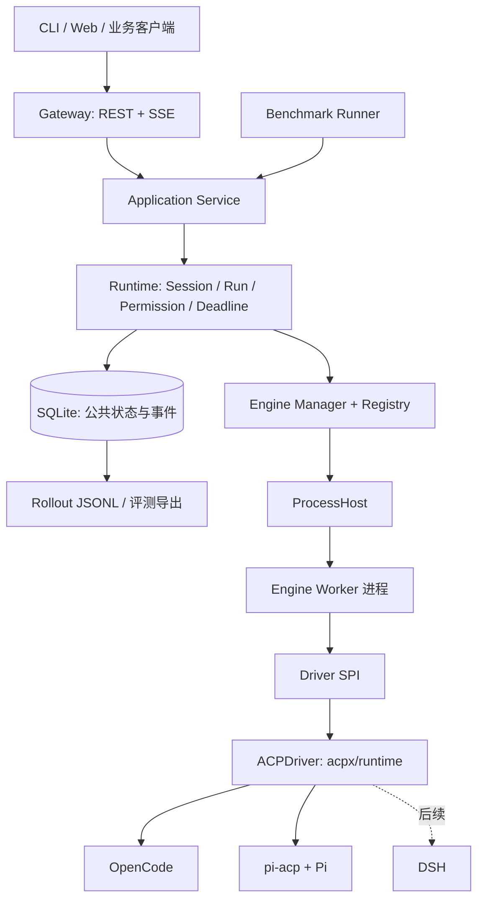

# HarnessHub 技术设计基线

版本：0.1。日期：2026-09-05。状态：架构决策已确认，执行骨架已实现；分项验收与缺口由 [TODO.md](TODO.md)维护。

本文件是后续开发的设计基线。源码依据保留在 [源码阅读与技术选型讨论稿](<HarnessHub 源码阅读与技术选型讨论稿.md>)；[原始架构提案](<HarnessHub 多 Agent 引擎可替换架构设计.md>)保留目标、参考项目和阅读顺序。出现冲突时，以本文件的已确认决定为准。

开发过程遵循 [AGENTS.md](AGENTS.md)，实现、验证与文档细则见 [开发文档索引](docs/README.md)。架构决定已确认不等于能力已实现，完成声明须附对应验收证据。

## 1. 已确认的三个决定

用户将三个决定交由我们定案，采用以下方案：

| 决定 | 采用方案 | 直接约束 |
|---|---|---|
| 运行形态 | Gateway + 本地独立 Engine Worker 进程 | 多 Session 可并行；同一 Session 串行 Run；Worker 懒启动并受并发与回收策略控制 |
| 数据边界 | 从 MVP 使用 SQLite 保存公共状态和规范化事件 | Gateway 是唯一业务写入者；JSONL 是导出格式；acpx Store 仅保存后端恢复材料 |
| 首批引擎 | OpenCode → Pi（经 pi-acp） | 共用 ACPDriver；第二个引擎接入不修改 Gateway 业务代码；随后接 DSH |

第一版目标是多引擎可替换执行、可观察轨迹和可复现评测。跨引擎会话迁移、跨机器调度、自动选路、跨引擎协作不进入本轮 MVP。

Gateway 规范尚未提供，按通用任务 API 开发设计；未来赛题通过入口适配层对接。Windows 10/11 是目标平台，实际兼容性、隔离能力和比赛计分均须独立验证。

## 2. 技术栈基线

| 部分 | 选型 |
|---|---|
| 核心语言 | TypeScript，strict + ESM |
| 运行时 | Node.js 24 LTS，实施时固定并验证 patch 版本 |
| HTTP 服务 | Fastify 5；REST + SSE；OpenAPI 契约 |
| 输入与 IPC 校验 | JSON Schema / Ajv，与公共类型保持一致 |
| ACP Driver | `acpx/runtime`，使用稳定 ACP v1；SDK 类型限制在 Adapter 内 |
| 配置 | YAML/JSON 基础目录 + SQLite 动态 overlay + 不可变 revision |
| 业务存储 | SQLite，经自有 Store 接口访问；优先 `node:sqlite`，固定版本验证其 release-candidate API |
| 产物与导出 | 本地文件产物 + JSONL Rollout |
| 进程通信 | 本地 Node 子进程 IPC，独立 schemaVersion |
| 开发组织 | 单仓库、单主包、按模块分目录；按实际需要再拆包 |
| 测试与验收 | 公共运行契约、真实引擎链路、Windows 原生行为 |
| Benchmark | Node CLI，复用 Application Service |

ACP Runtime、Adapter、Harness、模型配置应分别记录版本；当前 Benchmark 自动记录 Hub/Node/OS、配置 revision 和配置模型，真实引擎/Adapter 版本及实际模型仍需验收记录补充。依赖先通过安装与兼容性检查再锁定；运行任务时不自动更新或临时下载引擎。

不因引入 Worker 额外引入 Go/Rust 服务。Windows 原生监督能力若确需 helper，单独评估与封装，其接口不进入业务域。

## 3. 模块和执行所有权



| 模块 | 拥有的职责 |
|---|---|
| Gateway | 校验请求、映射响应、SSE 订阅与重放 |
| Application Service | 统一执行入口；CLI、HTTP、Benchmark 复用 |
| Runtime | 公共 ID、Session 串行队列、Run 状态、deadline、权限决定、终态归并 |
| Engine Manager / Registry | 引擎配置快照、能力校验、Worker 分配 |
| ProcessHost | Worker 启动、进程归属、退出监测、升级终止 |
| Engine Worker / Driver | 后端会话、原生事件转换、权限往返、运行结果证据 |
| Store / Rollout | 事务、事件序号、游标查询、导出与产物元数据 |
| Evaluator | 判断任务是否达标，独立于执行是否正常结束 |

Gateway 父进程是公共状态的唯一逻辑写入者。Worker 不直接写 HarnessHub 数据库，只上报事件、权限请求和后端结果。若存储操作下沉线程，写入权仍由 Gateway 的单一 Store 管理。

Driver 类型由 HarnessHub 定义，公共接口不泄露 ACP/SDK 类型。ACPDriver 与通用 CLIDriver 已实现；CLI 逐 Run 启动并在结果发布前回收 Worker 进程组，适合非 ACP 命令和 SDK 包装程序。NativeDriver 暂无独立实现；引擎的原生 SDK 仍可由包装程序接入。

EngineManager 提供运行中发现、注册、替换、禁用、移除和默认选择；文件配置只热更新引擎和默认项。发现仅检查本机安装与 manifest，不自动调用模型或登记候选。API overlay 与历史 revision 先提交 SQLite 再发布；Session 固定 revision，旧 Run 不因热更新迁移。行为、优先级与限制见 [动态引擎管理](docs/engine-management.md)，取舍见 [ADR 0003](docs/decisions/0003-dynamic-engines.md)。

工具编排通常归 Harness；部分 ACP 文件、terminal 操作由 acpx 执行。公共权限回调并不自动覆盖所有工具路径，能力与审批覆盖范围必须如实报告。

## 4. Session、Worker 与引擎切换

Session 固定绑定 engineId、profileRevision、workspaceId 和不透明 backend handle。`AGENT_ENGINE` 只决定新 Session 的默认引擎；显式 engineId 可覆盖默认值，已有 Session 不被迁移。

同一 Session 同时只有一个活动 Run，后续 Run 按接收顺序排队。多个 Session 可并行，受全局和每引擎的有限并发配置约束。每个 Run 保存模型选择、配置版本与期限快照，权限决定单独持久化；运行时观测到的模型/usage及只读安装快照另以事件为据，不把配置声明当成实际模型。

Worker 按 Session 归属，懒启动；并不要求所有持久 Session 都常驻进程。空闲回收必须满足：无活动或待决权限请求、后端 checkpoint 已完成、会话具有已验证的恢复能力。不能恢复的后端保留活进程直至显式关闭，或按明确的会话过期策略结束；不得静默丢失上下文。

显式开启 `acp.sessionMode: resume` 的引擎，首次后端ID与事件提交并ACK后才发prompt；idle suspend 和正常重启后，按公共backendSessionId与私有checkpoint严格恢复。DSH已在Mac取得真实证据；执行中的未知结果、其它引擎与Windows分别验收。

恢复失败报告明确错误，不创建同名空会话冒充恢复成功。Worker 崩溃不会触发原 Run 的自动重跑；公共 Session 恢复、轨迹重放与新建 Run 是不同操作。

## 5. Run 生命周期与控制契约

DriverRun 返回 `events`、`result`、`cancel()` 和权限响应入口。关闭事件流不等于取消运行；SSE 订阅者断开后任务继续执行。

公共状态包括：

```text
queued → starting → running ↔ waiting_permission
                         ↓
                    finalizing → completed / failed

非终态 → cancelling → finalizing → cancelled / timed_out
崩溃或恢复时无法证明执行结果 → interrupted
```

`completed` 表示执行正常结束，任务正确性另由 Evaluation 判断。Driver 提供后端完成证据，Runtime 结合取消、deadline 和故障判定唯一终态。正常完成还应记录工具或回合预算触顶等具体 stopReason，不把“执行结束”直接计为得分。

控制约束：

1. 每次执行拥有 runId 与 executionGeneration；所有 IPC 和取消都关联该身份，迟到控制不得影响下一次 Run。
2. Run 接收时建立总 deadline，覆盖排队、启动、执行及权限等待；清理 grace 单独记录。Runtime 禁用或隔离 acpx 将部分回复视为超时成功的路径。
3. 取消接口返回“请求已接收”及当前状态；协议取消、Worker 关闭和进程树升级终止逐级执行。取消应幂等。
4. 完成、取消和 deadline 的竞争由 Runtime 串行仲裁；已判定的停止原因不能被晚到后端完成覆盖。
5. 终态与唯一终止事件在同一 SQLite 事务提交。`cleanupStatus` 单独表达已确认、未确认或失败；待清理资源进入隔离状态，不分配给下一次 Run。

权限记录包含 permissionId、runId、generation、toolCallId、实际 optionId 列表、有效期和状态。决定先持久化再发送给 Worker；相同重复决定幂等，冲突或过期明确拒绝。持久化决定不等于后端已应用；后端确认单独记录，崩溃后不向失去归属的请求自动重发。

## 6. 业务存储与事件

首版表：`sessions`、`runs`、`events`、`permissions`、`artifacts`。Benchmark 已增加 `benchmark_attempts` 与 `evaluations`，附加表由独立 `benchmark_metadata.schema_version=1` 管理；`runtime_metadata` 保存 Gateway owner 与 version 1 引擎目录。外部配置和后端 Store 不能更改这些表的状态权威。

事件信封包含 `schemaVersion / eventId / sessionId / runId / seq / occurredAt / observedAt / type / data`。message、tool、permission 保留独立关联 ID。父进程生成 Run 内递增 seq；Worker 原始序号与 generation 用于去重。日志、后端重复输出及旧 generation 事件不得创造重复公共终态。

数据流程：

```text
Worker 事件 → Runtime 校验、归属与规范化 → SQLite 事务提交
                                             ├─ SSE 查询 / 推送
                                             └─ JSONL 导出
```

SSE 从已提交日志重放，允许连接恢复时重复投递，客户端按 eventId/seq 去重。慢订阅者用游标追赶；不让订阅者持有无界执行缓冲。

Run 可以声明相对 `outputs`，Gateway 在正常回合结束到公共终态之间收集稳定普通文件，复制成不可变Artifact；缺失输出记事件，评判器独立判失败。采集计入deadline、拒绝链接/越界并回收未登记文件。Benchmark可准备版本化fixtureFiles，使用文本、JSON结构或文件hash判分。详见 [文件说明](docs/file-artifacts.md)和 [ADR 0004](docs/decisions/0004-file-tasks-and-resume.md)。

JSONL 可从 SQLite 重建，不与数据库双写为两个事实源。二进制及大输出存文件，校验并发布文件后再登记 hash、大小、mediaType 与内部路径。未完整登记的产物不能以完成状态返回；临时孤儿文件可另行清理。

acpx Store 与日志在独立后端目录管理，仅保存恢复材料。凭证只在运行环境解析，数据库和配置快照保存引用，不把秘密写入会话选项或轨迹。

SQLite 写入串行、分批且有界；同步访问阻塞时间需要测量。存储失败时停止接收新执行并发起活动 Run 的清理；不能假称失败终态已成功持久化。恢复后再核对并记录 interrupted 和清理结果。

Gateway 重启后先核实 Worker 归属与残留进程，对缺少明确终态的 Run 作 interrupted 处理；不自动重放具有副作用的工具。

## 7. 通用 API 基线

| 方法与路径 | 职责 |
|---|---|
| `GET /v1/engines` | 引擎、可用性与能力摘要 |
| `GET /v1/engines/discover`、`POST /v1/engines`、`PUT/DELETE /v1/engines/:id` | 发现、动态完整注册/替换、移除；默认和 reload 见管理 API |
| `POST /v1/sessions` | 创建公共 Session，指定 Engine/Profile/Workspace |
| `GET /v1/sessions/:id` | 会话状态和可恢复性 |
| `POST /v1/sessions/:id/suspend` | 释放空闲、显式可恢复的ACP Worker，保留Session与backend ID |
| `POST /v1/sessions/:id/close` | 停止接收 Run，取消排队和活动 Run，收敛执行资源，保留历史 |
| `POST /v1/sessions/:id/runs` | 提交执行，持久接收后返回 202 + Run ID |
| `GET /v1/runs/:id` | 状态、结果、usage、清理状态和产物 |
| `GET /v1/runs/:id/events` | SSE；Last-Event-ID / afterSeq 重放与追踪 |
| `POST /v1/runs/:id/cancel` | 幂等取消请求 |
| `POST /v1/permissions/:id/decision` | 对有效权限请求提交明确 optionId |
| `GET /v1/artifacts/:id` | 获取已登记产物 |
| `GET /health/live`、`GET /health/ready` | 进程存活与服务就绪，具体 Engine 状态另报 |

Run 创建使用 Idempotency-Key，按 Session 和调用方范围隔离；同 key/同输入返回同一 Run，同 key/不同输入报冲突。创建失败不得返回已接收的 Run。

输入使用有序内容块及 artifact references，能力不足时拒绝不支持的图像或资源。公开请求引用登记的 Workspace 和 Engine，不传任意 executable 或原始凭证。

MVP 默认绑定本机。公开网络访问时增加认证及 Session/Run 所有权校验；后续赛题的同步返回或字段变化由 ingress adapter 转换。

## 8. Windows 能力与验证边界

ProcessHost 直接控制 Worker 的 argv、cwd、env、stdio 和退出。内部 Agent/MCP/工具进程是否都能被清理，须验证整棵进程树。进程归属记录避免仅凭 PID 误终止其他进程。

Windows 原生 supervisor 优先研究 Job Object/受控 launcher；DSH 提供的参考不能泛化为所有 spawn 都有同等保证。平台隔离策略独立表达 filesystem read/write、network、process，以及实际 `none / partial / full` 能力。

独立 Worker 不自动提供 OS 隔离；DSH ACL 的写限制也不意味着禁读、禁网。若没有实现某项限制，应报告 unsupported，不能静默宣称已生效。

Windows 验收至少覆盖：中文/空格路径、直接 argv 与 cmd/PowerShell 差异、流式 stdio、MCP 与孙进程、启动中及执行中取消、强制退出后残留、重启恢复、文件完整性。GUI/桌面任务需要独立或可重置的桌面环境，不能只换 cwd。

## 9. 目录与实施顺序

具体开发任务、依赖和进度由 [TODO.md](TODO.md)维护；本节保留阶段目标，不重复记录任务状态。

模块布局如下；当前公开行为与限制见 [运行/API 说明](docs/runtime-api.md)。

```text
src/
  domain/          公共实体、状态与事件类型
  application/     HTTP、CLI、Benchmark 共用服务
  gateway/         REST、SSE、校验和错误映射
  runtime/         Run 仲裁、队列、权限与期限
  engine/          Registry、Profile、能力与 Worker 分配
  process/         Worker 启动和平台监督
  worker/          IPC 入口与后端运行
  drivers/acp/     acpx 封装、事件转换和能力适配
  storage/         SQLite、迁移与查询
  artifacts/       文件登记与读取
  rollout/         JSONL 导出
  benchmark/       attempt 准备、Evaluator 与结果汇总
engines/           固定版本的本地引擎 Profile
tests/             契约、集成与平台验收
```

| 阶段 | 交付 | 必须通过的验收 |
|---|---|---|
| A：运行契约 | Store、假引擎 Worker、REST/SSE、权限与状态机 | 幂等接收、同 Session 串行、断线重放、终态唯一且事务一致 |
| B：OpenCode | 第一个真实 ACPDriver 和 Windows 启动链 | 真任务、外层 deadline、取消升级、故障状态、产物与轨迹 |
| C：Pi | pi-acp + Pi，共用 ACPDriver | Gateway 不改，通过与 OpenCode 相同的执行/取消/权限/轨迹契约 |
| D：DSH | profile、模型选择、resume/close 与差异适配 | 恢复真实后端状态，不静默丢历史；不支持能力明确失败 |
| E：Benchmark | 隔离 attempt、Evaluator、成绩矩阵与组合覆盖 | 调用同一执行服务，固定版本和预算，结果可复查、失败可归因 |

Phase B 就包含 Windows、取消、超时、清理和轨迹验收。单个引擎不支持的可选能力可以声明不支持，但不得将未验证标为通过。OpenCode + Pi 验证不同 Harness 共用 ACPDriver，不代表 Native/CLI Driver 已完成。

第一阶段具体交付是：启动本地 Gateway，创建 Session 和 Run，从 SSE 观察假引擎执行，取消运行，重启后仍可查询结果与导出 Rollout。随后以真实 OpenCode 替换假引擎，复用相同业务路径。

Benchmark 每次记录 task/dataset/evaluator 版本、Engine/Adapter/Runtime、实际模型、预算、权限、环境及 attempt ID。执行成功与评分独立记录。best-of-engines 是事后评分的组合覆盖指标，能否作为比赛分数仍待规则核实。
