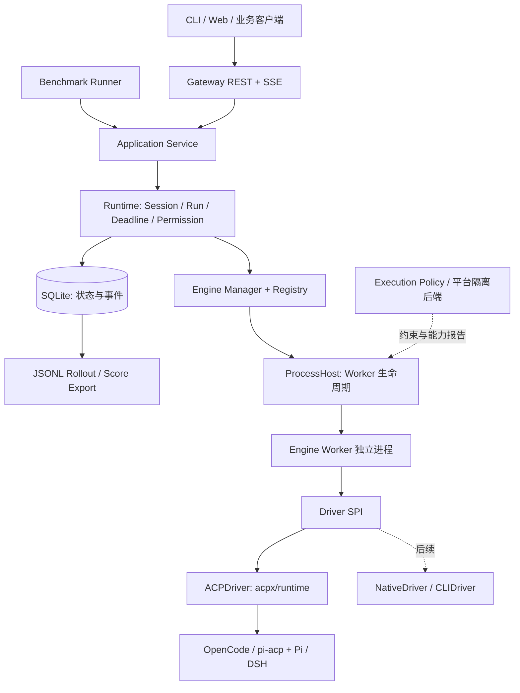

# HarnessHub 源码阅读与技术选型讨论稿

日期：2026-09-05。状态：源码调研记录；第 10 节三个决定已确认并整理为 [DESIGN.md](DESIGN.md)，尚未实施。本文其他建议与快照作为研究依据，实施约束以设计基线为准。

本轮先完整阅读原设计，再按第 11 节顺序阅读 agent-guide/agent-gateway → ACP TypeScript SDK → ACP Registry → acpx → OpenClaw → DSH 的关键源码；第 9 节剩余三个项目作为补充参考。没有安装或运行候选 Harness，没有做 Windows 实机验收。源码使用单独的临时 checkout，未改动原设计或现有 DSH 开发目录。

用户已确认：Gateway 接口规范尚无，先按通用接口设计。因此本文的 API 是 HarnessHub 候选公共契约；赛题适配、评分规则、模型限制、网络权限及发布要求以后单独核实。原设计中的技术建议按待评估方案处理。

## 1. 初步结论

建议主体采用 **TypeScript + Node.js 24 LTS + Fastify，ACP 后端复用 acpx/runtime，业务状态使用 SQLite，Rollout 导出 JSONL**。

最需要补强的是执行所有权：Gateway 管理公共 Session、Run、期限、权限决定和最终状态；本地 Engine Worker 承载 Harness 及 Adapter；Driver 隐藏 ACP、SDK、CLI 的差异。Worker 作为独立进程懒启动、按需回收，第一版同一 Session 串行执行。

保留原设计的 Gateway → Engine Manager → Driver 思路，调整三处：

1. `run()` 返回带事件、结果和取消入口的 RunHandle，不能仅返回事件迭代器。
2. 持久状态和终态从第一条链路开始实现，Cancel、Timeout、Cleanup 同期验收。
3. Windows 运行支持、进程监督、文件写限制、读取与网络隔离分别声明和验证。

## 2. 按阅读顺序得到的源码结论

### 2.1 agent-guide/agent-gateway：借公共运行契约和生命周期边界

当前代码已经调整了原设计列出的目录：公共运行抽象在 `pkg/agent/runtime`，ACP 进程池和会话管理在 `pkg/acp/host`。`agentspi` 与 `transport` 仍存在。公共 Backend 暴露能力和执行入口；Session 查询、权限处理和取消通过可选接口扩展。

公共层分配 Run ID 和事件序号；ACP host 管进程与原生会话。精确 Run 取消独立于会话关闭。配置变更后旧实例按指纹退休，避免正在启动的旧配置重新进入池。这些是可借鉴的所有权边界；MVP 不必照搬其配置发布和控制面规模。

来源：[架构说明](https://github.com/agent-guide/agent-gateway/blob/aa82f307de0293409045ec0fea8ec32842d3ff09/docs/architecture/acp-architecture.md)、[公共契约](https://github.com/agent-guide/agent-gateway/blob/aa82f307de0293409045ec0fea8ec32842d3ff09/pkg/agent/runtime/types.go)、[事件排序](https://github.com/agent-guide/agent-gateway/blob/aa82f307de0293409045ec0fea8ec32842d3ff09/pkg/agent/runtime/events.go)、[Run 取消](https://github.com/agent-guide/agent-gateway/blob/aa82f307de0293409045ec0fea8ec32842d3ff09/pkg/acp/host/runs.go)。

### 2.2 ACP SDK：协议统一，不代表所有能力相同

核实 SDK 主入口仍为稳定 ACP v1，v2 需显式 experimental 导入。当前 SDK 包版本 1.4.0 与协议版本 1 是两个概念。

重点源码涵盖客户端连接、NDJSON stdio、initialize、session/new/load/resume/prompt/cancel/update、权限请求。HarnessHub 是 ACP Client；Harness 或 Adapter 是 ACP Agent。文件、terminal 等客户端能力也可能在 HarnessHub 一侧执行，不能把 ACP 理解成纯单向输出流。

`loadSession`、恢复、模型配置、图像输入等要按协商结果处理；“配置里写了 true”不能证明能力存在。优先复用 acpx，只有确实需要直接接线或补充能力时才使用 SDK，不维护第二套 JSON-RPC。

来源：[SDK 发布入口](https://github.com/agentclientprotocol/typescript-sdk/blob/5e2cfcabb5303dc93c093da788b68460b9958526/package.json)、[客户端示例](https://github.com/agentclientprotocol/typescript-sdk/blob/5e2cfcabb5303dc93c093da788b68460b9958526/src/examples/client.ts)、[SDK 连接与会话 API](https://github.com/agentclientprotocol/typescript-sdk/blob/5e2cfcabb5303dc93c093da788b68460b9958526/src/acp.ts)。

### 2.3 ACP Registry：安装描述与运行能力分开

官方 Registry 用 `distribution.binary / npx / uvx` 描述分发，binary 的平台项包含 `archive / sha256 / cmd / args / env`，不是所有项目都统一用一个顶层 command。Schema 适合借鉴 Agent ID、版本、来源、平台及完整性字段。

HarnessHub 建议保留两层：外部 Catalog 描述软件来源；本地 EngineProfile 描述安装后绝对 executable、argv、工作目录、模型路由、权限策略和 Driver。安装解析发生在准备阶段，执行任务时使用已固定的产物。

另存三种能力事实：静态期望、运行时协商、平台实测结果。官方 Registry 是带认证要求的 curated list，不是所有可用 Harness 的完整集合。

来源：[格式](https://github.com/agentclientprotocol/registry/blob/a361be05a627a54b318b9e25838e484bbbc8c5d8/FORMAT.md)、[Schema](https://github.com/agentclientprotocol/registry/blob/a361be05a627a54b318b9e25838e484bbbc8c5d8/agent.schema.json)、[Registry 范围](https://github.com/agentclientprotocol/registry/blob/a361be05a627a54b318b9e25838e484bbbc8c5d8/README.md)。

### 2.4 acpx：可以直接嵌入，但必须包装执行语义

当前已发布 `acpx@0.13.2`，公开导出 `acpx/runtime`，要求 Node >=22.13.0。公开入口包括 `createAcpRuntime`、`createAgentRegistry`、`createFileSessionStore`；主流程是 `ensureSession` → `startTurn`。它仍处于 1.0 之前，建议锁定精确依赖并维护 Driver 契约测试。

关键发现：

- `startTurn().events` 不承载最终 done/error；`result` 才是最终结果入口，并等待持久化与复用或关闭的清理尝试结束。`runTurn()` 是兼容旧终态事件形式的包装。
- `closeStream()` 只关闭事件消费，不等同取消执行。Gateway 的 SSE 客户端断开不能直接决定 Run 结束。
- Prompt RPC 超时后，如果会话已出现 Agent 回复，`prompt-turn.ts` 可能返回 `end_turn`。因此评测 deadline 必须由 HarnessHub 外层掌握，超时不能被映射成正常完成。
- 公共配置支持 Store、Registry、权限策略、MCP 与权限回调，未提供生产级 ProcessHost / filesystem / terminal / sandbox 注入点。Agent 进程、ACP terminal 和文件操作由 acpx 内部实现拥有。
- 公共权限回调对应 Agent 的 permission 请求；不能直接推导它统一拦截全部 fs/terminal 操作。交互审批覆盖范围需通过 Adapter 验证。
- `sessionOptions.env` 会持久化，且子进程环境为合并策略。凭证通过 Worker 启动时的受控环境提供，持久记录只保存 credential reference。
- `getCapabilities()` 的公共摘要主要覆盖 runtime controls/config option keys，不能直接代替 HarnessHub 完整的能力矩阵。

来源：[入口与工厂](https://github.com/openclaw/acpx/blob/9ace84727fc219fd15ccec84963af14536efd275/src/runtime.ts)、[Turn 和配置契约](https://github.com/openclaw/acpx/blob/9ace84727fc219fd15ccec84963af14536efd275/src/runtime/public/contract.ts#L298-L369)、[超时行为](https://github.com/openclaw/acpx/blob/9ace84727fc219fd15ccec84963af14536efd275/src/runtime/engine/prompt-turn.ts#L60-L78)、[客户端执行实现](https://github.com/openclaw/acpx/blob/9ace84727fc219fd15ccec84963af14536efd275/src/acp/client.ts)、[会话选项持久化](https://github.com/openclaw/acpx/blob/9ace84727fc219fd15ccec84963af14536efd275/src/runtime/engine/session-options.ts)。

### 2.5 OpenClaw：借包装层，特别是期限与进程归属

`extensions/acpx/src/runtime.ts` 确实从 `acpx/runtime` 导入实现，上层增加会话命名与归属、模型处理、进程 lease 和清理。Runtime backend 可注册，service 负责创建、探测、发布及撤回。

OpenClaw 显式关闭 acpx 的 turn timeout，自己管理 deadline；注释给出的原因正是“部分输出后超时可能被 acpx 视为完成”。这印证 HarnessHub 需要自己定义执行结果。

lease 保存 gateway/session、PID、命令散列等归属证据，避免误清理其他进程。但该 `process-reaper.ts` 的 Windows 分支明确返回 `unsupported-platform`，不能照搬后宣称 Windows 进程树治理已完成。当前 OpenClaw 固定 acpx 0.13.1，而本轮独立查看的是 0.13.2，二者需分别记版本。

来源：[Runtime 包装](https://github.com/openclaw/openclaw/blob/bfbf880320bf77ecaaa43690a437c0f90c32510c/extensions/acpx/src/runtime.ts)、[服务组合](https://github.com/openclaw/openclaw/blob/bfbf880320bf77ecaaa43690a437c0f90c32510c/extensions/acpx/src/service.ts)、[进程归属记录](https://github.com/openclaw/openclaw/blob/bfbf880320bf77ecaaa43690a437c0f90c32510c/extensions/acpx/src/process-lease.ts)、[Windows 清理限制](https://github.com/openclaw/openclaw/blob/bfbf880320bf77ecaaa43690a437c0f90c32510c/extensions/acpx/src/process-reaper.ts#L345-L360)。

### 2.6 DSH：借能力接口和真实 Windows 边界

DSH 将 subprocess、shell、sandbox、fs、approval、session persistence 等服务分开，调用方依赖能力接口，实现和生命周期由组合层提供。HarnessHub 可以使用普通 TypeScript interface 和组合根表达这些边界，首版不需要引入整个 Cordis 插件系统。

Session 是追加事件日志，模型消息由日志派生，持久化是独立服务。尤其值得借鉴 `session/flush` 的等待语义，以及崩溃恢复时把无法证明完成的工具记录为 outcome unknown，而非自动重放有副作用的工作。

原设计的 `examples/acp-agent` 已不在当前树中；当前实现位于 `packages/acp/acp`，以 `dsh --profile acp` 的 profile 方式组合。它使用 `session/resume` 恢复，并支持 list/close；不提供 `session/load` transcript replay。说明“恢复会话”“回放轨迹”“重新加载 transcript”必须分开建模。

Windows 方面：

- PowerShell 执行器处理路径选择、非交互参数、UTF-8 和 argv；这属于 shell 能力，不自动改变外部 Harness 自带工具的 shell。
- Windows ACL 后端通过 Node + Koffi 调用 restricted token / NTFS ACL，主要提供写限制，固定报告 `partial`；读取、网络及进程可见性没有隔离。
- sandbox runner 的 inherited-stdio 路径用 Job Object；默认 piped spawn 和普通 subprocess 路径不能泛化成同样的监督保证。
- confined Node/libuv 子进程继续以 pipe 启动孙进程存在 EPERM 限制，read-only 模式也可能改变 PowerShell language mode。不能未经兼容性验证把整个 acpx/Agent 树套在此 runner 下。

来源：[能力接口图谱](https://github.com/deepseek-ai/deepseek-harness/blob/d347e703908d0406b7a7ef80e3a0e594d86b2215/docs/capability-seams.md)、[Session 实现](https://github.com/deepseek-ai/deepseek-harness/blob/d347e703908d0406b7a7ef80e3a0e594d86b2215/packages/core/session/src/index.ts)、[恢复修复](https://github.com/deepseek-ai/deepseek-harness/blob/d347e703908d0406b7a7ef80e3a0e594d86b2215/packages/core/session/src/repair.ts)、[ACP 契约](https://github.com/deepseek-ai/deepseek-harness/blob/d347e703908d0406b7a7ef80e3a0e594d86b2215/packages/acp/acp/README.md)、[Windows ACL 限制](https://github.com/deepseek-ai/deepseek-harness/blob/d347e703908d0406b7a7ef80e3a0e594d86b2215/packages/sandbox/sandbox-windows-acl/README.md)。

### 2.7 agentgateway/agentgateway：借 Route / Backend / Policy 边界

补充阅读的顺序为 agentgateway → codex-acp → claude-agent-acp。agentgateway 的 Rust 数据面将 Route 的匹配和后端引用，与 Backend 的 TLS、认证、协议策略分开；策略又分 Frontend / Traffic / Backend 范围，有明确继承和 override 规则。

可借鉴配置归属与策略合并方式。它的代理会话亲和性不等于 Agent Session 恢复；本轮没有发现需要把完整代理数据面引入 HarnessHub MVP 的理由。

来源：[Route](https://github.com/agentgateway/agentgateway/blob/748b38b25d6e8c981c42e40b5e808d84c483c1bf/crates/agentgateway/src/types/agent.rs#L802-L827)、[Backend policy](https://github.com/agentgateway/agentgateway/blob/748b38b25d6e8c981c42e40b5e808d84c483c1bf/crates/agentgateway/src/store/binds.rs#L249-L310)、[策略继承](https://github.com/agentgateway/agentgateway/blob/748b38b25d6e8c981c42e40b5e808d84c483c1bf/crates/agentgateway/src/store/policy.rs#L272-L285)。

### 2.8 codex-acp：Adapter 负责两套生命周期的翻译

当前 checkout 包版本 1.10.0。TypeScript Adapter 启动 Codex app-server 子进程，用 thread/start 建会话，将 turn、item、文本、工具、usage 和权限事件转换成 ACP。turn 完成事件会在发送请求前订阅，以避免完成早于响应的竞态；取消也要等待原生 turn 状态收敛。

有明确被忽略的 app-server 事件，所以 ACP 提供统一可观察表面，并不保证暴露 Harness 所有内部功能。Windows 有 spawn 分支和运行库缺失诊断，但本轮未实测。适合使用现成 Adapter，并记录其与 Harness 各自版本。

来源：[进程启动](https://github.com/agentclientprotocol/codex-acp/blob/061f9a4a2e463a220d7a3ab2ae5e9732837085ef/src/CodexJsonRpcConnection.ts#L15-L42)、[Turn 时序](https://github.com/agentclientprotocol/codex-acp/blob/061f9a4a2e463a220d7a3ab2ae5e9732837085ef/src/CodexAppServerClient.ts#L289-L313)、[事件翻译](https://github.com/agentclientprotocol/codex-acp/blob/061f9a4a2e463a220d7a3ab2ae5e9732837085ef/src/CodexEventHandler.ts#L453-L612)、[权限翻译](https://github.com/agentclientprotocol/codex-acp/blob/061f9a4a2e463a220d7a3ab2ae5e9732837085ef/src/permissions/CodexApprovalHandler.ts#L40-L111)。

### 2.9 claude-agent-acp：SDK 接入也包含进程和持续事件所有权

当前 checkout 包版本 0.74.0、Node >=22、Claude SDK 0.3.257。它通过 SDK 启动平台对应的 Claude native binary；Windows 分发包含可选的 x64/arm64 包，不能漏装平台 optional dependencies。

每个 Session 持有持续的 SDK stream consumer，覆盖两个 prompt 之间的事件。权限可能先于工具流到达，Adapter 会补发 tool_call 并去重，同时处理审批等待期间的取消。这支持“完整复用 Adapter”的判断，也说明公共事件需要稳定关联 ID，不能靠出现顺序猜测归属。

来源：[依赖](https://github.com/agentclientprotocol/claude-agent-acp/blob/f74a51758dc42896addbcdaf7611a29ec1d1db17/package.json#L67-L77)、[平台程序解析](https://github.com/agentclientprotocol/claude-agent-acp/blob/f74a51758dc42896addbcdaf7611a29ec1d1db17/src/acp-agent.ts#L1350-L1388)、[持续流消费](https://github.com/agentclientprotocol/claude-agent-acp/blob/f74a51758dc42896addbcdaf7611a29ec1d1db17/src/acp-agent.ts#L2995-L3018)、[权限时序](https://github.com/agentclientprotocol/claude-agent-acp/blob/f74a51758dc42896addbcdaf7611a29ec1d1db17/src/acp-agent.ts#L6719-L6760)。

## 3. 技术栈与语言候选

| 层 | 建议 | 选择依据与限制 |
|---|---|---|
| 核心语言 | TypeScript，strict + ESM | 与 acpx、ACP SDK 直接组合；异步事件和判别联合适合 Driver 契约 |
| 运行时 | Node.js 24 LTS，固定 patch | acpx 的 Node 版本范围覆盖；Node 24 的构建文档列出 Windows 10 x64 支持，Harness 仍各自验收 |
| Gateway | Fastify 5 | 路由、schema 校验、日志、生命周期钩子足够；HTTP 层保持薄 |
| 对外通信 | REST + SSE，OpenAPI 描述 | 创建与控制走 REST，执行事件走可重连 SSE；未来赛题增加 ingress adapter |
| ACP | acpx/runtime；SDK 1.4.x / ACP v1 | 第一个具体 Driver；固定具体版本后验证，不跟随 latest 自动变化 |
| 输入校验 | JSON Schema / Ajv，与 Fastify 共用边界 schema | TypeScript 编译期类型不能替代外部输入与 IPC 校验 |
| Registry | YAML/JSON + 内存快照 | 静态配置足够；Runtime 探测信息单独保存 |
| 持久化 | SQLite + 文件产物 | SQLite 保存公共业务状态与规范化事件；JSONL 是可重复生成的导出 |
| DB 访问 | 优先小型 Store + node:sqlite | Node 24.15+ 将其列为 release candidate，仍须锁版本；若不接受该稳定性级别，再评估 better-sqlite3 的 Windows 分发成本 |
| Worker | Node 子进程 + 有版本的 IPC | 可隔离环境、回收执行进程；OS 权限隔离需额外后端，进程分离本身不提供 sandbox |
| 测试 | 契约测试 + 真引擎验收 + Windows 原生测试 | 验证替换语义与进程行为，不能只依赖 Mock |
| Benchmark | Node CLI 调同一执行服务 | 避免评测走另一套执行实现 |
| 可视界面 | 后续薄 Web 控制台 | 复用 REST/SSE；首轮先确定运行契约和验收页面需求 |

语言取舍：Go 可以构建优秀的 Gateway，但若仍复用 acpx，需要额外 Node 服务边界；当前收益不足以抵消双语言工程成本。Rust 的代理吞吐优势不是此阶段主要瓶颈，可留给明确需要的 Windows helper。Python 可用于后续任务评判器，但不必成为 Gateway 主语言。这些是基于复用路线的工程判断，不是通用性能排名。

来源：[Node LTS 状态](https://nodejs.org/en/about/previous-releases)、[Node 24 平台支持](https://github.com/nodejs/node/blob/v24.x/BUILDING.md)、[node:sqlite 稳定性](https://nodejs.org/docs/latest-v24.x/api/sqlite.html)、[Fastify 服务配置](https://fastify.dev/docs/latest/Reference/Server/)。

## 4. 建议的模块与进程结构



Gateway 父进程是公共状态的唯一写入者，Worker 只通过 IPC 上报候选事件、结果和权限请求。acpx 自己的 Store 保存不透明恢复材料，不能反向成为 HarnessHub Run 状态的权威。

每个 Session 绑定 engine profile revision 和 backend session handle。模型变更是否支持通过能力接口表达；每个 Run 固定实际模型和权限快照。`AGENT_ENGINE` 是新 Session 的默认引擎；通用 API 可显式选择 Engine，已有 Session 不被隐式迁移。

Worker 懒启动、空闲回收、受全局及每 Engine 并发数约束。恢复失败必须明确报告，不静默换成空会话。第一版先实现本机监督，不扩展分布式调度。

## 5. 核心契约需要增加的内容

以下是设计伪代码，不可直接运行，类型细节在实现阶段定义；这些类型归 HarnessHub 所有。

```ts
interface HarnessDriver {
  inspect(profile: EngineProfile): Promise<EngineInspection>;
  open(input: OpenSessionInput): Promise<DriverSession>;
  startRun(session: DriverSession, input: RunInput): DriverRun;
  close(session: DriverSession): Promise<CloseEvidence>;
}

interface DriverRun {
  readonly events: AsyncIterable<DriverEvent>;
  readonly result: Promise<DriverResult>;
  cancel(reason: CancelReason): Promise<CancelAcknowledgement>;
  respondPermission(decision: PermissionDecision): Promise<void>;
}
```

约束：

- `DriverResult` 提供后端停止原因、退出证据、产物和 usage；公共 Runtime 结合 deadline、取消与清理结果判定 RunResult。
- `completed` 只表示正常结束；任务是否做对由独立 Evaluation 判定。取消被接收与进程已停止使用不同状态。
- Session 内串行；取消绑定 Run ID 和 execution generation，防止迟到取消影响下一轮。
- 权限使用 requestId、runId、toolCallId、允许选项、有效期。重复相同决定可幂等返回，冲突或过期返回明确错误。
- `REASONING`、usage、Plan、图像等为可选能力；没有报告时表示 unknown，不伪造为零或完整轨迹。
- 原生 SDK 或 CLI 不具备恢复、工具细节或交互权限时，明确标记不支持。

建议状态：`queued → starting → running ↔ waiting_permission → finalizing → completed/failed/cancelled/timed_out/interrupted`；取消时进入 `cancelling` 后再清理。终态互斥，状态变更与唯一终止事件事务提交。另存 `cleanupStatus`：已确认、未确认或失败，避免“超时”被误解为“已经清干净”。

采用接收请求时开始计时的总 deadline，覆盖排队、启动和执行；可另设 queue/setup/permission 上限以帮助诊断。清理 grace 独立记录。评测同时保留执行耗时与总耗时。超时或取消后不接纳晚到事件去改写既定结果，晚到诊断可进入单独的清理记录。

## 6. 通用 Gateway API 候选

| 接口 | 职责 |
|---|---|
| `GET /v1/engines` | 引擎配置、可用性及能力摘要 |
| `POST /v1/sessions` | 选择 Engine/Profile、Workspace，创建 Session |
| `GET /v1/sessions/:id` | 读取公共会话与后端恢复状态 |
| `POST /v1/sessions/:id/close` | 关闭会话执行资源，保留可查历史 |
| `POST /v1/sessions/:id/runs` | 提交一次执行，返回 202 + Run ID |
| `GET /v1/runs/:id` | 状态、结果、usage、产物引用 |
| `GET /v1/runs/:id/events` | SSE，按 Run 内递增 seq 重放并追踪 |
| `POST /v1/runs/:id/cancel` | 幂等请求取消，返回当前进度 |
| `POST /v1/permissions/:id/decision` | 对某个有效权限请求提交选项 |
| `GET /v1/artifacts/:id` | 读取登记的文件、截图或其他输出 |
| `GET /health/live`、`GET /health/ready` | 进程存活与服务准备状态，具体 Engine 健康另报 |

运行输入先支持有序文本与 artifact references，保留 image/resource 的内容块结构。请求只引用服务端允许的 Engine/Workspace，公开 API 不直接接受任意 executable 或凭证文本。

Run 创建支持 Idempotency-Key：同 key + 同输入返回同一 Run，不重复执行；同 key + 不同输入报冲突。SSE 的 event id 使用 Run 内 seq，支持 Last-Event-ID/afterSeq；断开订阅默认不取消执行。公共错误码区分无效输入、Engine 不可用、不支持能力、审批过期、超时和后端异常。

默认面向本机可信使用；如果开放到网络，增加认证及 Session/Run 所有权校验。比赛协议后来若要求同步返回或其他字段，仅由入口适配器转换，执行服务保持一致。

## 7. 存储、事件与恢复

推荐核心表：`sessions`、`runs`、`events`、`permissions`、`artifacts`，后续增加 `benchmark_attempts`、`evaluations`。Engine 配置使用独立文件，但每次执行保存解析后的非敏感版本快照及配置 hash。

事件最小信封：`schemaVersion / eventId / sessionId / runId / seq / occurredAt / observedAt / type / data`。message/tool/permission 各自保留关联 ID。Driver 规范化事件，父进程分配公共 seq 并写库，提交后才供 SSE 查询与推送。

SQLite 是公共事实源，JSONL 从已提交 events 导出；无需首版同时解决 SQLite 与追加文件的跨介质原子双写。大输出和二进制存文件，以 hash、大小、mediaType、路径引用登记。acpx 的事件日志可能位于它自己的默认 home 路径，需在 Worker profile 隔离并明确 retention，不能把 `stateDir` 等同所有轨迹路径。

事件接收与 HTTP 订阅解耦；慢客户端通过持久游标追赶，不能用无界内存队列拖住执行。事件写入失败应中止或明确失败，不继续把缺失轨迹的执行标为完整可评测。SQLite 写入由单一 Store 串行处理，限制每批规模；同步 API 的阻塞时间需要测量，必要时把存储操作移至专门线程，避免拖延父进程的取消与 deadline 调度。

父进程重启后，先检查 Worker 与进程归属，再将没有明确终态的 Run 标记为 interrupted/待核实清理。第一版不自动重放有副作用的工具；恢复后端 Session 和重新执行 Run 是两个不同操作。

## 8. Windows 与发布策略

ProcessHost 直接负责 Worker 启动边界的 exact argv、cwd、允许的 env、stdio、进程归属和升级终止。Agent、MCP、工具后代进程的治理依赖经过验证的进程树机制；acpx 内部 spawn 参数没有现成的统一注入点。PowerShell 脚本仅是启动便利入口；ACP 子进程优先直接 executable + argv，不让模型文本经过额外 shell 拼接。

对进程树清理，研究 Job Object 或受控 launcher；先验证 Worker/Agent/MCP 的整条树，再决定 Windows helper 的实现方式。对 sandbox，显式记录 `none / partial / full` 及更具体的 filesystem/network/process 能力。父子进程分离、Job Object、ACL 写保护各自解决不同问题。

需要 Windows 实测的最小集合：中文及带空格路径、PowerShell/cmd 差异、流式 stdio、Agent 再启动 MCP/工具、排队和启动中取消、执行中取消、强制结束后的孙进程、Worker 崩溃、重启恢复、文件产物完整性。

若任务包含 GUI/桌面交互，应为评测 attempt 提供独立或重置后的桌面环境；只换 cwd 不足以隔离浏览器状态、系统设置和全局资源。具体环境由任务能力需求决定。

首版候选发布物为平台 ZIP：固定 Node runtime、已编译 JS、经过准备的 Engine/Adapter、启动脚本、配置与版本清单。先验证可重复启动，再评估单 executable 或安装器；“Windows 可运行”也需要明确哪些依赖预装或随包携带。

## 9. 功能实施顺序建议

| 阶段 | 主要功能 | 验收标准 |
|---|---|---|
| A：契约与假引擎 | Session/Run/事件状态机、Store、REST/SSE、取消与权限 | 可创建、观察、断线重放；终态一致；重复提交不重复执行 |
| B：第一个真实引擎 | OpenCode ACP、Worker、外层 deadline、产物、诊断 | 真任务执行；取消/超时/崩溃后有可查结果；Windows 原生启动与清理 |
| C：第二个真实引擎 | Pi 经 pi-acp，共用 ACPDriver | Gateway 不改，执行同一套契约验收；能力差异如实呈现 |
| D：DSH 与恢复补强 | DSH profile、模型选择、resume/close、权限差异 | 能恢复支持恢复的 Session，拒绝不支持的操作，无静默丢历史 |
| E：Benchmark | Task × Engine × Model × Attempt，环境准备、Evaluator、导出 | 重复可复现，失败可归因，有单引擎成绩和组合覆盖 |

OpenCode + Pi 是首组候选，依据现成入口和复用成本；本轮没有比较两者真实任务得分。它们只证明“不同 Harness 共用 ACPDriver”，NativeDriver/CLIDriver 要在出现具体接入对象时再实现。Hermes 保留候选位置，尚未在本轮深入阅读或验证。

Benchmark 记录 task/dataset/evaluator 版本、Harness/Adapter/Runtime 版本、实际模型、预算、工具和权限、环境快照、attempt ID、耗时与失败类型。每个 attempt 重新准备环境；调用同一 Application Service。

“每题取各引擎最高分”可作为离线组合覆盖指标，暂命名为 best-of-engines。它依赖事后评分，不能解释为在线自动选出最佳引擎；提交规则、额外尝试次数及总成本仍待赛题原文核实。

## 10. 已确认的三个决定

用户回复“三个决定都听你的”，采用以下推荐方案：

1. **运行形态**：Gateway + 本地独立 Worker，支持多 Session，同一 Session 串行；Worker 懒启动，按后端恢复能力回收。
2. **数据边界**：MVP 即以 SQLite 保存公共状态和事件；Gateway 为唯一业务写入者，JSONL 仅导出。
3. **首批引擎**：先 OpenCode，再 Pi（pi-acp），共用 ACPDriver 跑通执行/取消/审批/轨迹；随后接 DSH。

对应职责、生命周期和实施验收见 [正式设计基线](DESIGN.md)。这些是已确认的设计选择，不代表能力已完成或平台已验证。

通用 Gateway 管到 Harness 生命周期和执行结果。工具编排通常由 Harness 拥有；ACP Client 提供的文件、terminal 等执行能力可能由 Worker 内的 acpx 承载，审批覆盖须按具体路径验证。后续确需统一工具，再以 MCP 或明确的能力接口接入。GUI/browser/coding 任务覆盖、跨引擎协作和自动选路分别立项，不由 ACP 兼容性自动保证。

## 11. 主阅读源码快照

| 仓库 | 本轮固定提交 |
|---|---|
| agent-guide/agent-gateway | `aa82f307de0293409045ec0fea8ec32842d3ff09` |
| agentclientprotocol/typescript-sdk | `5e2cfcabb5303dc93c093da788b68460b9958526` |
| agentclientprotocol/registry | `a361be05a627a54b318b9e25838e484bbbc8c5d8` |
| openclaw/acpx | `9ace84727fc219fd15ccec84963af14536efd275` |
| openclaw/openclaw | `bfbf880320bf77ecaaa43690a437c0f90c32510c` |
| deepseek-ai/deepseek-harness | `d347e703908d0406b7a7ef80e3a0e594d86b2215` |
| agentgateway/agentgateway | `748b38b25d6e8c981c42e40b5e808d84c483c1bf` |
| agentclientprotocol/codex-acp | `061f9a4a2e463a220d7a3ab2ae5e9732837085ef` |
| agentclientprotocol/claude-agent-acp | `f74a51758dc42896addbcdaf7611a29ec1d1db17` |

checkout 位于 `/tmp/harnesshub-source-review-20260905/`，可能被系统清理；上方 GitHub 固定提交链接是长期复核入口。版本信息已核对源码和相关 npm 元数据，但尚未运行兼容性测试。
