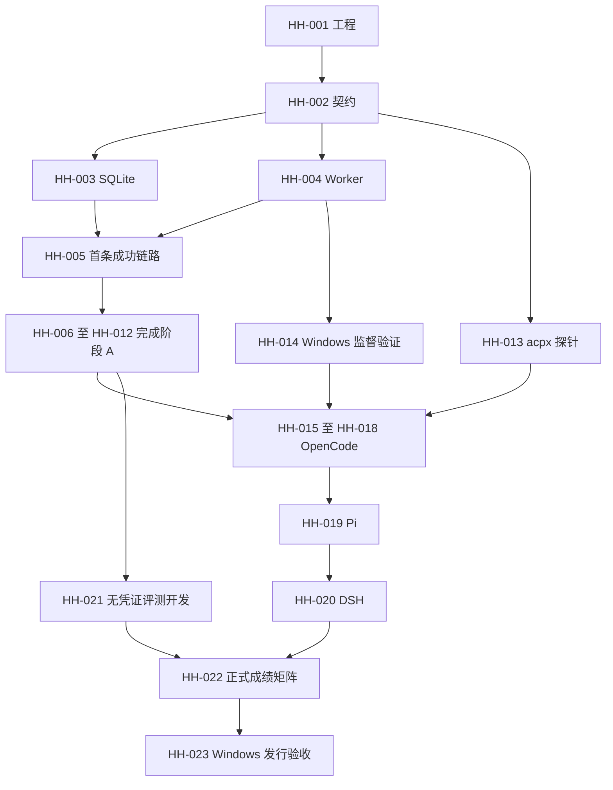

# HarnessHub 开发任务

更新：2026-09-07。阶段 A（HH-001～HH-012）、HH-013/HH-015 及既有 macOS 引擎证据保留。Windows 11 ARM64 原生环境已可直接开发；已补入发现、脚本启动、Job 监督/恢复、文件 ACL/锁与 DPAPI。Codex 的真实文本、只读工具和流式取消已通过；历史范围见 [Windows 验收](docs/verification/2026-09-06-windows.md)。上一轮 11 个引擎通过 DeepSeek V4 Flash 短任务，最新检查、工具与发行进展见 [便携引擎验收](docs/verification/2026-09-06-portable-engines.md)。其余平台范围见 [Windows 指南](docs/windows.md)，不以单个引擎通过代替全部发行验收。

本文件拥有任务依赖、优先级和进度；架构契约由 [DESIGN.md](DESIGN.md)拥有，开发与验收按 [AGENTS.md](AGENTS.md)及 [测试要求](docs/testing.md)执行。任务勾选不改变架构，也不代替证据。

## 使用方式

每项任务有固定 ID、前置任务、修改范围、交付和验收。`[ ]` 表示未验收，内部状态可记待开始、进行中、待验收或受阻；只有验收满足且附提交/文件和证据位置后才改为 `[x]`。受阻写明实际缺少的条件，独立任务继续推进。

P0 是首批双引擎 MVP 的关键能力或早期风险验证；P1 是随后扩展、评测与发行。优先级不能跳过依赖。每项可包含几个小提交，跨模块契约、迁移和组合入口由指定负责人串行合入，不用一次大改完成整个阶段。

开始任务时记录实际负责人和当前版本；完成时更新本条状态与证据，不另维护重复进度表。所有功能任务都包含相关测试和所属文档，阶段验收只负责组合验证，不把测试推迟到阶段末尾。

## 已具备的开发基础

- [x] 已确定独立 Worker、SQLite 公共状态及 OpenCode → Pi → DSH 接入顺序，见 [设计基线](DESIGN.md#1-已确认的三个决定)。
- [x] 已建立开发、测试、文档规范及模板，见 [文档索引](docs/README.md)。
- [x] 已建立零依赖文档检查及拒绝样例测试，见 [验收记录](docs/verification/2026-09-05-development-rules.md)。该证据不包含业务或 Windows 能力。

## 里程碑与执行顺序

| 里程碑 | 任务 | 可观察交付 |
|---|---|---|
| 工程准备 | HH-001～HH-002 | 固定工具链、可检查的模块结构与首条链路契约 |
| 首条成功链路 | HH-003～HH-005 | 编译后的 Gateway → 真 SQLite → 真 Worker/IPC → 假引擎 → SSE/结果查询 |
| 阶段 A | HH-006～HH-012 | 队列、取消、期限、权限、恢复、产物和导出全部经假引擎组合验收 |
| 提前排查风险 | HH-013～HH-014 | 与阶段 A 并行验证 acpx 和 Windows 监督的实际边界 |
| 阶段 B | HH-015～HH-018 | OpenCode 真任务与恢复；Windows 原生验收 |
| 阶段 C | HH-019 | Pi 经 pi-acp 复用同一个 ACPDriver，证明双引擎可替换 |
| 阶段 D | HH-020 | DSH 接入及其 resume/close 差异验收 |
| 阶段 E | HH-021～HH-022 | 可复查的 attempt、评分、矩阵与离线组合覆盖 |
| 发行验收 | HH-023 | 从准备好的 Windows 发布目录启动并完成产品 smoke |

阶段 A 无需真实模型凭证。HH-013 使用本地可控 ACP 对端先验证 Runtime；真实引擎探针按已提供的运行配置执行。HH-014 缺 Windows 环境时不阻塞 HH-005～HH-012，但 HH-018 不得在缺少原生证据时勾选。

## 阶段 A：先交付可运行的执行服务

### HH-001 工程与工具链基线

- [x] 已验证；P0；前置：无；负责范围：根配置、构建、开发脚本与 CI 基础。

进展：Node24、锁文件离线干净安装/编译、Git基线与CI配置已建立；远端CI未运行。 证据见 [本次执行记录](docs/verification/2026-09-05-runtime-mvp.md)。

交付：初始化可恢复的 Git 基线；固定并核实 Node 24 patch、pnpm 和锁文件；建立 strict ESM、build、typecheck、lint/format 及已有文档检查入口。建立最小 CI 配置与可本地执行的同等检查；远端任务实际运行另附证据。

验收：实际 Node 版本匹配锁定值；干净目录按锁文件安装并编译；plain Node 能加载构建输出；现有文档检查可运行。计划中的业务测试不得用空测试组或恒成功脚本占位。未配置 CI 远端 runner 时只记录本地等效检查，不声称远端通过。

### HH-002 首条链路契约与模块约束

- [x] 契约基线已验证；P0；前置：HH-001；负责范围：`src/domain/`、边界 schema、公开接口说明、导入检查。

进展：领域类型、IPC/HTTP输入与响应schema、OpenAPI和AST边界均已落地；未支持的输入能力明确拒绝。 证据见 [本次执行记录](docs/verification/2026-09-05-runtime-mvp.md)。

交付：定义品牌 ID、Session/Run/结果/事件/权限/能力类型、Store 与 DriverRun/ProcessHost 接口、IPC 版本和 generation、基础 HTTP 请求响应与错误码。建立与边界 schema 共用定义的 OpenAPI 生成方式，公开清单只列实际已实现端点。明确状态转移、提交点、事件序号、取消和 deadline 的仲裁规则；定义本地 EngineProfile/Workspace 最小配置。

验收：schema 有有效/无效样例；封闭状态穷尽处理；事件流和最终结果分开；SDK 类型没有进入公共域。模块依赖检查对故意越界的 import/re-export/type-only import fixture 失败，公开类型与文档字段一致。只定义已规划使用方需要的端口。

### HH-003 SQLite Store 与持久接收

- [x] 已验证；P0；前置：HH-002；负责范围：`src/storage/`、初始迁移与 Store 集成测试。

进展：7项真SQLite测试通过；含事务故障回滚、跨连接终态竞争与重开；1001次事务测量已记录。 证据见 [本次执行记录](docs/verification/2026-09-05-runtime-mvp.md)。

交付：初始 schema、Session/Run 创建、幂等接收、事件追加与查询、终态事务和必要的权限/产物登记接口。公共写入仅由 Gateway Store 拥有，串行写入、批量和积压均有明确上限与背压行为。

验收：真 SQLite 文件覆盖事务回滚、同 key 同输入复用、同 key 不同输入冲突、Run 内 seq、终态及唯一终止事件同事务；重新打开 DB 可读取相同事实。测量指定数据量和批量下同步访问对事件循环的阻塞，验证写入积压有界；必要时在 Store 内隔离阻塞操作。不以内存替身代替事务测试。

### HH-004 Worker、IPC 与可控假引擎

- [x] macOS已验证；P0；前置：HH-002；负责范围：`src/process/`、`src/worker/`、测试专用 Driver 与 fixtures。

进展：真实Worker/IPC、ACK背压、私有环境、权限与ACP本地对端通过；Windows原生能力由HH-014负责。 证据见 [本次执行记录](docs/verification/2026-09-05-runtime-mvp.md)。

交付：正式 Worker 编译入口、启动握手、IPC 校验、进程身份、退出与清理接口；假 Driver 可用 barrier 触发输出、完成、错误、权限、取消和异常退出。使用 HH-002 的最小配置进行显式测试组合，假引擎不成为发布默认引擎。

验收：plain Node 启动真实子进程；错误协议/旧 generation 被拒绝；握手失败不会遗留资源；退出可等待、监听器可释放。开始准备 Windows 测试入口，但尚无原生结果时明确记录未验证。

### HH-005 首条可运行纵向链路

- [x] 已验证；P0；前置：HH-003、HH-004；负责范围：`src/application/`、`src/runtime/` 基础流程、`src/gateway/` 和启动组合根。

进展：正式CLI与HTTP链路、SSE、幂等、产物、重启查询可用，已保留运行中的演示服务。 证据见 [本次执行记录](docs/verification/2026-09-05-runtime-mvp.md)。

交付：组装最小 Runtime 和 Gateway，实现 live/ready、创建与查询 Session、持久接收 Run、执行成功、查询 Run 结果和基本 SSE；仅使用明确登记的测试 Profile。启动与 HTTP 实例复用正式执行服务，已实现路由同步进入 OpenAPI。

验收：通过 HTTP 驱动编译后的 Gateway、真 SQLite 和真 Worker；看到已提交事件及最终结果；SSE 断开不取消 Run；默认绑定本机；无持久接收不能返回 202。记录可复现启动与请求示例。

本任务是最早可演示的成功路径，不代表阶段 A 完成，不对尚未接入的取消/恢复能力作完成声明。

### HH-006 Profile、Workspace、会话队列与并发

- [x] 已验证；P0；前置：HH-005；负责范围：`src/engine/`、Runtime 调度、Session 应用服务。

进展：不可变Profile、Session/Run安全配置快照、声明/观测/验证能力分层、FIFO、并发、队列及常驻Worker容量已实现并通过相关用例。 证据见 [本次执行记录](docs/verification/2026-09-05-runtime-mvp.md)。

交付：YAML/JSON 配置解析与不可变 spec、Engine/Workspace 注册、配置指纹和能力期望、`GET /v1/engines` 查询、`AGENT_ENGINE` 新会话默认选择、Session FIFO、全局及每引擎有限并发。按 Profile 构造环境快照和独立后端目录，接口同步更新 OpenAPI。

验收：未知 Engine/Workspace、无效配置或不支持输入明确失败；既有 Session 不因默认引擎改变而迁移；同 Session 不并发执行、跨 Session 有界并行；排队归属持久可查；凭证不进入配置快照。

### HH-007 取消、deadline 与终态仲裁

- [x] 已验证；P0；前置：HH-006；负责范围：Runtime 生命周期、ProcessHost 终止控制、取消 API。

进展：已覆盖排队/启动/活动取消、期限、同轮完成竞争与迟到结果；清理失败会拒绝握手/结果并隔离资源，不无限等待。 证据见 [本次执行记录](docs/verification/2026-09-05-runtime-mvp.md)。

交付：接收时起算的总 deadline、精确 Run/generation 取消、串行终态仲裁、协议取消到升级终止的控制、cleanupStatus 与待清理资源隔离。

验收：排队/启动/执行中取消、完成与期限竞争、重复取消、迟到完成和旧 generation 控制均有确定性测试；唯一终态和事件一致；取消确认不等于退出；未确认清理的资源不复用；外层期限不能被已有输出掩盖。

### HH-008 权限往返与持久决定

- [x] 已验证；P0；前置：HH-007；负责范围：Runtime 权限管理、Worker 响应桥接、权限 API。

进展：实际optionId、持久决定、Worker确认、重复决定及过期拒绝已验证；应用确认不冒充外部工具执行成功。 证据见 [本次执行记录](docs/verification/2026-09-05-runtime-mvp.md)。

交付：权限请求归属和有效期、实际 optionId 校验、决定事务、下发与后端应用确认、等待期间取消和超时。

验收：先提交决定再发送；重复同决定幂等、冲突/过期拒绝；保存与应用状态分开；权限等待计入总 deadline；取消和重启不向失去归属的请求误发允许决定。

### HH-009 SSE 重连、游标与慢消费者

- [x] 已验证；P0；前置：HH-005；负责范围：Gateway SSE、事件查询适配及独立集成测试。

进展：SSE游标、断流继续、无效游标与慢消费场景通过；暂停SSE不阻止另一Run期限收敛，公共查询和IPC均有界。 证据见 [本次执行记录](docs/verification/2026-09-05-runtime-mvp.md)。

交付：Last-Event-ID/afterSeq、稳定事件 ID、有界批量查询、历史到实时流的衔接及慢订阅者追赶。需要 Store 查询变更时由 HH-003 所有者合入。

验收：重连期间不漏已提交事件；允许重复但客户端可去重；无效/越界游标有定义；读取与订阅切换的竞态不丢事件；慢消费者不会形成无界队列或阻塞执行；终态后流可正确结束。

### HH-010 崩溃恢复、Session close 与 Worker 回收

- [x] macOS已验证；P0；前置：HH-007、HH-008；负责范围：Runtime 恢复、Engine Worker 管理、关闭会话 API。

进展：SQLite Gateway独占owner、死PID原子接管、旧Worker token/命令/PGID核实恢复、未知身份隔离及崩溃后interrupted已验证；真实引擎上下文恢复由HH-017/HH-020验收。 证据见 [本次执行记录](docs/verification/2026-09-05-runtime-mvp.md)。

交付：Gateway 重启核对、Worker 异常退出归因、DB 失败时停止接收和清理、Session close 收敛排队/活动 Run、按恢复能力决定空闲回收。

验收：未知结果记 interrupted，不自动重跑；不清库或创建空会话冒充恢复；close 停止新接收并等待资源结果；不可恢复后端不静默回收；存储故障不虚构已持久化终态；重新启动可查询原 Run。

### HH-011 产物登记、读取与 JSONL 导出

- [x] 已验证文本产物与独立导出；P0；前置：HH-005；负责范围：`src/artifacts/`、`src/rollout/`、产物读取 API 和导出 CLI。

进展：产物登记/hash读取、JSONL重建和compiled导出CLI通过；CLI拒绝覆盖、失败清理半成品；二进制上传与通用文件采集不在当前文本版范围。 证据见 [本次执行记录](docs/verification/2026-09-05-runtime-mvp.md)。

交付：写入完成后校验与登记的文件产物、hash/大小/mediaType、受控读取、从已提交事件生成 JSONL、临时孤儿文件清理。迁移或 Store 接口调整由存储所有者串行合入。

验收：半成品不返回为完成产物；引用不能越过允许目录；导出可从 DB 重建并保留关联 ID/终态；重启后可读取同一产物和 Rollout；不存在第二份独立业务事实源。取消/异常 Run 的组合导出在 HH-012 一并验收。

### HH-012 阶段 A 组合验收

- [x] 阶段A文本版已验证；P0；前置：HH-006、HH-007、HH-008、HH-009、HH-010、HH-011；负责范围：正式入口验收、CI 必需检查和运行文档。

进展：正式入口、控制竞态、DB故障、Worker归属恢复、慢SSE、权限过期、响应契约与独立导出均按新增范围通过；未重复运行未变的整套检查。 证据见 [本次执行记录](docs/verification/2026-09-05-runtime-mvp.md)。

交付：假引擎正式入口验收用例、复现说明及 [验收记录](docs/templates/verification.md)；把本阶段已有类型、边界、单元、集成、构建、文档检查接入统一执行方式与 CI。

验收：提交 → SSE → 权限/取消 → 退出核对 → Gateway 重启 → 查询同一 Run → 产物与 JSONL 导出全部成立；再覆盖完成/取消竞态、DB 故障、Worker 崩溃和慢消费者。按 DESIGN 第 7 节核对 API 路径、错误响应和生成的 OpenAPI 清单；在事件压力下确认写入有界，deadline、取消和 SSE 仍能推进。必需检查没有被空组、skip 或未依赖的 CI 任务掩盖；平台未验证项清楚列出。

## 提前排查：与阶段 A 并行

### HH-013 acpx 公开接口与执行边界探针

- [x] 本地ACP后端已验证；P0；前置：HH-001、HH-002；负责范围：独立 ACP 探针、可复用 fixtures 和接入决策记录。

进展：真实acpx/runtime连接本地SDK对端、双轮复用、精确权限映射、运行时能力/模型信息与私有home日志引用已验证；真实引擎可用性另由HH-016验收。 证据见 [本次执行记录](docs/verification/2026-09-05-runtime-mvp.md)。

交付：固定候选 acpx/SDK 版本，在编译后程序里连接本地可控 ACP 对端，验证 events/result/cancel、权限回调、模型/恢复能力读取以及 stateDir、默认 home 日志和环境传递的实际落点。涉及依赖变更交给工程基线负责人。

验收：证明关闭流与取消的区别；外层 deadline 的方案不会接受部分输出后的虚假完成；凭证不进入持久 sessionOptions/快照/轨迹；明确公共能力不足处及采用的适配方式。Windows/真实模型尚未运行的部分分别记录，不把探针算真实引擎接入完成。

### HH-014 Windows 进程监督可行性

- [x] Windows 11 ARM64 原生监督已验证；P0；前置：HH-004；负责范围：平台探针与 ProcessHost 平台适配。

进展：2026-09-06 直接在 Windows 11 ARM64 完成原生 Job Object helper、Worker 启动归属、取消、CLI 后代收敛、ACP 探测与 Gateway 崩溃恢复；Windows 专用及 Worker-host 12 项全部通过。仅 POSIX 信号注入不用于 Windows；文件/网络/桌面沙箱仍为 unsupported。证据见 [Windows 原生进程验收](docs/verification/2026-09-06-windows-process.md)。Windows 10/x64 尚待各自主机验收。

交付：验证 Worker → 模拟 Agent → MCP/工具子孙进程的启动、stdio、身份和终止；据证据决定 Job Object/受控 launcher 的实现方式。需要新 native helper 时记录实际取舍，不能绕过公共进程接口。

验收：中文/空格路径正常；启动中及执行中取消可收敛整棵树；无关进程不受影响；pipe 和文件句柄可释放；报告监督、读写限制和网络隔离的独立能力。分别记录 Windows 10/11 与架构范围；缺环境只影响本任务和后续 Windows 验收。

## 阶段 B：OpenCode 真实执行

### HH-015 共享 ACPDriver

- [x] 本地协议契约已验证；P0；前置：HH-012、HH-013；负责范围：`src/drivers/acp/`、Worker Driver 组合与契约测试。

进展：共享ACPDriver已复用公开runtime入口；事件、结果、权限与会话双轮验证通过，能力不足明确保守处理；真实OpenCode任务仍待HH-016。 证据见 [本次执行记录](docs/verification/2026-09-05-runtime-mvp.md)。

交付：包装 acpx/runtime，完成 Session handle、事件规范化、结果证据、精确取消、权限响应、能力协商与配置应用；复用探针中有效的 ACP fixtures。

验收：公共 Driver 契约通过；SDK 类型不泄露；原始事件与公共事件关联明确；可选能力不足有稳定错误；公共 Runtime 保持唯一终态裁决者，不为某个引擎加入 Gateway 分支。

### HH-016 OpenCode 真任务纵向链路

- [ ] Mac文件/真实权限已验证，取消/故障与Windows专项仍待补；P0；前置：HH-015；外部条件：固定版本引擎和明确模型/凭证/预算；负责范围：OpenCode Profile、真实引擎用例与运行说明。

进展：macOS OpenCode 1.1.21 经原配置/缓存引用后，Gateway默认opencode/big-pickle任务9.414s通过；新增独立DeepSeek Profile已在10.017s完成CSV/JSON文件任务，两次实际权限均applied；原免费模型429记录保留。取消/故障和Windows专项尚待验收。 证据见 [macOS引擎验收](docs/verification/2026-09-05-macos-engines.md)。

交付：准备固定版本的 OpenCode，经正式 Gateway/Worker 执行可用文件内容或确定评判器验证的任务，产生产物、事件和 Rollout。

验收：真实完成、断流继续、取消、超时、权限相关路径及 Worker 故障均有证据；SQLite 终态与事件一致；产物内容实际核对。可选能力未触发或不支持时记录区别，不把模型回复当任务完成依据。

### HH-017 OpenCode 恢复与回收资格

- [ ] DSH同套机制已先验证，OpenCode恢复仍待专项；P0；前置：HH-016；负责范围：恢复能力验证、Profile 验证记录与通用生命周期用例。

交付：验证同一后端 Session 在新 Worker 中恢复、关闭和空闲回收；把已验证能力提供给通用 Worker 管理策略。

验收：恢复后能证明原上下文延续；失败时明确报错，未恢复的旧 Run 不重跑；不支持恢复时明确禁止自动回收且保留历史；close 的进程和清理状态可复核。该用例集供后续 Pi/DSH 共用。

### HH-018 阶段 B Windows 原生验收

- [ ] 部分完成：Windows 11 ARM64 的公共运行契约与 Codex 已验证，OpenCode 真实恢复仍待专项；P0；前置：HH-014、HH-016、HH-017；负责范围：Windows CI/验收与平台说明。

交付：在声明支持的 Windows 环境执行 OpenCode 真任务与恢复/关闭场景，核对平台能力声明；将可自动执行的部分纳入 Windows 检查。

验收：中文/空格路径、启动及执行取消、MCP/孙进程、stdio drain、文件句柄、SQLite 重启和产物完整性取得原生证据；清理和沙箱分别报告。缺少必要环境、用例或退出证据时阶段 B 保持部分完成。

## 阶段 C 与 D：验证引擎替换和恢复差异

### HH-019 Pi 经 pi-acp 接入并验收

- [ ] Mac文本/文件任务已验证，恢复/取消/Windows仍待补；P0；前置：HH-018；外部条件：固定 Pi/pi-acp 版本和运行配置；负责范围：Pi Profile、兼容适配与同套契约验收。

进展：Pi0.85.0 + pi-acp0.0.33已固定安装，复用现有DeepSeek引用，正式Gateway文本与文件任务均通过；文件任务8.798s、两份产物正确、0残留lease。真实审批未触发，不能冒称全工具覆盖。见 [本轮验收](docs/verification/2026-09-05-file-tasks-and-recovery.md)。

交付：Pi 经现成 pi-acp 使用共享 ACPDriver，记录 Harness 与 Adapter 各自版本和协商/实测能力。测试专用模型/权限配置独立，不能影响 OpenCode 默认配置。

验收：Gateway 业务代码不改；通过与 OpenCode 相同的执行、取消、权限、轨迹、关闭/恢复能力和受影响平台用例；切换新 Session 的 Engine 可实际观察；未支持的可选能力稳定拒绝。此项不证明 Native/CLI Driver 或跨引擎续聊已完成。

### HH-020 DSH 接入与 resume/close 差异

- [ ] Mac文件与严格上下文恢复已验证，异常中断/Windows仍待专项；P1；前置：HH-019；外部条件：固定 DSH 与模型运行配置；负责范围：DSH Profile、必要的薄适配及引擎验收。

进展：已提前按用户指定通过本机DSH现有CLI/profile完成Gateway真实文本任务（deepseek-v4-flash，2.738s）；本轮动态注册后完成了实际文件write任务（3.639s，独立文件hash核对）；本轮补齐正式Gateway idle suspend及重启后同backend ID/nonce恢复；真实权限未触发、执行中异常与Windows差异仍待专项。 证据见 [macOS引擎验收](docs/verification/2026-09-05-macos-engines.md)。

交付：通过 DSH ACP profile 接入，验证模型选择、权限和 `session/resume` / `session/close`；公共历史仍由 HarnessHub 事件查询和导出提供。

验收：新 Worker 恢复原上下文；不把 session/load transcript 当作恢复前提；恢复失败不新建空会话冒充成功；关闭和平台差异有实测证据；不会引入 DSH 内部包对 Gateway 的依赖。

## 阶段 E：评测与发行

### HH-021 Benchmark attempt 与 Evaluator

- [x] Mac文本/普通文件/二进制证据范围已验证；P1；前置：HH-012；负责范围：`src/benchmark/`、必要存储迁移和评判器 fixtures。

进展：正式 CLI 复用 Application/Runtime、独立 attempt/workspace、SQLite 证据与 Evaluation、离线重新评分、提交/评分崩溃窗口与数据污染校验已实现；DSH/OpenCode 两次真实文本 Benchmark 均通过。本轮新增显式outputs、版本化fixtureFiles、JSON结构/二进制hash判分、显式权限策略；DSH/OpenCode/Pi三次同文件题通过。GUI桌面隔离不在当前支持任务集。证据见 [本轮验收](docs/verification/2026-09-05-dynamic-engines.md)。

交付：CLI 通过 Application Service 提交任务；创建独立 attempt、准备/重置环境、登记输入和版本、持久化 Evaluation。先用假引擎与确定评判器开发，正式多引擎验收在 HH-022 完成。

验收：没有第二套 Runtime；completed 但答案错误能评测失败；执行中断和评判器故障分别记录；环境污染和不同 attempt 的产物串用可检测；保存 Run/attempt/评分关联。GUI 任务未具备桌面隔离时不纳入已支持任务集。

### HH-022 成绩矩阵与可复查评测

- [ ] 文件矩阵/模型观测已验证，正式任务集与后端成本信息待补；P1；前置：HH-019、HH-020、HH-021；外部条件：版本化任务集、评判器和运行预算；负责范围：评测汇总、导出和复现说明。

进展：已实现 --report，从持久 attempt/最新评分重建矩阵、按批次和dataset分组、失败归因、重评分次数和事后覆盖率；对真实 DSH/OpenCode 批次生成矩阵，无重复模型调用。缺失实际模型/usage/cost明确为null，未跑任务不假记失败；本轮自动保存启动文件hash/可识别包版本及ACP模型/usage来源；后端未提供的usage/cost仍null。完整后端版本自动采集和比赛任务集仍待补。证据见 [本轮验收](docs/verification/2026-09-05-dynamic-engines.md)。

交付：Task × Engine × Model × Attempt 矩阵、单引擎结果、失败归因、离线 best-of-engines 覆盖和运行成本依据。

验收：模型、工具/权限、预算、环境、引擎各层版本均可追溯；已保存产物可重新评分；缺失 usage 不当作零；组合得分明确为事后指标；重复 attempt 有独立记录。比赛是否采用该评分方式仍以任务书为准。

### HH-023 Windows 发布目录与发行验收

- [ ] Windows 11 ARM64 发布目录构建成功，11 个 DeepSeek 引擎及 6 个 MCP 工具绑定已配置并启动；用户将本轮收尾范围缩为引擎配置，额外发行搬迁、取消、重启和 ZIP 验收待后续；P1；前置：HH-018、HH-019、HH-020、HH-022；负责范围：发布脚本、固定运行时与 16 个引擎模板、免安装工具包、版本清单和启动说明。11 个引擎真实短任务与 6 个 MCP/文件任务证据见 [本轮记录](docs/verification/2026-09-06-portable-engines.md)；未知裁判机和赛题规则不提前标通过。

交付：平台 ZIP/发布目录包含固定 Node、编译 JS、已准备的引擎/Adapter 和启动配置；明确随包及需预装的组件、许可证、数据目录与凭证设置。只提供已验收版本和能力。

验收：从发布产物而非源码入口启动，完成真任务、取消、重启查询、JSONL 和 Benchmark smoke；任务执行期间不下载或更新依赖；清理和产物结果可复核；以目标 OS/架构分别记录，不用开发机结果代替发行验收。

## 用户追加：本机已有引擎连接

### HH-024 macOS 已安装引擎连接与最小任务

- [x] 检查已完成；P0；前置：HH-015；负责范围：本地Profile、官方Adapter、认证目录引用和实际连接证据。

交付：按用户指定验证Codex、Claude Code、OpenCode、OpenClaw、DSH，保留独立workspace和Gateway轨迹，不升级系统CLI、不复制凭证。

验收结果：前四个实际成功引擎为Codex、Claude Code、OpenCode、DSH，均经HarnessHub回复精确标记且工具事件为0；OpenClaw已完成协议检查，但模型OAuth失效，未计作模型通过。四个Gateway Session关闭后lease为0、所属进程组不存在。证据见 [macOS引擎验收](docs/verification/2026-09-05-macos-engines.md)。这不替代复杂任务、上下文恢复或Windows验收。

## 当前优先：动态引擎与 Mac 可运行交付

### HH-025 动态注册、版本归档与配置热加载

- [x] Mac范围已验证；P0；前置：HH-006、HH-024；负责人：主 Agent；范围：Engine Catalog、SQLite、Runtime、API、组合根。

交付：支持空目录启动、运行中新增/替换/禁用/移除引擎和修改默认引擎；配置文件自动重读及手动 reload；无效更新保留最后有效配置。注册与历史 revision 持久化，老 Session 固定原 revision，运行和排队任务不被配置更新迁移。

验收：正式 HTTP 新增后直接执行；更新/移除后旧会话仍用旧版本、新会话使用新版本；重启后动态注册可用；无效热更新不覆盖有效目录。

证据见 [本轮动态引擎验收](docs/verification/2026-09-05-dynamic-engines.md)。

### HH-026 本机发现与开放 manifest

- [x] Mac范围已验证；P0；前置：HH-025；范围：本机发现器、配置样例、API。

交付：按 PATH 和已知安装路径发现本机 Agent/Adapter；可用 manifest 声明任意新引擎；发现仅报告安装/适配状态，选择注册后参与任务分配，不调用模型、不安装包、不复制认证。

验收：Mac 发现已安装引擎；新增 manifest 无需改源码即可发现；经发现 → 注册 → Session → Run 完成真实任务。

证据见 [本轮动态引擎验收](docs/verification/2026-09-05-dynamic-engines.md)。

### HH-027 通用 CLI Driver

- [x] Mac范围已验证；P0；前置：HH-025；范围：CLI Driver、Worker 组合、IPC。

交付：非 ACP 命令可通过 stdin 或 argv prompt 占位符接入，统一文本事件、结果、失败、取消和输出上限；SDK 可由本地 CLI 包装程序接入。CLI 不宣称支持权限交互或跨轮上下文。

验收：编译后的真实 Worker 验证 stdin/argv、UTF-8、失败、输出溢出及超时清理；通过 Gateway 动态注册后执行。

证据见 [本轮动态引擎验收](docs/verification/2026-09-05-dynamic-engines.md)。

### HH-028 Mac 动态多引擎组合验收

- [x] Mac组合链路已验证；P0；前置：HH-025、HH-026、HH-027；范围：真实 Mac Gateway 与文档。

交付：保持服务运行时发现/增加/切换引擎并分配任务；保存真实引擎结果、版本、profile revision 和清理证据；继续推进 HH-021 的评测入口。仅运行新增能力所需的真实模型任务。

验收：真实任务内容被确定逻辑核对；注册和结果重启可查；服务可留给用户继续调用；Windows、OAuth 与未经验证的恢复能力分别保留状态。

证据见 [本轮动态引擎验收](docs/verification/2026-09-05-dynamic-engines.md)。

## 当前追加：Mac 文件任务与恢复

### HH-029 声明式文件采集与下载

- [x] Mac范围已验证；P0；前置：HH-028；范围：Run outputs、Collector、Runtime、Artifact API。

交付：只采集明确声明的相对输出文件；支持二进制、不可变快照、hash和完整性读取；采集纳入deadline，缺失与不安全路径分别报告。

验收：正式Gateway执行产生JSON和二进制→登记→HTTP读取→重启读取；覆盖越界/链接/变化/容量/取消/持久失败和孤儿回收。

证据见 [本轮文件与恢复验收](docs/verification/2026-09-05-file-tasks-and-recovery.md)。

### HH-030 文件任务评判与权限策略

- [x] Mac范围已验证；P0；前置：HH-029、HH-021；范围：fixtureFiles、json-equal/file-sha256、证据/报告与CLI。

交付：版本化输入文件；多步骤文件任务；显式deny/allow-once策略走持久权限API；文件证据支持离线重评与模型/usage事件归属。

验收：确定fixture及Mac真实DSH/OpenCode各完成同一CSV读取/计算/两文件写入任务；错误内容、缺文件、污染、旧评分和权限拒绝不会被计成功。

证据见 [本轮文件与恢复验收](docs/verification/2026-09-05-file-tasks-and-recovery.md)。

### HH-031 严格ACP会话恢复

- [x] Mac范围已验证；P0；前置：HH-028；范围：ACP Driver、持久backend身份、Runtime idle suspend及API。

交付：显式开启resume，保存并约束同一backendSessionId；idle Worker释放后或Gateway正常重启后新Run恢复旧上下文；checkpoint丢失/不匹配/能力不支持明确失败，不创建替代会话。

验收：真实Mac DSH两Worker nonce证明；正式Gateway suspend/重启仍同backend ID；中断Run不自动重跑；原有不支持恢复的Profile保持保守关闭。

证据见 [本轮文件与恢复验收](docs/verification/2026-09-05-file-tasks-and-recovery.md)。

### HH-032 Mac比赛验收集与VMware交接

- [x] Mac验收集和VMware交接文档已交付；P0；前置：HH-029、HH-030、HH-031；范围：真实任务、环境清单、运行文档与Windows测试入口。

交付：将Mac通过的确定任务和命令保存，可在后续Windows环境复用；原有Windows检查不标通过。OpenClaw Bridge/Pi接入已通过Mac验证，未返回的版本/成本信息明确保留未知。

验收：可复现数据/输出/评分/恢复结果；不重复未变化的整套测试；用户准备VMware后按同一任务集做原生验证。

交付见 [VMware验收](docs/vmware-validation.md)与 [本轮证据](docs/verification/2026-09-05-file-tasks-and-recovery.md)；Windows原生执行本身仍归HH-014/018/023，不因交接文档完成而勾选。

## 当前追加：可视化控制台与自动任务规划

### HH-033 完整观测投影与原生用量

- [x] Mac本机范围已验证；P0；前置：HH-032；范围：Driver原生观测、Run投影、汇总API与前端。

交付：按Run精确关联模型、安装、时间、token、费用与来源；区分后端报告、估算、累计和缺失。只读取本轮Worker私有状态，公共观测由已提交事件重建。

验收：不跨会话计数、不重复累加累计用量；真实引擎原生数据核对，UI展示覆盖状态、工具/权限/产物与时间线。

证据见 [控制台与自动规划验收](docs/verification/2026-09-05-console.md)。

### HH-034 自动拆分、引擎选择与持久工作流

- [x] Mac本机范围已验证；P0；前置：HH-032；范围：Workflow Service/Store/API。

交付：引擎生成并校验任务DAG；可确认的持久计划；按能力、历史结果和负载选择引擎并记录理由。确认后复用原Runtime执行，绑定所批准版本，取消和重启不自动重复副作用。

验收：真实目标→计划→确认→多步骤执行→产物；无效计划/循环/版本变化/重复批准/失败/取消/重启被正确处理，不使用写死计划假装自动拆分。

证据见 [控制台与自动规划验收](docs/verification/2026-09-05-console.md)。

### HH-035 React可视化控制台

- [x] Mac本机范围已验证；P0；前置：HH-033、HH-034；范围：web/ Next.js+React。

交付：采用shadcn/ui、assistant-ui、AI Elements、Streamdown、Lucide；中文简约任务工作台、流式对话/计划/权限/工具/来源/产物/观测、引擎管理和历史。

验收：实际后端数据与真实浏览器操作；刷新保留任务、取消可用、错误/断连/空态正确、窄屏/键盘/reduced-motion可用；不使用假统计和静态伪流程。

证据见 [控制台与自动规划验收](docs/verification/2026-09-05-console.md)。

### HH-036 控制台与服务组合交付

- [x] Mac本机范围已验证；P0；前置：HH-033、HH-034、HH-035；范围：代理、安全本机入口、构建脚本、文档与Mac验收。

交付：Next同源受限代理、统一pnpm workspace锁、可复现启动、自动规划真实任务和观测证据。只将本机验证范围标为完成。

验收：正式构建入口启动、浏览器计划确认/执行/产物下载/刷新与观测一致；未知用量不伪造，跨站请求拒绝；Windows和远端多用户发行继续独立验收。

证据见 [控制台与自动规划验收](docs/verification/2026-09-05-console.md)。

### HH-037 主流 Harness 主动发现与启动适配

- [x] Mac 发现、启动配方传输与浏览器已验证；P0；前置：HH-026、HH-027、HH-035；负责人：主 Agent；范围：内置配方、发现、控制台与验收。新增真实引擎模型任务与 Windows 未验证。

交付：核对 Multica / AgentSpace 的发现机制，覆盖主流 Harness 及常见 Mac 安装路径，生成 ACP / CLI 启动配置；控制台主动重新扫描，保留本地 manifest 与已注册配置。发现、协议握手和模型执行分开报告。

验收：正式 Gateway 发现→注册→SQLite / Worker / ACP 或 CLI 执行与清理；本机 Hermes / MiMo / Gemini 协议探测；浏览器自动展示、刷新与重扫；来源与证据见 [主流发现验收](docs/verification/2026-09-05-mainstream-discovery.md)。Windows及未安装引擎的真实任务另验。

### HH-038 引擎独立配置与检查

- [x] Mac 配置层、组合运行、Keychain与浏览器已验证；P0；前置：HH-037；负责人：主 Agent；范围：Profile/schema、配置解析、Worker/Driver、Keychain、API 与控制台。未支持的Provider组合、远端模型和Windows按能力矩阵另验。

交付：每引擎模型/Provider/API URL、密钥引用与写入、便携 Skills、ACP MCP、能力拒绝、配置检查、标准模板切换、旧目录迁移和浏览器编辑。

验收：配置保存/重启/旧 revision，同名秘密变量跨引擎隔离、Skill 指纹与启停、MCP 秘密下发、真实 Keychain、真实 Harness 配合本地模型/MCP 模拟服务、浏览器保存与重载。证据见 [本轮配置验收](docs/verification/2026-09-05-engine-configuration.md)。原生账号绑定引擎的任意 Provider、原生 Skills 包安装、Windows Keychain 不作为已实现能力。

### HH-039 面向GitHub的使用、架构与API文档交付

- [x] 文档、Mac 本地检查、公开GitHub发布与Ubuntu CI已验证；P0；前置：HH-038；负责人：主 Agent；范围：README/使用指南/架构导览/逐接口参考/OpenAPI/示例/发布检查。Windows仍归独立验收。

交付：新克隆可运行的无Key demo，当前40项API的输入输出、处理链路、存储/副作用与错误；生成/新鲜度检查和拒绝样例；第三方来源与许可状态；修正设计计划与已实现能力的差异。核查提交及历史不含运行数据/凭证后创建GitHub仓库并推送。远端CI结果独立报告。

证据见 [文档交付验收](docs/verification/2026-09-05-github-documentation.md)：139项Mac测试、生产前端构建、API同步、实际HTTP示例与浏览器刷新通过；历史和拟提交目录凭证扫描无命中；[公开仓库](https://github.com/wyzz973/HarnessHub)已推送main，[首次CI](https://github.com/wyzz973/HarnessHub/actions/runs/33973899563)通过。

## 并行与文件所有权

最早安全的并行窗口是 HH-002 完成之后：HH-003 负责 Store，HH-004 负责 Worker；HH-013 可用独立探针提前验证 acpx。HH-005 由主负责人组装，必须使用相同版本的公共接口。

HH-005 后，HH-006 → HH-007 → HH-008 → HH-010 依次修改 Runtime，默认串行；HH-009 可独立实现 SSE，HH-011 可独立实现产物/导出；HH-014 在独立 Windows 环境或单独平台文件进行。HH-021 可在 HH-012 后提前开发无凭证评判流程。

`src/domain/`、Store 迁移、Runtime 总控制器、组合根、package/lockfile、README 和本 TODO 都要指定单一合入负责人。并行任务提出共享接口需求，由负责人更新后再继续，不允许各自改出不兼容版本。

## 外部条件与范围

| 条件 | 需要时间 | 当前处理方式 |
|---|---|---|
| Node 24 与包管理/CI 基础 | HH-001 | 实际核实版本；不能因路径名含 node@24 就认为版本正确 |
| Windows 原生执行环境及 runner | HH-014 开始前 | Windows 11 ARM64 已直接原生验证；Windows CI 已配置，Windows 10/x64 远端结果另验收 |
| 模型、凭证与预算 | HH-016 及后续真引擎用例前 | 在运行前核实明确配置；本计划不代表已取得凭证或执行预算 |
| 固定引擎与 Adapter 安装产物 | HH-013/HH-016/HH-019/HH-020 | 准备阶段解析和锁定，运行时不下载 |
| 任务与评判器 fixture | HH-021/HH-022 | 优先可通过文件/确定逻辑验证的任务，保持版本化 |
| 赛题接口、限制与评分原文 | 专用适配或提交前 | 不阻塞通用 API；到材料齐备后新增具体适配任务 |

原首轮的控制台、自动拆分与选路排除项已由用户明确的新要求替代，见HH-033～036；无损迁移、分布式调度和统一GUI工具系统仍独立规划。

## 下一批工作

### HH-040 公司内网开源引擎与离线运行

- [x] Windows 11 ARM64 公开代码及最终运行目录范围已验证；分支 `feat/offline-chat-completions`；基线 `1989d224b93f0344cae744444d656ad7519e8398`。模型服务仅 OpenAI Chat Completions；公司真实网关另在内网验收。
- 范围：克隆并固定十个开源引擎及相关适配器源码，随分支携带可校验源码；准备全部运行依赖、内网无安装入口、统一 Chat 适配、原生 MCP 和便携 Skill。
- 验收：损坏/缺失源码拒绝、闭源条目明确排除、固定真实引擎使用本地 Chat API 与 MCP/文件回合、取消及进程清理、离线开发依赖和移动后的运行目录；公司真实网关无法在外部验收，单独说明。
- 证据见 [公司开源引擎验收](docs/verification/2026-09-07-offline-company.md)：14 源码归档、10 固定引擎的本地 Chat/MCP/Skill、最终目录 10 版本/9 ACP/Kimi CLI、Pi 实际工具回合、前后 hash、离线开发构建和双平台 CI；Release 交付归 HH-041。

### HH-041 公司 Agent 交接 Skill 与 GitHub 交付

- [x] 与 HH-040 同轮；已交付能离线使用的 `harnesshub-company-gateway` Skill、合并基线与源代码/运行包清单；新分支与公开离线 Release 已推送。
- 公司已修改的网关代码禁止上传；Skill 指导公司 Agent 保留本地网关，按模块合并本分支，不用远端版本覆盖公司实现，不将个人凭证与运行状态放入交付。
- 证据见 [最终归档与交付](docs/verification/2026-09-07-offline-company.md#最终归档与交付)：实际归档、独立 Python 校验、系统 PowerShell 5.1 恢复和四附件远端 SHA256 均通过；[Release](https://github.com/wyzz973/HarnessHub/releases/tag/offline-win11-arm64-2026-09-07)已公开，无登录下载入口已核验。公司真实网关行为仍按 HH-040 在内网验收。

HH-033～036已完成本机控制台、真实模型拆分/审批执行、启发式引擎选择及Run级原生观测；macOS 浏览器已有两步文件任务、Pi用量与取消证据。Windows 11 ARM64 已开展原生及真实 Codex 验收，其他引擎/平台继续按同套契约验证。远端多用户部署、并行DAG、大规模聚合与账单对账尚不属于已验证能力。
