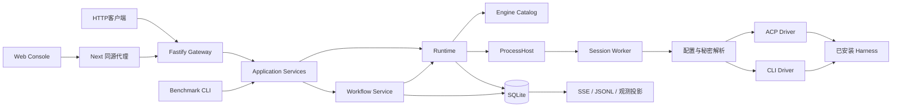
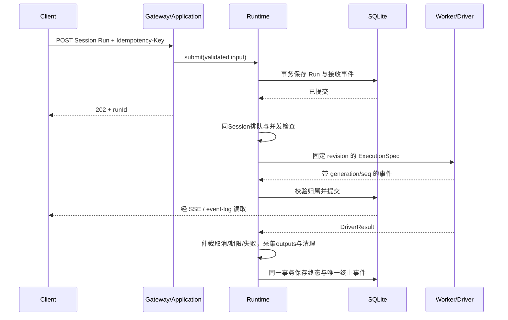

# 架构与实现导览

本页解释当前代码如何组织、请求如何流动。架构约束的权威位置仍是 [DESIGN.md](../DESIGN.md)，取舍在 [ADR](decisions/README.md)，每个HTTP接口的实现入口在 [API参考](api/reference.md)。

## 系统组成

Gateway是本地控制面与公共业务状态的唯一逻辑写入者。Worker负责后端连接与规范化事件，不直接写公共数据库。Workflow和Benchmark复用同一个Application/Runtime执行入口，不另建任务执行循环。

Console不是引擎执行器：它调用Next的 `/api/gateway/...` 代理，再由Gateway拥有任务。assistant-ui只负责消息适配与呈现，关闭浏览器不会停止后端Run。

## 源码地图

| 位置 | 职责与主要入口 |
|---|---|
| [main.ts](../src/main.ts) | 组合根：配置、Store、Host、Runtime、Workflow、观测、秘密/配置操作与Gateway组装 |
| [domain](../src/domain/types.ts) | 自有实体/品牌ID、状态、公共schema、IPC和接口；不依赖具体后端SDK |
| [gateway](../src/gateway/server.ts) | 请求校验、HTTP错误映射、SSE/下载；不选择引擎实现 |
| [application](../src/application/service.ts) | HTTP、Benchmark共同入口；工作流、选路和观测服务 |
| [runtime](../src/runtime/runtime.ts) | Session队列、Run状态、总deadline、权限、结果仲裁与恢复 |
| [engine](../src/engine/manager.ts) | 配置校验、静态文件+API overlay、不可变revision、发现和模板 |
| [process](../src/process/worker-host.ts) | 懒启动Worker、有限驻留数、进程归属、升级终止与lease恢复 |
| [worker](../src/worker/main.ts) | 校验IPC、单Session绑定、确认事件、选择Driver和准备配置 |
| [ACP Driver](../src/drivers/acp/driver.ts) | acpx/runtime边界、ACP会话/模型/MCP、权限与事件适配 |
| [CLI Driver](../src/drivers/cli/driver.ts) | argv/stdin、stdout文本、退出/输出限额/取消；每Run独立 |
| [配置准备](../src/drivers/configuration/prepare.ts) | 进程级原生配置、秘密引用、便携Skill上下文和MCP参数 |
| [storage](../src/storage/sqlite-store.ts) | 事务、幂等、记录校验、事件序号、公共终态唯一性 |
| [artifacts](../src/artifacts/collector.ts) | 声明式outputs采集、不可变文件、hash与安全读取 |
| [benchmark](../src/benchmark-main.ts) | 隔离attempt、调用Application、Evaluator与报告 |
| [web](../web/README.md) | 控制台、代理、UI响应校验、SSE重放与任务选择 |

依赖由 [边界检查脚本](../scripts/check-boundaries.mjs)校验。第三方ACP类型止于Driver，不流入公共Session/Run类型。

## 一次Run的处理链

Session固定engineId、profileRevision、workspaceId和后端身份；Worker按Session归属、首次Run时启动。同Session串行，跨Session受全局和每引擎并发限制。Worker驻留上限另算，不能为了腾位静默丢弃无法恢复的上下文。

总deadline从接收Run开始，包括排队、启动、执行和文件采集；清理grace独立。Run终态不是“最后一个回调赢”：Runtime按所属generation处理取消、完成、超时和错误，迟到消息不能修改下一轮任务。

## 配置、密钥与工具

文件配置是基础目录，API是持久overlay，同ID时API优先；删除写tombstone。每次修改先提交SQLite再发布内存目录，已有Session继续解析历史revision。配置文件只热更新引擎/默认项；Workspace与部署限额变化要求重启。

发现器使用有限的已知安装清单与本地manifest，发现不自动注册。同ID manifest可覆盖内置发现配方，但多个manifest重名会失败。动态管理、发现和实际执行是三件事。

秘密在HTTP写入Keychain或执行/显式检查时短暂进入内存，业务配置只保存引用。执行时只把该引擎需要的源环境交给所属Worker，准备阶段映射为原生变量；不修改Gateway全局环境，不把值放入argv或acpx持久session环境。Keychain helper只访问HarnessHub自身service。

Skills是显式选中的 `SKILL.md` 主指令，上下文注入前校验SHA-256；附件仍从原目录引用。MCP参数通过ACP下发，工具调用与权限由后端协议处理。原生插件/Skills包安装、任意引擎的Provider兼容、OS级秘密隔离不属于这套接口自动保证的能力。

## 存储与恢复

| 数据 | 保存位置与所有者 |
|---|---|
| Session、Run、Permission、Artifact元数据、AgentEvent | SQLite；Gateway Store |
| 引擎当前overlay/默认项/全部历史revision | SQLite runtime_metadata.engine_catalog v2；兼容读取v1 |
| Workflow请求、计划、步骤绑定与状态 | 同一SQLite的workflows表；WorkflowStore v1，要求当前Gateway拥有数据库 |
| Benchmark attempt/evaluation | Benchmark版本化表；通过共享执行入口取得Run结果 |
| 后端恢复材料 | Run/Session后端目录里的acpx checkpoint；不能替代公共状态 |
| 文件产物 | 受控文件目录；登记hash/大小/媒体类型后由API下载 |
| Keychain秘密 | macOS专属service；数据库只保存不可变引用ID |
| JSONL、观测 | 从提交事件重建；不是第二个业务事实源 |

Store通过owner记录拒绝第二个活Gateway写相同数据库，死owner才会恢复。引擎目录、业务记录、Workflow、Benchmark分别有版本边界，未知版本/坏JSON/内容hash不匹配明确失败。

Gateway重启时先核对残留Worker的归属，未能证明完成的Run记interrupted，不自动重跑有副作用的请求。显式可恢复ACP会话可在checkpoint和backend ID匹配时继续；恢复失败不创建空会话冒充成功。详见 [恢复契约](session-recovery.md)。

## 权限、取消与结果含义

权限请求带permissionId、runId、generation、toolCallId、实际options和期限。客户端必须回传实际optionId；决定先持久化，后发送Worker，后端确认后才变为applied。不能把decided当作工具已经执行。

取消请求202仅表示被接受。需要继续看Run终态与cleanupStatus；事件流结束、exit code 0和Agent自报完成都不是任务正确性的充分证据。Evaluator独立检查文本、JSON结构或文件hash。

SSE只读已提交事件，按Run内seq重放，慢客户端等drain；断开不会取消Run。JSONL导出同样从SQLite查询，Artifact下载只接受登记ID，不接受任意文件路径。

## 平台与验证边界

默认只支持本机单用户控制面；没有公网认证、分布式调度、租户隔离或统一OS沙箱。POSIX进程组与Windows监督分别验证，macOS测试不证明Windows原生清理正确。

自动测试保留真实数据库、HTTP、IPC与Worker，只替换不可控的外部模型/引擎。真实Harness、本地模拟模型、真实远端模型、权限/文件任务、恢复、Windows是独立证据层次，详见 [测试要求](testing.md)和 [验收索引](README.md#验收与历史资料)。
