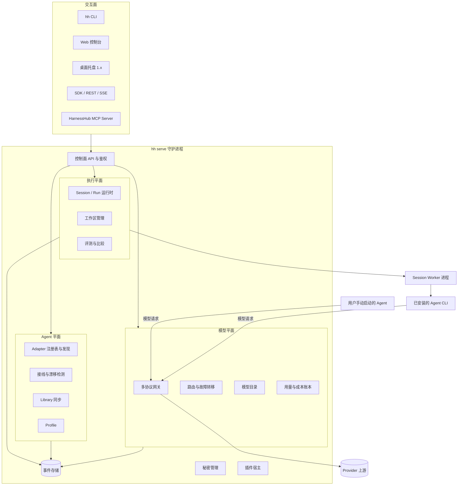
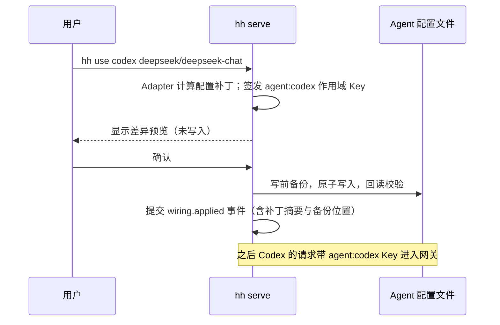
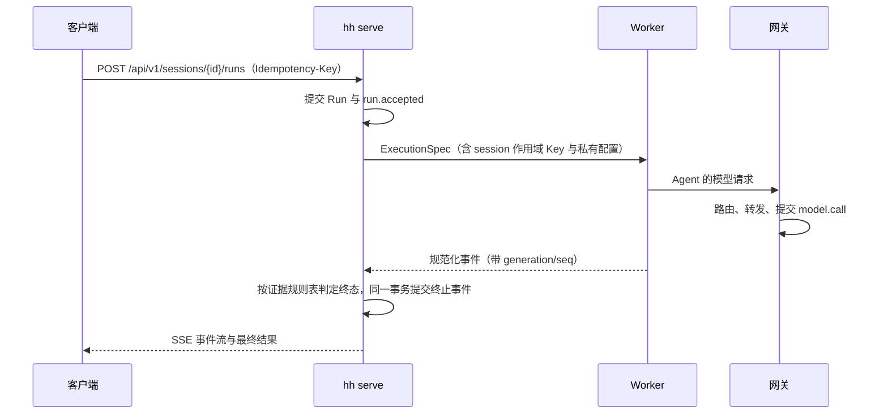

# 02 系统架构

状态：提案（草案），2026-10-02。本文是开源版设计的核心基线，其他章节的术语、模块名、端口和数据归属以本文为准；采纳后拆分进 [DESIGN.md](../../../DESIGN.md) 与正式 ADR。产品定位与范围见 [01 产品定义](01-product.md)。

## 1. 设计目标与约束

开源版不再受比赛接口、公司网关、统一单模型和单一平台的约束。设计目标按优先级排列：

1. **一处管理所有编码 Agent 的模型与工具**：覆盖 Magpie 的核心价值，即 Agent 发现、模型接线、多协议网关、provider 与路由、用量与成本、Skills/MCP/指令库。
2. **一套 API 无人值守地运行任何 Agent**：保留并放大 HarnessHub 独有的执行平面，包括 Session/Run、事件、权限、产物、工作区隔离、并行比较和评测。
3. **每个结论都有可核对的证据**：模型调用、路由决策、配置写入和 Run 结果都先持久化再展示，可以导出，也可以接入 OpenTelemetry。
4. **默认安全、默认本机**：只监听回环地址；秘密进入系统密钥库；任何改写用户配置的操作都可预览、可回滚。
5. **可扩展而不分叉**：provider、Agent 适配器、工具包和导出器都通过稳定的插件协议扩展，核心仓库不为个别厂商写分支逻辑。

非目标（1.0 不做）：托管 SaaS；替代各 Agent 自身的 UI；训练或微调模型；在核心仓库内置违反厂商服务条款的订阅复用方式（见 [01 产品定义](01-product.md#6-非目标)）。

## 2. 术语

| 术语 | 含义 |
|---|---|
| Agent | 一个可被管理的编码 Agent 产品，如 Claude Code、Codex、Gemini CLI、OpenCode |
| Adapter | 描述如何发现、配置、启动某个 Agent 的声明式清单加可选代码 |
| Provider | 提供模型的上游，如 OpenAI、Anthropic、DeepSeek、Ollama、自定义中转 |
| Credential | Provider 的认证材料（API Key、OAuth 令牌），只以引用形式出现在配置中 |
| Model Ref | 模型的全名 `provider/model`；路由组写作 `group/<id>` |
| Route Group | 多个 Model Ref 组成的路由单元，带选择策略与粘性 |
| Gateway Key | 调用 HarnessHub 网关的令牌，按作用域签发给 Agent、Session 或外部客户端 |
| Wiring | 让某个 Agent 使用 HarnessHub 网关和指定模型的配置动作 |
| Profile | 一组 Agent 接线、默认模型与 Library 选择的命名快照 |
| Library | Skills、MCP 服务、指令集的统一仓库，可同步到各 Agent |
| Session / Run | 执行平面的会话与一次执行，沿用现有运行契约 |
| Workspace | Run 使用的工作目录；可以是现有目录、git worktree 或临时目录 |
| Evidence | 已提交的事件：模型调用、路由尝试、配置写入、工具调用、Run 终态 |

## 3. 总体结构

HarnessHub 是一个本机守护进程加若干外壳。守护进程内部分为控制面和三个平面：



两条主要数据流：

- **接线流（对标 Magpie）**：用户在 CLI 或控制台选择“让 Codex 用 deepseek/deepseek-chat”。Agent 平面按 Adapter 生成配置补丁，经预览后写入 Codex 的配置，并签发一个 Agent 作用域的 Gateway Key。之后用户自己运行 Codex，请求经网关转发、记账、可追踪。
- **执行流（HarnessHub 独有）**：客户端调用 `POST /api/v1/sessions/{id}/runs`。执行平面为 Session 启动 Worker，Worker 用 Session 私有配置启动 Agent，Agent 的模型请求带 Session 作用域的 Gateway Key 进入同一个网关。事件、调用、产物和终态都写入事件存储。

两条流共享同一个网关、同一套 provider 与路由，以及同一份账本。区别只在 Gateway Key 的作用域和配置写入位置。

## 4. 三个平面

### 4.1 模型平面

详见 [03 模型平面](03-model-plane.md)。要点：

- 单个监听入口同时提供 OpenAI Chat Completions、OpenAI Responses、Anthropic Messages（含 count_tokens）、Gemini generateContent/streamGenerateContent 与 `/v1/models`。
- 内部采用中间表示（IR）做 N×M 转换。上游原生支持请求方协议时直接透传，只做白名单内的补丁。这一点吸收 Magpie 的做法；HarnessHub 现有的单向转 Chat Completions 降级为 IR 的一个出口。
- 路由组支持 order、rotate、least-used、latency 四种策略，以及会话粘性。故障转移只发生在首个字节送达客户端之前，并且只针对可证明的瞬时失败（见 [03 模型平面](03-model-plane.md#5-路由故障转移与重试)）。
- 每次调用生成一条 `model.call` 证据：请求方、作用域、请求模型与实际应答模型、每次尝试、首字节与首内容时间、用量与成本。

### 4.2 Agent 平面

详见 [04 Agent 平面](04-agent-plane.md)。要点：

- Adapter 是声明式清单（发现规则、配置文件位置与格式、接线字段、能力、运行方式），复杂逻辑用插件补充。核心仓库在 1.0 维护 12 个以上一线 Agent 的 Adapter。
- 两种接线模式：**全局接线**改写用户的 Agent 配置，与 Magpie 相同，但要求先预览差异、写前备份、可一键还原，并做漂移检测；**隔离接线**只为执行平面的 Session 生成私有配置，沿用现有 HarnessHub 的做法，不触碰用户配置。
- Library 把 Skills、MCP 服务与指令集保存一份，按每个 Agent 的原生格式同步；内容寻址存储、跨进程锁与严格路径校验沿用现有工具包实现。

### 4.3 执行平面

详见 [05 执行平面](05-run-plane.md)。要点：

- 沿用现有运行契约：Session 串行 Run、先提交后发布、事件序号、权限往返、期限与取消仲裁、崩溃后 interrupted，规则见 [DESIGN.md](../../../DESIGN.md#5-run-生命周期与控制契约)。
- 新增工作区管理（git worktree 隔离、清理策略）、多 Agent 并行比较、可复现的评测（Benchmark 演进），以及 MCP Server：其他 Agent 可以把任务委派给 HarnessHub 管理的 Agent。
- Run 结果判定改为基于调用证据的规则表，修复现状中“失败被判为 completed”的问题（见 [05 执行平面](05-run-plane.md#4-run-结果判定)）。

## 5. 进程模型

| 进程 | 数量 | 职责 | 生命周期 |
|---|---|---|---|
| `hh serve` 守护进程 | 每个数据目录 1 个 | 控制面 API、网关、路由、账本、Agent 平面、执行平面调度、事件存储唯一写入者 | 由 CLI 按需拉起，或注册为用户级服务；单实例锁由内核释放的文件锁保证 |
| Session Worker | 每个活动 Session 1 个 | 启动并驱动 Agent（ACP 或 CLI）、转换原生事件、准备 Session 私有配置 | 懒启动；空闲且可恢复时回收 |
| Agent 进程 | Worker 的子进程 | 实际执行编码任务 | 归属 Worker 的进程组或 Job，随 Run/Session 回收 |
| 插件进程 | 每个启用的插件 1 个 | provider 认证与请求变换、Adapter 扩展、导出器 | 守护进程监督，崩溃隔离，按需重启 |
| `hh` CLI | 按调用 | 调用控制面 API；守护进程未运行时可拉起 | 短进程 |

设计要点：

- 网关在守护进程内，而不是像现状那样在每个 Worker 内各起一个。全局接线的 Agent 需要一个稳定地址；按 Session 归因则改由 Session 作用域的 Gateway Key 实现。这样既得到 Magpie 式的单一入口，又保留 HarnessHub 的结构性归因。
- 事件存储只有守护进程一个写入者。Worker 与插件通过带版本号的 IPC 上报，沿用现有的 generation 与序号去重规则。
- 单实例：守护进程在写任何状态之前，先取得数据目录下的独占锁（SQLite 独占连接或平台文件锁），进程退出即释放。PID 只作为提示信息，不作为所有权依据。这修复了现状中“第二次启动改写运行中实例配置”的问题。

## 6. 部署形态

| 形态 | 目标用户 | 监听 | 存储 | 认证 | 版本 |
|---|---|---|---|---|---|
| 本机（默认） | 个人开发者 | 127.0.0.1 | SQLite | 本机管理令牌 + Gateway Key | 0.x 起 |
| 局域网共享 | 一人多机、小团队 | 显式开启后监听指定地址，要求 TLS 或反向代理 | SQLite | 命名 Gateway Key，管理面仍只允许本机 | 1.0 |
| 团队服务器 | 团队、企业 | 容器或系统服务 | PostgreSQL | OIDC 登录、RBAC、API Key | 1.x |
| CI 运行器 | 流水线 | 临时实例 | 临时 SQLite，结束时导出 | 一次性令牌 | 1.0（GitHub Action 封装） |

同一份二进制支持全部形态，区别只在配置。团队服务器的多租户隔离、配额与审计放在 [07 数据与安全](07-data-security.md)。

## 7. 技术选型

| 部分 | 选择 | 理由与替代方案 |
|---|---|---|
| 语言与运行时 | TypeScript（strict、ESM）+ Node.js 24 LTS | 复用现有约 3.6 万行源码与 2.8 万行测试；ACP 官方 SDK 与多数被管理的 Agent 都是 TypeScript/Node 生态。替代方案 Go 重写可以得到更小的单文件，但要重写运行时、驱动和全部测试；见 [ADR 草案](adr-drafts.md#adr-p01-语言与运行时) |
| 分发 | Node 单可执行文件（SEA）为主，npm 包与容器镜像为辅 | 用户无需预装 Node；体积约 90–110 MB，大于 Magpie 的 15 MB，M0 需要验证打包可行性与启动时间 |
| HTTP | Fastify 5 + JSON Schema（Ajv）+ OpenAPI 3.1 生成 | 沿用现状；协议入口的请求体校验与流式写出统一由网关模块负责 |
| 存储 | 本机 `node:sqlite`；团队版 PostgreSQL；同一 Store 接口与迁移体系 | 沿用现有 SQLite Store、事务与幂等规则；Postgres 适配在 1.x |
| 控制台 | React + Vite 静态单页，构建产物内嵌进守护进程 | 现有 Next.js 控制台需要单独的 Node 服务进程，内嵌静态资源后单文件分发更简单；组件（shadcn/ui、assistant-ui）可复用 |
| 桌面托盘 | Tauri 2 薄外壳（1.x） | 只负责托盘菜单与窗口，业务全部调用守护进程 API |
| 配置文件编辑 | JSONC 用 `jsonc-parser` 的增量编辑；YAML 用 `yaml` 的 Document API；TOML 自研“键路径定点编辑”并用解析器回读校验 | 保证只改目标键，保留注释、顺序和缩进；Magpie 的 `internal/edit` 是参照 |
| 插件协议 | 进程外 JSON-RPC 2.0（stdio），带能力声明与版本协商 | 与语言无关，崩溃隔离；见 [09 扩展](09-extensibility.md) |
| 观测 | OpenTelemetry（trace、metric、log），属性遵循 GenAI 语义约定 | 可接入任何后端；本机默认只写本地 |

## 8. 模块与依赖规则

开源版仓库改为 pnpm workspace 多包结构，包名与依赖方向如下（详细目录见 [10 工程体系](10-engineering.md#1-仓库结构)）：

```text
packages/
  core        领域类型、品牌 ID、错误码、事件信封；不依赖任何其他包
  store       事件存储与迁移（SQLite/Postgres）；依赖 core
  secrets     系统密钥库与加密文件后端；依赖 core
  gateway     模型平面：协议、IR、路由、目录、账本；依赖 core、store、secrets
  agents      Agent 平面：Adapter 注册表、发现、接线、Library；依赖 core、store、secrets
  runtime     执行平面：Session/Run、Worker 监督、工作区、评测；依赖 core、store、agents
  drivers     ACP、CLI 驱动，运行在 Worker 内；依赖 core
  plugin-host 插件宿主与协议；依赖 core
  daemon      组合根：HTTP API、鉴权、调度；依赖以上全部
  cli         hh 命令；只依赖 core 与 sdk
  sdk         TypeScript SDK（OpenAPI 生成加手写便捷层）；依赖 core
  console     Web 控制台；只通过 sdk 调用 API
```

规则沿用现状并扩展：第三方 SDK 类型止于所属包；`daemon` 是唯一组合根；`cli`、`console` 不得直接导入服务端包；依赖方向由边界检查脚本强制，检查脚本保留无效样例测试。

## 9. 关键时序

### 9.1 全局接线



### 9.2 无人值守执行



## 10. 与现状的关系

| 现状 | 开源版 |
|---|---|
| 每个 Worker 一个私有网关，只转发到一个统一模型 | 守护进程内一个共享网关，IR 多协议互转，多 provider 与路由；按 Gateway Key 作用域归因 |
| 只有隔离接线（Session 私有配置） | 隔离接线 + 全局接线两种模式 |
| 工具包只下发到 HarnessHub 管理的 Session | Library 既可下发到 Session，也可同步到用户的 Agent 配置 |
| Next.js 控制台单独进程 | 静态单页内嵌进守护进程 |
| 比赛接口、离线 Windows 便携包、公司交接 | 移出核心，作为独立仓库或删除（见 [12 路线图与迁移](12-roadmap-migration.md)） |

保留不变的部分：运行契约、事件存储语义、权限往返、期限与取消仲裁、Worker 监督与进程归属、秘密只存引用、工具包内容寻址存储。
