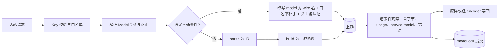

# 03 模型平面

状态：提案（草案），2026-10-02。术语、模块名、端口与数据归属以 [02 系统架构](02-architecture.md) 为准；需要拍板的决定见 [ADR 草案](adr-drafts.md) 的 ADR-P03 与 ADR-P05。本文描述 `packages/gateway` 的目标行为，现行实现仍以 [统一模型网关](../../model-gateway.md) 为准。

模型平面的目标是与 Magpie 持平，不在预设数量、订阅复用或目录规模上竞争（理由见 [01 产品定义](01-product.md#8-同类产品格局)）。差异化投在三处：每次调用先提交后发布的证据、按作用域签发的 Gateway Key，以及公开的四协议一致性测试套件。文中 Magpie 引用均指 `yetone/magpie@d874adb`，HarnessHub（下称 HH）引用均指 `feat/unified-model-gateway@324c9e8`；“上一轮核验”指 2026-10-02 的 Magpie 与 HH 对比调研，其中的实验在本机回环假上游上完成。

## 1. 范围与入口

网关运行在 `hh serve` 守护进程内，与控制面共用一个监听地址，默认 `127.0.0.1:3180`（ADR-P03）。同一端口按路径分流：`/v1/*` 与 `/v1beta/*` 归网关，`/api/v1/*` 归控制面，其余路径归内嵌控制台。局域网共享需要显式开启，并且要求 TLS 或反向代理（02 第 6 节）；此时控制面仍只接受回环来源。

| 协议 | 方法与路径 | 流式形式 | 说明 |
|---|---|---|---|
| OpenAI Chat Completions | `POST /v1/chat/completions` | `chat.completion.chunk` SSE，以 `data: [DONE]` 结束 | `n` 大于 1 返回 400 |
| OpenAI Responses | `POST /v1/responses` | 命名事件 SSE，`sequence_number` 递增 | 网关不保存响应；`previous_response_id`、`conversation`、`background` 只在直通到原生 Responses 上游时可用 |
| Anthropic Messages | `POST /v1/messages` | 命名事件 SSE | `anthropic-version`、`anthropic-beta` 按第 3 节处理 |
| Anthropic 计数 | `POST /v1/messages/count_tokens` | 无 | 上游支持时转发；否则本地估算，响应头带 `x-hh-token-count: estimated` |
| Gemini | `POST /v1beta/models/{model}:generateContent`、`:streamGenerateContent`、`:countTokens` | `?alt=sse` 时为 SSE，否则为 JSON 数组 | `{model}` 取 `/models/` 之后到最后一个 `:` 之前的全部内容，因此 `deepseek/deepseek-chat` 可以不转义 |
| 模型列表 | `GET /v1/models`、`GET /v1/models/{ref}`、`GET /v1beta/models` | 无 | 只列出调用方 Key 白名单内的 Model Ref 与路由组，字段见第 7 节 |

路径前缀规则：OpenAI 与 Anthropic 路径的 `/v1` 可以省略，兼容只配置根地址的客户端；Gemini 路径接受 `/v1beta`、`/v1` 与 `/v1alpha`。查询参数只解释 `key`（仅 Gemini）与 `alt`，其余忽略（如 Claude Code 的 `?beta=true`）。部署在反向代理之后时，用 `gateway.publicBaseUrl` 声明对外地址，接线与连接示例使用该地址；网关本身不支持路径前缀改写，由代理剥离。

可接受的鉴权头：`Authorization: Bearer <key>`、`x-api-key`、`x-goog-api-key`，以及 Gemini 路径的查询参数 `key`。同一请求出现多个且取值不同时返回 401，防止代理链混入其他凭据。带 `Origin` 头的请求返回 403，`Host` 必须是回环名称或已声明的 `publicBaseUrl` 主机，用来阻断浏览器跨站与 DNS rebinding（沿用 [gateway.ts](../../../packages/gateway/src/gateway.ts) 的 Origin 拒绝）。所有拒绝都使用该路径所属协议的错误格式，并带 `x-hh-error-source: gateway`，与上游错误区分。

## 2. Gateway Key 与作用域

Gateway Key 是调用网关的唯一凭据，与 provider 的上游 Credential 完全分开。Magpie 在回环来源接受任意 token（`internal/gateway/lan.go:19`），同机任意进程都能消耗上游额度，也无法归因；HH 现状每个 Session 一个随机令牌，归因清楚但无法服务全局接线。开源版采用 ADR-P03：**回环来源同样必须带有效 Key**。

| 作用域 | 签发时机 | 持有者 | 默认有效期 | 默认模型白名单 | 吊销时机 |
|---|---|---|---|---|---|
| `agent:<adapterId>` | 全局接线成功写入后 | 用户手动启动的 Agent | 不过期 | 接线所选模型及所在 Profile 的模型 | `hh unwire`；重新接线时轮换 |
| `session:<sessionId>` | 执行平面创建 Session | Worker 启动的 Agent | Session 存续期 | 该 Session 的 Run 模型选择（含路由组） | Session 关闭且在途调用结束后 |
| `client:<name>` | `hh key create` 或控制台 | 脚本、IDE、其他工具 | 90 天，可改 | 空，必须显式填写 | 手动吊销或过期 |
| `user:<id>` | 团队服务器 OIDC 登录（1.x） | 团队成员本机的 `hh` | 由团队策略决定 | 由 RBAC 决定 | 管理员吊销或离职同步 |

Key 格式为 `hhk_<作用域字母>_<keyId>_<secret>`：`keyId` 为 12 位 base32，用于索引与展示；`secret` 为 32 字节随机数的 base64url。固定前缀便于秘密扫描规则识别。存储只保存 `keyId` 与 `SHA-256(secret)`，校验时按 `keyId` 取记录并做常数时间比较；secret 熵为 256 位，不需要慢哈希。明文只在签发时返回一次；`agent:` 作用域的明文直接写入 Agent 配置（见 [04 Agent 平面](04-agent-plane.md#4-全局接线)），守护进程不保留，因此每次重新接线都签发新 Key，写入并回读成功后才吊销旧 Key，失败时吊销新 Key。

每个 Key 的属性：名称、作用域、`modelAllow`（Model Ref 列表，支持 `provider/*` 与 `group/<id>`）、额度、过期时间、吊销时间、允许来源（默认仅回环；开启局域网共享后，只有显式标记的 `client:` Key 可以从局域网使用）、最近使用时间。规则如下：

- `session:` Key 的调用只在该 Session 有活动 Run 时接受，否则返回 409 `no_active_run`，沿用现状的 Run 作用域语义。调用自动归属到当时的活动 Run 与 generation，因为同一 Session 的 Run 串行；Run 结算屏障与 Run 预算的规则见 [05 执行平面](05-run-plane.md#4-run-结果判定)，Run 预算与 Key 额度在同一检查点执行，预算触顶的拒绝原因为 `run_budget_exceeded`。
- 额度分三类：每分钟请求数（令牌桶，硬限制）、每日 token 与每月成本（按已提交的账本累计，转发前检查）。跨过阈值的那一次调用允许完成，因此成本额度最多超出一次调用；之后的请求返回 429 `quota_exceeded`，`Retry-After` 指向窗口重置时刻。
- 吊销与过期对新请求立即生效；在途流默认继续到结束，`hh key revoke --terminate` 同时取消在途调用。
- Gateway Key 只能访问网关路径，不能访问 `/api/v1` 控制面；控制面使用本机管理令牌（02 第 6 节）。

被拒绝的请求同样提交 `model.call`，`rejected: true` 并带拒绝原因：缺 Key 或错误 Key 记为 401 `invalid_key`，已吊销 401 `key_revoked`，已过期 401 `key_expired`，越权模型 403 `model_not_allowed`，来源不允许 403 `source_not_allowed`，超额 429 `quota_exceeded`；Key 有效但请求在路由层被拒绝时，未知路径记为 404 `route_not_found`，路由参数畸形记为 400 `route_invalid`，带浏览器 Origin 记为 403 `origin_forbidden`。上一轮核验发现现状中路由层拒绝不留记录（附录 B 的 V7-N2），漂移检测的 `stale-key` 判定也依赖这些记录。为防止刷写，同一 Key 与同一原因每分钟最多记录 20 条明细，其余聚合为一条计数。

## 3. 协议转换

网关内部用中间表示（IR）连接四种入站协议与四种上游协议，即 parse → IR → build，以及上游 decoder → IR 事件 → 入站 encoder。这是 Magpie 的结构（`internal/gateway/ir.go`）；HH 现有的四个入站转换器（`chat.ts`、`responses.ts`、`anthropic.ts`、`google.ts`）改写为 IR 的 parse 与 encode，现有的单向转 Chat Completions 成为 IR 的一个出口。



IR 请求的字段：`model`、`system[]`、`messages[]`（角色 user 或 assistant，内容为有序的 part）、`tools[]`（名称、描述、JSON Schema、`strict`、种类 function、custom 或 namespace）、`toolChoice`（auto、none、required、指定名称）、`maxOutputTokens`、`temperature`、`topP`、`stop[]`、`stream`、`reasoning`（effort、budgetTokens、是否要求可见、是否显式关闭）、`parallelToolCalls`、`responseFormat`（text、json_object、json_schema）、`cache`（`prompt_cache_key`、`cache_control` 位置）、`vendorEcho`（只在同协议重建时原样带回的字段，如 Responses 的 `include`、`client_metadata`，Anthropic 的 `metadata`），以及 `unmapped[]`（转换中丢弃的字段名，写入证据）。part 的种类为 text、image、document、audio、tool_call、tool_result（内容可含文本与图片，带 `isError`）、reasoning（文本、`signature`、`encrypted`、来源协议与 provider）。

IR 事件：`start`（消息 ID、上游自报模型）、`text.delta`、`reasoning.delta`、`reasoning.signature`、`tool.start`（index、id、name）、`tool.args.delta`、`tool.end`、`usage`、`stop`（规范化原因加上游原值）、`error`（状态、错误码、消息、`retryAfter`）。`keepalive` 只在网关内部流转，不进入 IR 结果，也不进入证据中的内容统计。

**直通条件**（全部满足才直通）：上游 provider 声明了与入站相同的原生端点；路由选中的候选在该端点上提供此模型；请求不需要网关代为执行的语义（例如托管工具由同一厂商执行时可以直通，跨厂商则不行）；provider 没有声明 `translateOnly`。直通时请求体只做三件事：按字节定点改写 `model` 为 wire 名（不重新序列化整个 JSON，参照 Magpie `rewriteModel`）；移除 HH 自己的鉴权头并加上 provider 认证；应用该 provider 声明的白名单补丁。响应字节原样转发，网关只在旁路解析事件，用于首字节判定、usage 与 served model。

**白名单补丁**：补丁种类是核心代码中的封闭集合，provider 预设只能按名称选用，每种补丁都有黄金语料覆盖。Magpie 把同类逻辑写成按主机名分支的代码（`internal/gateway/gateway.go:1665` 起对 `api.x.ai`、`openai.com`、Bedrock、Azure 的判断），违反 [01 产品定义](01-product.md#6-非目标) 中“不为单个厂商写分支”。1.0 的补丁集合：`developer-to-system`、`max-tokens-field`（改写为 `max_completion_tokens`）、`drop-fields`（只能从第 5 节的可选字段闭集中选）、`include-usage`、`json-schema-to-json-object`、`anthropic-beta-allow`（只转发列出的 beta 头）、`thinking-off-unless-asked`、`lift-additional-tools`。新增补丁种类需要核心 PR、语料与文档同时提交。每次调用实际应用的补丁写入 `model.call.patches[]`。

保真要求如下，任何一项做不到都必须明确失败或记录降级，不能静默改变语义：

| 方面 | 要求 | 依据 |
|---|---|---|
| 工具名 | 原样保留；上游名称规则（`^[A-Za-z0-9_-]{1,64}$`）不满足时转为可读扁平名 `namespace__name`，超过 64 字符时截断并追加 8 位哈希，同一请求内建立双向映射。不再使用不透明的 `hh_<32hex>` | 现状 [protocol.ts](../../../packages/gateway/src/protocol.ts) 第 103 行使 Codex 下全部 MCP 工具名不可读；Magpie `e3b6397` |
| 工具调用 | 并行调用按 index 归集，交错的参数增量不串线；custom 工具（Codex `apply_patch`）以 `{input}` 往返；`tool_choice: required` 而过滤后没有可调用工具时返回 400 | 现状已领先 Magpie（Magpie 翻译路径丢 freeform 工具，交错参数会开出空名调用） |
| 推理文本 | 双向转换为对应协议的推理块；需要回传推理的上游（provider 能力 `requiresReasoningReplay`）由会话级缓存补回，缓存键按会话隔离，不逐出当前历史仍引用的条目 | 现状 [reasoning.ts](../../../packages/gateway/src/reasoning.ts) 的 LRU 会逐出仍被引用的条目 |
| 推理签名 | Anthropic `signature`、`redacted_thinking`、OpenAI `encrypted_content` 只对签发它的 provider 有效：上游与来源是同一 provider 时原样带回，否则丢弃并记录 `reasoning_dropped`；跨协议只携带明文推理（`hh-r1.` 编码），不伪造签名 | 粘性路由（第 5 节）使同一会话尽量留在同一 provider |
| 图片与文档 | 在 base64 与 URL 两种形式之间转换；目录显示模型不接受该模态时，按 provider 的 `onUnsupportedMedia` 处理：默认替换为文字占位并记录 `media_placeholder` 计数，可设为 `reject` | 现状的占位策略防止“历史中出现一张图后整个会话失败”，开源版改为按模态元数据决定 |
| usage | 规范化为 `input`（不含缓存）、`cacheRead`、`cacheWrite`、`output`、`reasoning` 五项，各协议输出时按其口径重组，避免缓存重复计数；转换到 Chat 上游时默认请求 `stream_options.include_usage`；上游仍未返回时 usage 记为 missing，不记为 0 | Magpie `ir.go:197-202` 的 `prompt()`、`chat.go:300-302`；上一轮核验 P1-1 |
| 停止原因 | IR 取值：`end_turn`、`max_tokens`、`tool_use`、`stop_sequence`、`content_filter`、`refusal`、`other`（保留原值）。已知的异常值（`network_error`、`sensitive`、`error`、Gemini `MALFORMED_FUNCTION_CALL`）转为错误；未知值透传为 `other` 并记录原值 | 上一轮核验 P1-9 流完整性 |
| 流完整性 | 2xx 但没有任何有效内容（HTML、业务错误 JSON、只有 index 不为 0 的 choice）记为 502 `upstream_invalid_response`；响应体正常结束但缺终止事件时视为完成并记录 `completion: inferred`；响应体中途断开为上游失败。执行平面据此推导调用的判定类别（[05 执行平面](05-run-plane.md#42-调用的判定类别)） | 现状把这几类都记为成功（核验 P1-9） |
| 错误 | 保留上游状态码；按入站协议格式重写错误体；脱敏后截断到 500 字符，先脱敏后截断；保留 pydantic 校验错误前 3 条的 `msg（loc: …）`；404 与 405 附上实际请求的上游地址（脱敏），用于发现基址填错 | 核验 P1-11、P1-14 |
| 上下文超长 | 判定同时看状态码与消息：429 与限速措辞一律不算超长；按数值区分 vLLM 的“输入超长”与“输出上限过大”；识别 GLM、火山引擎等措辞；判定为超长时按入站协议写成客户端会触发压缩的形式 | Magpie `eb3a074`、`40812f1`；现状 [upstream.ts](../../../packages/gateway/src/upstream.ts) 第 547 行的模式会把 429 误判为超长 |
| Gemini 流内错误 | 写成 `@google/genai` 能识别的形式（不带 `data:` 前缀的错误 JSON），由黄金语料固定 | 核验 V1-N1：`data: {"error":…}` 使 SDK 1.30.0 反复重试后以 exit 0 结束 |

不可转换的语义按下表处理。原则是：直通时一律原样转发；转换时只有“丢弃不改变任务结果、并且写入 `unmapped[]`”的字段可以丢弃，其余明确返回 400 `unsupported_feature` 并在消息中点名字段。

| 语义 | 转换时的处理 |
|---|---|
| Responses 有状态字段（`previous_response_id`、`conversation`、存储的 `prompt`、`background`） | 400；1.0 网关不保存响应 |
| 托管工具（web_search、file_search、code_interpreter、computer_use、MCP 连接器） | 400；跨厂商模拟（Magpie 自建搜索）留给 1.x 插件 |
| 多候选输出（`n`、`candidateCount` 大于 1）、非文本输出模态 | 400 |
| 跨 provider 的不透明推理签名 | 丢弃并记录，客户端会重新生成 |
| Anthropic `cache_control` 到 OpenAI 系上游；`prompt_cache_key` 到 Anthropic 上游 | 丢弃并记录；粘性路由负责保持缓存命中 |
| `json_schema` 到不支持结构化输出的上游 | 400，除非该 provider 启用 `json-schema-to-json-object` 补丁 |
| 未知顶层字段 | Anthropic 入站忽略并记录（Claude Code 频繁增加 beta 字段）；Responses 与 Gemini 入站丢弃并记录，但“不可静默丢弃字段表”中的字段返回 400。该表在代码中集中维护并有测试 |

## 4. Provider 与 Credential

Provider 分四类：`vendor`（模型厂商官方 API）、`relay`（聚合或中转网关，包括 OpenRouter、LiteLLM、new-api、one-api、Magpie，以及 1.x 的“另一个 HarnessHub”）、`local`（Ollama、LM Studio、vLLM、llama.cpp server）、`custom`（用户自定义）。把其他网关当作上游是一等用法：它们的模型列表来自 `/v1/models`，返回的 `model` 字段记为 served model，OpenRouter 等在 usage 中自报的费用作为价格来源之一（第 8 节）。

预设是 `gateway` 包中 `presets/<provider-id>.json` 的数据文件（目录约定见 [10 工程体系](10-engineering.md#1-仓库结构)），由 JSON Schema 校验，随发行包分发，不在运行时从网络更新。贡献新预设只需提交数据文件与一条录制的交换报文（第 11 节）。字段含义：`catalog` 是 models.dev 中的 provider id，用于元数据与价格；`auth.apiKeyHeader` 取 `authorization-bearer`、`x-api-key`、`api-key`、`x-goog-api-key`、`query-key` 或 `custom:<名称>`；`models.source` 取 `live`、`catalog` 或 `static`。下面是格式示意（设计示意，不可直接运行）：

```json
{
  "schemaVersion": 1,
  "id": "deepseek",
  "name": "DeepSeek",
  "kind": "vendor",
  "website": "https://platform.deepseek.com",
  "keysUrl": "https://platform.deepseek.com/api_keys",
  "catalog": "deepseek",
  "auth": { "methods": ["api-key"], "apiKeyHeader": "authorization-bearer" },
  "endpoints": {
    "chat": "https://api.deepseek.com/v1",
    "anthropic": "https://api.deepseek.com/anthropic"
  },
  "models": { "source": "live", "listPath": "/models" },
  "capabilities": { "requiresReasoningReplay": true },
  "patches": { "chat": ["developer-to-system"] },
  "regions": []
}
```

自定义 provider 用 `hh provider add <id> --chat <url> --anthropic <url> --responses <url> --gemini <url>`，至少一个端点。基址校验：以 `/chat/completions`、`/responses`、`/messages` 或 `:generateContent` 结尾时拒绝并提示正确写法（核验 P1-11）；只允许 HTTPS，回环地址、RFC 1918 私网地址与显式 `--allow-insecure-http` 除外；不允许内嵌账号、查询串和片段。

认证方式：核心支持 Bearer、`x-api-key`、Azure 的 `api-key`、`x-goog-api-key`、查询参数 `key` 与自定义头名；OAuth 设备码登录、AWS SigV4（Bedrock）、Google 应用默认凭据（Vertex）由插件实现（ADR-P07）。复用其他 Agent 的订阅登录不进核心（ADR-P09）。

Credential 只以引用出现在配置中，引用模型为 `store`、`env`、`file` 三种，定义与校验规则见 [07 数据与安全](07-data-security.md#43-引用模型)（现有的 `keychain` 引用在迁移时改为 `store`），值存入秘密后端（`packages/secrets`）。Magpie 把 Key 明文存在 `providers.json`（0600），开源版不这样做。一个 provider 可以有多个 Credential：`credentials: [{id, name, ref, protocols?, enabled}]`，每个 Credential 是独立的路由候选与熔断单位（参照 Magpie `internal/gateway/fallback.go` 的 `perKey`）；`protocols` 用于只对某一端点有效的中转 Key。账本记录 Credential 的 `id`、名称与指纹（Key 的 SHA-256 前 8 位十六进制），从不记录原值；删除或轮换 Credential 后历史记录保持原身份。

模型列表有四个来源：`live`（用该 provider 的 Key 请求 `/models`，Anthropic 为 `/v1/models`）、`catalog`（models.dev 中该 provider 的列表）、`static`（预设中的 `models`）、`manual`（用户添加）。`expose` 为 `all` 或显式列表，决定哪些模型出现在 `/v1/models` 与 Agent 选择器中。live 列表在添加 provider 时、执行 `hh provider models --refresh` 时以及每 24 小时后台刷新；刷新失败保留上一次成功结果并标记 `stale`，不清空。

wire 名：Model Ref `provider/model` 是 HH 的规范名，用于路由、白名单、账本与价格。provider 可以按模型或按 `provider/*` 声明上游名称，`*` 替换为模型名（Magpie README 的 `magpie model wire`）。只有发往上游的请求体 `model` 字段使用 wire 名；账本同时记录请求名、Model Ref、wire 名与 served model。

## 5. 路由、故障转移与重试

路由组 `group/<id>` 由若干 Model Ref 组成，四种策略（02 第 4.1 节）定义如下：`order` 取第一个可用候选；`rotate` 在新会话或粘性允许切换时轮转到下一个成员；`least-used` 取最近 24 小时账本 token 最少的候选；`latency` 取最近 50 次成功调用首内容时间的指数加权平均最小者，样本少于 5 次的候选按 order 优先以获得样本。组的窗口取成员最小值，推理档位取成员交集。设计示意，不可直接运行：

```yaml
id: fast
strategy: latency
stickiness: auto        # auto、session、turn、off
members: [deepseek/deepseek-chat, openrouter/deepseek/deepseek-chat-v3]
retry: {perCandidate: 2, totalAttempts: 4, baseBackoffMs: 500, maxBackoffMs: 8000, retryAfterWaitCapMs: 8000}
```

**粘性与提示缓存**：会话键依次取 `x-hh-conversation` 请求头、客户端自带的会话标识（如 Codex 的 `prompt_cache_key`）、作用域加 system 与首条 user 消息的哈希。`auto` 模式下，同一轮内（客户端回传工具结果）总是留在上次应答的 Credential；跨轮时，只有上次读缓存不少于 1024 token 且距上次调用不超过 5 分钟才保留（Magpie `internal/gateway/affinity.go` 的 `cacheWorth`、`cacheCold`）。`session:` 作用域默认 `session` 粘性，优先可复现。粘性记录持久化（最近 512 个会话、24 小时）；粘性被打破时（候选熔断、白名单变化）在证据中写明原因。

**首字节前判定**：“首字节”指写给客户端的第一个响应体字节。还存在其他候选或剩余重试次数时，网关在上游返回 200 之后先扣留输出，直到出现第一个内容事件（文本、推理或工具调用），扣留上限 15 秒或 1 MiB（Magpie `fallback.go` 的 `holdLongest`、`holdMost`）；扣留期间出现的流内错误按首字节前失败处理。没有替代路径时不扣留，收到首个上游数据即开始写出。Gemini 客户端的响应头超时为 60 秒，因此 Gemini 入站另有 45 秒的“响应头提交期限”：到期即提交 200 头，此后不再转移。首字节一旦送达，任何失败都只在流内报告，不重试、不转移。

**可重试分类**（ADR-P05）。“重试”指同一候选再试，“转移”指换下一个候选：

| 失败类型 | 判定依据 | 同候选重试 | 转移 | 计入该 Credential 熔断 |
|---|---|---|---|---|
| 连接失败（DNS、连接拒绝、TLS 握手前重置） | 没有 HTTP 响应 | 是 | 是 | 是 |
| 等待响应头超时 | 超过 `upstreamHeaderTimeoutMs` | 是，最多 1 次 | 是 | 是 |
| 408、500、502、503、504、529 | 状态码 | 是 | 是 | 是 |
| 429 且 `Retry-After` 不超过等待上限 | 状态码加响应头 | 是，按 `Retry-After` 等待 | 是，有其他候选时先转移不等待 | 是，冷却到 `Retry-After` |
| 429 无 `Retry-After` 或超过上限；配额用尽措辞 | 状态码、措辞 | 否 | 是 | 是，冷却 60 秒或到上游给出的重置时间 |
| 401、403 认证失败；402 余额不足 | 状态码 | 否 | 是 | 是，`auth_failed` 持续到 Credential 更新 |
| 404 或“模型不存在、未开通”措辞 | 状态码、措辞 | 否 | 是 | 只标记该 Credential 与模型组合 10 分钟 |
| 其他 400、413、422（请求本身的问题） | 状态码 | 否 | 否 | 否 |
| 上下文超长 | 第 3 节判定 | 否 | 否（1.x 可选：转移到窗口更大的成员，默认关闭） | 否 |
| 首字节前的内容拦截（refusal、content_filter） | 停止原因 | 否 | 否 | 否 |
| 首字节已送达后的任何失败 | — | 否 | 否 | 按类型计入 |
| 客户端断开、Run 取消、Key 吊销 | — | 否 | 否 | 否 |

表中“认证、余额、配额、未开通”几行允许转移但不重试：失败归因于某个 Credential，换一个 Credential 等于换一个上游，这是对 ADR-P05“只针对可证明的瞬时失败”的补充，采纳时需要一并确认。

次数与退避：同一候选最多重试 2 次（Magpie `lastRetries`），退避 `500 ms × 2^n`，加 ±20% 抖动，单次不超过 8 秒；单个请求总尝试默认 4 次，全局硬上限 8 次，重试总耗时不超过 30 秒。网关内按 `Retry-After` 等待的上限为 8 秒；超过时不等待，把 429 返回客户端，并把 `Retry-After` 透传但截断到 60 秒以内（Gemini 入站改为在错误体中写 RetryInfo）。客户端自身也会重试（Gemini 10 次、Qwen 3 次、OpenCode 5 次），两层次数相乘；为此隔离接线把可配置的 Agent 请求重试设为 1，全局接线不改 Agent 的重试设置，靠熔断让后续请求在不访问上游的情况下快速失败。

**按 Credential 熔断**：状态为关闭、打开、半开。连续 3 次计入熔断的失败，或一次认证、配额类失败，使其打开；打开时长取 `Retry-After` 或上游重置时间，否则从 60 秒（Magpie `fallbackCooldown`）起指数增长，上限 10 分钟；到期进入半开，只放行 1 个请求探测。所有候选都打开时直接返回最近一次失败的状态与原因，不访问上游。熔断状态在内存中维护，每次状态变化提交 `route.breaker` 事件。

**取消不转移**：客户端断开或 Run 取消时立即中止上游请求，不再发起任何尝试。证据中区分 `client_cancelled`（Run 取消、超时、会话关闭，或结算屏障中止在途调用）与 `engine_disconnected`（Run 仍有效时 Agent 先断开，通常是 Agent 自身超时），后者参与 Run 结果判定（核验 P1-8，规则见 [05 执行平面](05-run-plane.md#43-证据规则表) 的 R11）。

**证据**：每次尝试写入 `model.call.attempts[]`：候选（provider、Credential、Model Ref、wire 名）、开始时间、首字节时间、状态、错误类别、`Retry-After`、决定（retry、failover、stop）与退避时长；路由决定写入策略、粘性是否命中、被跳过的候选及原因。

**上游点名拒绝可选字段**：默认不自动剔除重发。provider 级显式开关 `dropRejectedOptionalFields: {enabled: false, fields: [...]}` 打开后，只在同时满足以下条件时剔除并重发一次：状态为 400 或 422；结构化错误或已知措辞点名了该字段（参照 Magpie `refusedOptional` 先解析 JSON 再匹配文本）；字段属于闭集 `store`、`metadata`、`service_tier`、`user`、`prompt_cache_key`、`prompt_cache_retention`、`safety_identifier`、`stream_options`、`parallel_tool_calls`、`verbosity`。改变推理行为的 `reasoning_effort`、`thinking`、`enable_thinking` 不在闭集内，Magpie 的闭集包含后两者，这里有意排除。剔除结果按 provider、端点与字段持久记录，在 `hh provider show` 中可见，provider 配置变化或满 7 天后失效；每次剔除写入 `model.call.patches[]` 并产生一条告警事件；剔除 `stream_options` 会导致 usage 缺失，证据中同时标注。默认关闭的理由：行为取决于学习到的状态，同一请求在不同时间可能不同，难以复现；实际发出的请求与客户端发送的不同，削弱证据链；能力体检（第 9 节）可以确定性地发现这类拒绝并给出静态补丁 `patches.<协议>.drop-fields`，效果相同而且可审查。

## 6. 流式、保活与资源上限

上游长时间推理而客户端收不到字节时，Agent 会按自己的超时断开并重试，每次都全量重发上下文。上一轮核验在本机复现了两类失败：Gemini 的响应头不 flush 导致 60 秒头部超时，以及 Codex 在上游只发注释时空闲超时。保活方式按入站协议决定，不按 Agent 分支：

| 入站协议 | 保活方式 | 依据 |
|---|---|---|
| OpenAI Responses | 重发 `response.in_progress`（`sequence_number` 递增）；尚未开始时先发 `response.created` 与 `response.in_progress` | Codex 只按事件计空闲、忽略注释；Magpie `a97643b`；上一轮用 Codex 0.144.5 实测有效 |
| Anthropic Messages | `event: ping` | 协议原生事件；Magpie `a97643b` 指出 Claude Code 的看门狗计入它 |
| OpenAI Chat | 空 delta 的 `chat.completion.chunk`，不用 SSE 注释 | openai-node 丢弃注释；Qwen 的 240 秒看门狗按 SDK chunk 计；实测空 delta 使 SDK chunk 间隔降到约 307 ms，注释不改变 SDK 间隔 |
| Gemini SSE | 开始写出时立即 flush 响应头；保活为空 parts 的 candidate `{"candidates":[{"content":{"role":"model","parts":[]},"index":0}]}`；**绝不发 SSE 注释** | `@google/genai` 1.30.0 的流解析遇注释会卡住；Magpie 对 Gemini 不发保活（`internal/gateway/gemini.go:426`）；空 parts 只在 Gemini 0.38.2 上实测通过，M1 必须在当时的最新固定版本上复核 |
| Gemini 非流式 | 到 Gemini 入站的响应头提交期限（自引擎请求起计，不早于上游 2xx 应答）才提交 200 与 `application/json` 头，此后按间隔写 JSON 允许的前导空白，最后写完整响应；期限前的失败保留真实状态码 | Gemini 0.58.0 的上下文压缩是两次非流式调用，受 60 秒头部超时约束；不在首块提交，因为 `@google/genai` 只在 HTTP 状态非 OK 时抛错，提前提交会把可重试的 429、5xx 变成空回答 |

保活规则：只在响应头已提交之后发送；只在上游仍有数据事件（包括被丢弃的推理、上游自己的空 delta、扣留中的工具参数）且客户端已静默不少于 `keepaliveGapMs`（默认 10 秒，可设 1–30 秒）时发送。上游只发注释时也可以触发保活，但距上一个数据事件超过 `maxNoDataMs`（默认 300 秒）后停止，让空闲超时生效。保活不是内容，不计入首内容时间、usage 或任何结果判定证据。必须保留的反例测试：上游完全静默时，网关仍按空闲超时返回 504。

首字节扣留窗口见第 5 节：默认 15 秒或 1 MiB，只在存在替代路径时启用；Gemini 入站的响应头提交期限为 45 秒，自引擎请求起计，但不早于上游 2xx 应答。扣留期间不发保活，因为保活会提交 200 响应头，使之后的上游错误无法以正确状态码返回。

空闲超时 `upstreamIdleTimeoutMs` 默认 300 秒，**只被上游数据事件重置**，注释与空行不重置（现状的计时会被任意字节重置，只发注释的上游可以让网关无限等待）。等待响应头的 `upstreamHeaderTimeoutMs` 默认 300 秒。隔离接线把 Agent 侧超时对齐到网关之上：Codex `stream_idle_timeout_ms` 设为 310000，Qwen 的请求与流空闲超时同样不低于 310 秒，Hermes 的 `auxiliary.compression.timeout` 设为 330 秒。

资源上限集中定义在 `gateway.limits`，默认值在唯一的解析器中给出：

| 项目 | 默认值 | 说明 |
|---|---|---|
| 入站请求体（解压后） | 64 MiB，可设到 256 MiB | 现状 8 MiB 在媒体占位之前生效，读过一个大 PDF 后该 Session 之后每次请求都 413（核验 P1-4）；接受 gzip、deflate、br、zstd，解压后大小计入上限 |
| 规范化后的上游请求体 | 由 provider 声明，缺省 32 MiB | 转换与补丁之后再检查一次，超出返回 413 并说明是哪一侧的上限 |
| 单个媒体 part | 20 MiB | 超出时按 `onUnsupportedMedia` 处理 |
| 响应内容字节 | 64 MiB | 按解码后的内容（文本、推理、工具参数、媒体）计，不按原始 SSE 字节计；现状 8 MiB 原始字节约等于 3.5 万个流块 |
| 单个 SSE 事件 | 16 MiB | 防止无界行缓冲 |
| 每个 Credential 并发上游请求 | 8，排队 64，超出返回 429 `busy` | 排队中的请求在客户端断开或 Run 取消时离开队列 |
| 全部在途请求体内存 | 512 MiB | 超出时新请求返回 503 `busy`，保护守护进程 |
| 入站请求头与请求体接收时限 | 10 秒、120 秒 | |
| 推理回填缓存 | 每会话 256 条、4 MiB；全局 64 MiB | 不逐出当前历史仍引用的条目 |

## 7. 模型目录与元数据

元数据按以下顺序解析，每个字段单独记录来源与取得时间，`hh model show <ref>` 与控制台显示“值、来源、时间”：

| 优先级 | 来源 | 说明 |
|---|---|---|
| 1 | 用户覆盖：精确 Model Ref | `hh model set <ref> context=…` |
| 2 | 用户覆盖：`provider/*` | 对该 provider 的全部模型生效 |
| 3 | provider 实时列表 | live `/models` 返回的窗口、输出上限等字段 |
| 4 | provider 预设 | 预设数据文件中的静态值 |
| 5 | models.dev | 先按预设的 `catalog` id 查，再按模型作者查 |
| 6 | 未知 | 不猜测；需要该值的功能给出告警 |

字段：上下文窗口、最大输出、推理（是否支持、档位列表、预算范围）、输入与输出模态（text、image、pdf、audio、video）、工具调用、结构化输出、价格（每百万 token 的 input、output、cacheRead、cacheWrite，币种 USD，支持按上下文长度分档）、发布日期、是否弃用。窗口与输出只有一个生效值，由 `resolveModelLimits` 返回值与来源，所有使用方都读它；校验“输出上限小于窗口”在所有入口使用同一比较（核验 P1-3：现状两层口径一个用 `>`、一个用 `>=`）。缺窗口时告警，不回落到任何默认大窗口（核验 V6-N1：Kimi 写死 1M 导致不压缩）。

目录数据直接使用开源的 [models.dev](https://github.com/anomalyco/models.dev)。发行包内置一份快照 `catalog/models-dev.json`，记录上游提交哈希与取得日期，由发布流水线生成，离线即可使用；其许可证为 MIT（2026-10-02 经 GitHub API 核对），快照随发行附带其版权与许可文本。后台刷新默认关闭，与“默认不外发”一致（[07 第 8 节](07-data-security.md#8-隐私与遥测) 的联网清单、[ADR-P08](adr-drafts.md#adr-p08-遥测默认关闭)）：首次运行时与更新检查一并询问，用户同意后设置 `catalog.autoRefresh: true`，此后每 24 小时请求一次 `https://models.dev/api.json`（带 ETag，超时 10 秒），某次调用的模型缺价格时最多每 6 小时提前刷新一次（与 Magpie `internal/catalog/fresh.go` 相同）；未开启时只有 `hh catalog refresh` 手动刷新。刷新结果单独存放，不覆盖快照；失败保留旧数据；`HH_OFFLINE=1` 关闭全部外发请求。Magpie 默认开启后台刷新，这里有意不同。`hh catalog status` 显示快照版本、刷新时间与来源。

`/v1/models` 的每项包含 `id`（Model Ref）、`owned_by`、`context_window`、`max_output_tokens`、`reasoning`、`supported_reasoning_levels`、`input_modalities` 与 `native_endpoints`（可以直通的入站端点，路由组不提供该字段）。Agent 自己的模型清单（如 OpenCode 的 `limit`、Pi 的 `contextWindow`）由 Agent 平面按同一份元数据写入，见 [04 Agent 平面](04-agent-plane.md#4-全局接线)。

## 8. 用量与成本账本

每次进入网关的调用（包括被拒绝的）生成一条 `model.call` 事件，事件存储是唯一事实来源。字段如下：

| 字段 | 含义 |
|---|---|
| `callId`、`routeId`、`occurredAt` | 调用身份；同一路由的多次尝试共享 `routeId` |
| `keyId`、`scope`、`adapterId`、`sessionId`、`runId` | 调用方归因；`adapterId` 来自作用域，没有时按 User-Agent 识别并标注 `inferred` |
| `conversationKey` | 会话键的哈希，用于粘性与按会话聚合 |
| `inbound`（协议、路径、是否流式） | 客户端说的协议 |
| `requestedModel`、`modelRef`、`group` | 客户端请求的名称、解析后的 Model Ref、路由组 |
| `provider`、`credentialId`、`credentialName`、`wireModel`、`upstreamProtocol`、`mode` | 实际上游；`mode` 为 passthrough 或 translated |
| `servedModel`、`swapSuspected` | 上游自报的应答模型；与 wire 名比较（忽略大小写与日期后缀）不一致时标记，只作提示 |
| `patches[]`、`unmapped[]` | 实际应用的补丁与转换中丢弃的字段 |
| `shape` | 消息数、工具数、图片数、请求字节数，不含内容；执行平面按工具数区分主调用与侧调用 |
| `status`、`errorClass`、`errorSource`、`error`、`upstreamRequestId` | `status` 为返回客户端的 HTTP 状态（流开始后才失败时记该失败本应对应的状态）；`errorClass` 如 `upstream_invalid_response`、`context_length_exceeded`、`client_cancelled`、`engine_disconnected`；`errorSource` 区分 gateway 与 upstream；`error` 已脱敏并截断 |
| `finishReason`、`finishReasonRaw` | 规范化与原始停止原因 |
| `usage` | input、cacheRead、cacheWrite、output、reasoning，及来源 reported、estimated 或 missing |
| `timing` | queueMs、upstreamHeadersMs、firstByteMs、firstContentMs、firstTextMs、durationMs；现状的 firstByteMs 只写在 engine.log 中 |
| `attempts[]` | 第 5 节的逐次尝试 |
| `cost` | 金额、币种、`priceSource`、价格版本哈希；价格未知时为 null，不为 0 |
| `completion` | `explicit` 或 `inferred`（缺终止事件但响应体正常结束） |
| `rejected`、`rejectReason` | 第 2 节的拒绝记录；Run 预算触顶为 `run_budget_exceeded` |

**先提交后发布**：流式响应的终止事件（`[DONE]`、`response.completed`、`message_stop`、Gemini 最后一块）在 `model.call` 提交之后才写出；提交失败时改为写出流内错误。非流式响应同理在提交后发送。账本提交批量进行，目标 p99 不超过 5 ms。存储不可写时网关停止接受新调用，返回 503 `evidence_unavailable`，与 [DESIGN.md](../../../DESIGN.md#6-业务存储与事件) 中“存储失败时停止接收新执行”一致。Magpie 写账本失败直接返回且不报告（`internal/usage/usage.go`），这是 01 第 7 节“证据完整率 100%”要修正的点。

**价格来源与重算**：提交时按“用户精确覆盖 → 用户 `provider/*` 覆盖 → 上游自报费用（如 OpenRouter 的 `usage.cost`）→ provider 预设 → models.dev”取有效价格，写入金额与来源。已提交的金额不可变；查询与导出另提供“按现行价格重算”的一列，两者并列显示。Magpie 在读取时整体重估，会改写历史数字；这里保留原值是为了对账。价格为 0 是显式价格；缺价格是未知，汇总时单独计数并标注“部分估算”。

**Run 级用量**以 `runId` 相同的 `model.call` 之和为准，不采用 Agent 经 ACP 回报的数字（上一轮实测 ACP 回报 21,160 token，网关合计 466,202）。

**导出**：`hh usage export --from --to --format csv|jsonl` 与 `GET /api/v1/model-calls`（游标分页）；按 Key、作用域、Agent、provider、Credential、模型、Session、Run、日期聚合。OpenTelemetry 导出遵循 GenAI 语义约定（`gen_ai.request.model`、`gen_ai.response.model`、`gen_ai.usage.input_tokens` 等），HH 专有字段用 `hh.` 前缀；导出从不包含提示词、输出、工具参数或任何凭据。

## 9. 能力体检

`hh provider doctor <provider> [--model <m>] [--deep]` 与 `POST /api/v1/providers/{id}/doctor` 对上游做一组显式检查。它会实际调用模型：执行前显示预计请求数与成本，费用记入账本，作用域为 `client:doctor`。体检从不修改配置。

| 检查项 | 方法 | 通过标准 | 失败时的建议 |
|---|---|---|---|
| 基址与路径 | 对每个声明的端点发最小请求 | 2xx；404、405 时报告实际请求地址 | 修正基址或删除不支持的端点 |
| 认证头 | 用配置的头；401 时只为诊断再试另一种头 | 2xx | `auth.apiKeyHeader` 的具体取值 |
| 模型列表与 wire 名 | `GET /models` | 列表含所测模型 | `wire` 映射或 `expose` 列表 |
| 流式 | `stream: true` | SSE 可解析且有终止事件 | 标记 provider 为非流式上游 |
| usage | 带与不带 `stream_options.include_usage` 各一次 | 至少一种返回 usage | 启用 `include-usage` 补丁，或接受 usage 缺失 |
| 输出上限字段 | 分别用 `max_tokens` 与 `max_completion_tokens` | 被接受的字段 | `max-tokens-field` 补丁 |
| 工具往返 | 两轮工具调用，第二轮带工具结果 | 第二轮 2xx 且返回文本 | — |
| 推理回传 | 第二轮带与不带 `reasoning_content` | 判定“必须回传、可选、拒绝”之一 | `requiresReasoningReplay` 或剔除推理字段 |
| 可选字段 | 基线请求通过后，逐个加入闭集字段 | 只有“单独加入某字段时 400、去掉后 200”才归因于该字段 | 静态 `drop-fields` 补丁（第 5 节） |
| 图片输入 | 1×1 PNG | 与目录模态一致 | 覆盖模态元数据 |
| 原生协议端点 | 各端点同一请求 | 结果与声明一致 | 删除或补充端点 |
| served model | 读取响应 `model` | 与 wire 名一致 | 提示可能的模型替换 |
| 首字节与首内容时间 | 3 次最小请求 | 记录中位数 | 用于设置扣留窗口与 latency 策略 |
| 上下文超长报错（仅 `--deep`） | 构造超过声明窗口的输入 | 第 3 节分类器识别为超长 | 补充识别措辞；需要消耗大量输入 token，因此默认不做 |

输出包括人类可读报告与 JSON：每项为 pass、warn、fail 或 skip，附状态码与脱敏后的错误摘录，并给出可直接执行的建议命令（如 `hh provider set relay-a patches.chat.drop-fields+=parallel_tool_calls`）。`--fix` 只生成待确认的配置补丁，经用户确认后才写入。每次体检提交一条 `provider.doctor` 事件。

## 10. 与现状的差异与迁移

| 现状（`324c9e8`） | 开源版 | 迁移动作 |
|---|---|---|
| 每个 Session 的 Worker 内一个网关，随机端口加令牌（[gateway.ts](../../../packages/gateway/src/gateway.ts)） | 守护进程内一个网关；Session 用 `session:` Key 归因 | Worker 不再启动网关，ExecutionSpec 改为携带网关地址与 Session Key；`beginRun`/`endRun` 语义移到 Key 校验 |
| 四种入站单向转为流式 Chat Completions | IR N×M 转换与原生直通 | 现有四个转换器拆成 IR 的 parse 与 encode；现有单元测试作为黄金语料的种子 |
| 统一模型与 alias `harnesshub-model` | Model Ref、路由组、白名单 | `hh migrate` 把 `harness-model.json` 与 `HARNESSHUB_MODEL*` 转为一个 custom provider 和 `group/default`，秘密引用原样保留 |
| `compatibility` 五个开关，默认剔除一组参数 | provider 补丁与能力标志，默认不剔除 | 迁移时把 `dropParameters` 转为 `drop-fields` 补丁，`maxTokensField` 转为 `max-tokens-field`，`includeUsage` 转为 `include-usage`，`reasoning: strip` 与 `images` 转为能力元数据 |
| 默认把 `json_schema` 降级为 `json_object` | 显式补丁 | 由迁移为旧配置自动启用，新 provider 默认不启用 |
| 零重试，并关闭 Codex 自身重试（[prepare.ts](../../../src/drivers/configuration/prepare.ts) 第 745–746 行） | 第 5 节的有界重试与熔断 | Codex 隔离接线恢复 `request_max_retries = 1`，`stream_max_retries` 保持 0 |
| Gemini SSE 不 flush 响应头，无协议内保活（[output.ts](../../../packages/gateway/src/output.ts)） | 第 6 节 | 在现有代码上先修，作为开源前的先行修复 |
| 8 MiB 入站与原始 SSE 字节上限 | 第 6 节的上限表 | `DEFAULT_GATEWAY_LIMITS` 改为 `gateway.limits` 配置解析器 |
| 上下文超长按消息匹配，429 会被误判 | 状态码加消息判定 | 修正 [upstream.ts](../../../packages/gateway/src/upstream.ts) 的 `isContextOverflow` 并补反例测试 |
| 工具名 `hh_<32hex>` | 可读扁平名 | 黄金语料覆盖超长与非法字符 |
| 调用记录在 Worker 内存与日志中，`runErrors()` 供结果判定 | `model.call` 事件先提交后发布 | 结果判定改读事件存储，规则见 [05 执行平面](05-run-plane.md#4-run-结果判定) |

现有 [model-gateway.md](../../model-gateway.md) 与 [ADR 0013](../../decisions/0013-unified-model-gateway.md) 在本提案采纳后标记为被替代，保留链接指向新文档。

## 11. 验证要求

**协议黄金语料（公开一致性测试套件）**：协议套件位于 `conformance/`，作为 `@harnesshub/conformance` 独立发布（[10 工程体系](10-engineering.md#33-三类一致性套件)），可以对任何实现四协议的网关运行，包括 Magpie、LiteLLM、claude-code-router，结果矩阵公开发布，这是 [01 产品定义](01-product.md#8-同类产品格局) 列出的差异化之一。真实 Agent 的入站报文存放在 `conformance/corpus/<agent-id>@<固定版本>/`，上游怪癖响应存放在 `corpus/providers/<provider-id>/`，由严格模拟上游 `tools/fake-provider` 回放（[10 工程体系](10-engineering.md#34-报文黄金语料与严格模拟上游)）。每个用例包含入站请求、脚本化上游的响应流、期望的上游请求（规范化 JSON）与期望的客户端输出（规范化事件序列）。覆盖 4 种入站 × 4 种上游的 16 个方向（同协议即直通），场景至少包括：单轮文本、多轮、单个与并行工具调用、交错的工具参数、custom 工具、推理与签名、图片、带缓存的 usage、每一种停止原因、上游 400、401、429（带与不带 `Retry-After`）、500、上下文超长、流中断开、流内错误、保活。请求样本从固定版本的真实客户端录制（Codex、Claude Code、Gemini CLI、OpenCode、openai-node、Anthropic SDK、`@google/genai`），秘密在录制时替换。Responses 部分参照 [Open Responses](https://www.openresponses.org) 的验收测试，把其中不依赖服务端状态的用例纳入；依赖状态的用例列为“1.0 不支持”。通过标准：HH 在全部用例上通过；直通用例逐字节比较，转换用例在规范化 ID 与时间戳后比较；套件本身对 HH 的已知缺陷版本（如现状的 Gemini 流内错误格式）至少有一个失败用例，证明能拒绝错误实现。

**属性测试与模糊测试**（fast-check）：随机生成的 IR 经“编码为协议 A 再解析”后与原 IR 相等（限可无损表达的子集）；同一上游 SSE 在任意字节边界切分，得到的事件序列相同；随机交错的并行工具参数归集结果不变；畸形 JSON、超深嵌套（1000 层）、超大字段、非 UTF-8 输入只产生该协议格式的 4xx，不崩溃，内存不超过上限。通过标准沿用 [10 工程体系](10-engineering.md#35-属性测试与模糊测试)：每条属性在 PR 中运行 200 例、夜间运行 10⁵ 例，零失败；失败种子写入回归清单永久回放。

**真实 SDK 客户端测试**：openai-node、openai-python、Anthropic SDK（TypeScript、Python）、`@google/genai` 与 Vercel AI SDK 的固定版本，经 HH 访问脚本化上游，验证流式、工具、错误类型与状态码、`Retry-After` 被遵守。保活用缩短的超时验证：Codex `stream_idle_timeout_ms` 设为 2500 并让上游在推理期间只发注释，Gemini 以 preload 把头部超时设为 3 秒，两者都必须成功；同时保留“上游完全静默时返回 504”的反例。真实 Agent 的端到端验证见 [04 Agent 平面](04-agent-plane.md#9-一致性测试)。

**故障注入**：覆盖 ADR-P05 的五种情形（503 后成功、首字节后断流不重试、400 不重试、取消期间不再发请求、`Retry-After` 超过上限不重试），以及熔断打开与半开、所有候选熔断、Key 吊销中的在途流。证据完整率：在故障注入与 `kill -9` 测试中，客户端收到终止事件的每个调用都有已提交的 `model.call`，比例 100%。

**性能基准**（假上游、回环、三平台，由 `pnpm bench` 运行，结果作为 CI 产物发布；相对 7 日中位数退步超过 10% 时开 issue，1.0 起作为发布门槛，与 10 工程体系第 4.2 节一致）：非流式附加延迟 p99 不超过 10 ms，流式首字节附加延迟 p99 不超过 15 ms（01 第 7 节）；转换路径单个流块的处理 p99 不超过 50 µs；200 个并发流、每流每秒 50 块时，守护进程 CPU 不超过 1 个核心，常驻内存不超过 400 MB；账本提交 p99 不超过 5 ms。
