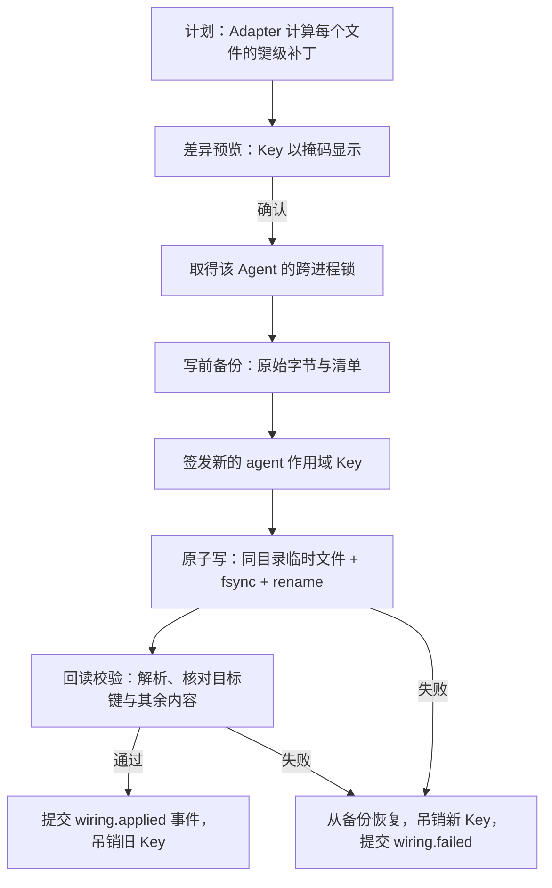

# 04 Agent 平面

状态：提案（草案），2026-10-02。术语、模块名与数据归属以 [02 系统架构](02-architecture.md) 为准；两种接线模式的决定见 [ADR 草案](adr-drafts.md) 的 ADR-P04，Gateway Key 见 ADR-P03 与 [03 模型平面](03-model-plane.md#2-gateway-key-与作用域)。本文描述 `packages/agents` 的目标行为，现行实现仍以 [本机引擎发现](../../engine-discovery.md)、[引擎独立配置](../../engine-configuration.md) 与 [本地便携工具包](../../tool-packages.md) 为准。

Agent 平面负责四件事：发现本机的 Agent；把 Agent 接到网关（全局接线改用户配置，隔离接线只为 Session 生成私有配置）；维护 Profile；把 Library 中的指令、Skills 与 MCP 同步到各 Agent。驱动层优先使用 ACP v1，引擎原生控制面（Claude Code 的 stream-json、Codex App Server、OpenCode server）只在 ACP 适配滞后时作为补充（[01 产品定义](01-product.md#8-同类产品格局)）。文中 Magpie 引用均指 `yetone/magpie@d874adb`，HarnessHub（下称 HH）引用均指 `feat/unified-model-gateway@324c9e8`。

## 1. Adapter 清单

Adapter 是声明式 YAML 清单加可选的插件代码钩子。清单放在 `agents` 包的 `adapters/<id>/adapter.yaml`（目录约定见 [10 工程体系](10-engineering.md#1-仓库结构)），由 JSON Schema 校验；复杂逻辑（例如 Codex 模型清单文件的生成）通过 `hooks` 引用核心或插件中的具名函数，不在清单里写脚本。HH 现状把 16 个引擎的识别写在代码中（[builtins.ts](../../../packages/agents/src/engine/builtins.ts)），配置准备集中在约 1,670 行的 [prepare.ts](../../../packages/agents/src/configuration/prepare.ts)；Magpie 把每个 Agent 写成一个 Go 函数（`internal/agent/agents.go`）。两者都要求改核心代码才能增加 Agent，开源版改为数据驱动。

| 字段 | 类型 | 必填 | 含义 |
|---|---|---|---|
| `schemaVersion` | 整数 | 是 | 当前为 1；未知版本拒绝加载 |
| `id`、`name`、`homepage` | 字符串 | 是 | `id` 为小写字母、数字与连字符，全局唯一，用于 `agent:<id>` 作用域 |
| `stability` | stable、beta、experimental | 是 | 级别标准见第 9 节；社区贡献的新 Adapter 从 experimental 开始 |
| `versions.range` | semver 范围 | 是 | 声明支持的版本范围；一致性测试使用的固定版本只记录在 `conformance/agents.lock.json`，不在清单中重复；范围外的版本仍可用，但显示“未验证” |
| `discovery` | 对象 | 是 | `executables[]`（名称、平台、身份校验）、`configDirs[]`、`versionSources[]`，见第 3 节 |
| `config.files[]` | `{id, path, format, createIfMissing, ownedByHarnessHub}` | 是 | `path` 支持 `~`、`${VAR}`、`${VAR:-默认值}` 与按平台覆盖；`format` 为 json、jsonc、json5、toml、yaml、dotenv、markdown |
| `wiring.protocol` | 枚举 | 是 | Agent 发往网关的协议：openai-chat、openai-responses、anthropic、gemini；可按模型覆盖 |
| `wiring.global` | 对象 | 否 | `mode`（file、env-launch、none）、`keyPlacement` 优先级、`set[]` 键路径与取值模板、`modelList` 写入器；缺省表示不支持全局接线 |
| `wiring.isolated` | 对象 | 是 | 私有目录与环境变量、命令行覆盖、超时与重试对齐、`set[]` |
| `models` | 对象 | 否 | Agent 自己的模型清单文件与元数据字段（窗口、输出上限、推理档位）的写法 |
| `library` | 对象 | 否 | `instructions`、`skills`、`mcp` 的用户级与项目级位置、MCP 文件格式、`transports[]`、秘密传递方式 |
| `run` | 对象 | 是 | `driver` 为 acp、cli 或 `native:<名称>`；命令、参数模板、输入方式、权限默认值、取消方式；`localCommands[]` 逐条列出不调用模型的本地命令（如 codex-acp 的 `/status`），供 [05 执行平面](05-run-plane.md#43-证据规则表) 的 R9 豁免精确匹配 |
| `drift` | 对象 | 否 | `lastUsed`（Agent 最近使用时间的来源，只读文件元数据）与 `reached`（Agent 日志中最近请求地址的来源） |
| `quirks[]` | 数组 | 否 | 已知例外：编号、触发条件、对策、对应一致性测试，见第 6 节 |
| `hooks` | 对象 | 否 | 具名钩子：`planGlobal`、`planIsolated`、`readState`、`writeModelList` |

下面以 Codex 为例给出完整清单（设计示意，不可直接运行；版本号与包名在 M2 以固定版本核实）：

```yaml
schemaVersion: 1
id: codex
name: Codex CLI
homepage: https://github.com/openai/codex
stability: stable
versions: {range: ">=0.150.0 <0.170.0"}   # 固定版本见 conformance/agents.lock.json
discovery:
  executables:
    - {name: codex, identity: {npmPackage: "@openai/codex"}}
  configDirs: ["${CODEX_HOME:-~/.codex}"]
  versionSources:
    - {type: npm-package-json, package: "@openai/codex"}
config:
  files:
    - {id: main, path: "${CODEX_HOME:-~/.codex}/config.toml", format: toml, createIfMissing: true}
    - {id: catalog, path: "${CODEX_HOME:-~/.codex}/harnesshub-models.json", format: json, ownedByHarnessHub: true}
wiring:
  protocol: openai-responses
  global:
    mode: file
    keyPlacement: [env-ref, file]
    set:
      - {file: main, path: model_provider, value: harnesshub}
      - {file: main, path: model, value: "${model.ref}"}
      - {file: main, path: model_reasoning_effort, value: "${model.effort}", optional: true}
      - {file: main, path: model_providers.harnesshub.name, value: HarnessHub}
      - {file: main, path: model_providers.harnesshub.base_url, value: "${gateway.baseUrl}/v1"}
      - {file: main, path: model_providers.harnesshub.wire_api, value: responses}
      - {file: main, path: model_providers.harnesshub.experimental_bearer_token, value: "${gateway.key}", when: key-in-file}
      - {file: main, path: model_providers.harnesshub.env_key, value: "${gateway.keyEnv}", when: key-in-env}
      - {file: main, path: model_catalog_json, value: "${file.catalog}"}
    modelList: {file: catalog, hook: codex-model-catalog}
  isolated:
    env: {CODEX_HOME: "${session.home}/.codex"}
    commandOverrides: ["-c", "model_provider=harnesshub", "-c", "model_providers.harnesshub.base_url=${gateway.baseUrl}/v1"]
    set:
      - {file: main, path: stream_idle_timeout_ms, value: 310000}
      - {file: main, path: request_max_retries, value: 1}
      - {file: main, path: stream_max_retries, value: 0}
library:
  instructions: {user: "${CODEX_HOME:-~/.codex}/AGENTS.md", shadowedBy: "${CODEX_HOME:-~/.codex}/AGENTS.override.md", project: AGENTS.md}
  skills: {user: "${CODEX_HOME:-~/.codex}/skills", project: .agents/skills}
  mcp: {file: main, format: codex-toml, transports: [stdio, http], secrets: env-ref}
run:
  driver: acp
  acp: {package: "@agentclientprotocol/codex-acp", passCodexExecutable: true}
  localCommands: ["/status"]
drift:
  lastUsed: {glob: "${CODEX_HOME:-~/.codex}/sessions/**/rollout-*.jsonl", by: mtime}
quirks:
  - {id: codex-project-layer, test: isolation-codex-project-layer}
```

## 2. 核心 Adapter 范围

1.0 维护 12 个核心 Adapter（02 第 4.2 节），1.x 达到 25 个以上（01 第 4 节）。入选标准按顺序：

1. **能把模型端点指向自定义地址**。不能配置 base URL 的 Agent（Cursor CLI、Antigravity、Kiro）接上网关也不经过网关，只能改模型名，无法产生调用证据，因此不进核心。
2. **有可无人值守运行的入口**，ACP 优先，其次是有结构化输出的 CLI。
3. **配置格式公开，可以固定版本在 CI 中跑一致性测试**。
4. **用户规模**（M0 时按 GitHub Star 与包下载量重新取一次数据）。
5. **HH 已有固定版本验证资产可以复用**：Codex、Gemini、Qwen、Pi、MiMo、DSH、OpenClaw、Kimi、OpenCode、Hermes 十个引擎在 2026-09 经正式 Gateway/Worker 跑过固定版本矩阵（见 [原生 MCP](../../native-mcp.md#验证)），Claude Code 与 Copilot 有配置映射与冒烟证据。

下表的配置位置与字段来自 HH 现有适配、Magpie 对应 Agent 的实现（`internal/agent/*.go`）及其 README；标“核实”的项在 M2 以固定版本源码确认后才能进入稳定级。

| Agent | 配置文件（格式） | 全局接线字段 | 接线模式 | 网关协议 | 运行方式 |
|---|---|---|---|---|---|
| Claude Code | `~/.claude/settings.json`（JSON；`CLAUDE_CONFIG_DIR`） | `env.ANTHROPIC_BASE_URL`、`env.ANTHROPIC_AUTH_TOKEN`、`env.ANTHROPIC_MODEL`、`env.ANTHROPIC_DEFAULT_{OPUS,SONNET,HAIKU}_MODEL`，以及告知窗口的变量（Magpie `7e454bb`） | file | Anthropic | ACP（`claude-agent-acp`） |
| Codex | `~/.codex/config.toml`（TOML；`CODEX_HOME`）＋ HH 自有模型清单 JSON | 见第 1 节示例；ChatGPT 登录不动 | file | Responses | ACP（`codex-acp`） |
| Gemini CLI | `~/.gemini/settings.json`（JSON）＋ `~/.gemini/.env`（dotenv） | `security.auth.selectedType`、`model.name`；`.env` 中 `GEMINI_API_KEY`、`GOOGLE_GEMINI_BASE_URL` | file（Key 进 dotenv） | Gemini | ACP（`gemini --acp`） |
| Qwen Code | `~/.qwen/settings.json`（JSON）＋ `~/.qwen/.env`（dotenv）（核实） | `security.auth.selectedType: openai`、`model.name`；`.env` 中 `OPENAI_BASE_URL`、`OPENAI_API_KEY`、`OPENAI_MODEL` | file（Key 进 dotenv） | Chat | ACP（`qwen --acp`） |
| OpenCode | `~/.config/opencode/opencode.json[c]`（JSONC；`OPENCODE_CONFIG_DIR`） | `provider.harnesshub`（`npm`、`options.baseURL`、`options.apiKey`、`models.<id>.limit`）、`model`、`small_model` | file（`{env:NAME}` 可用时为 env-ref） | Chat | ACP（`opencode acp`） |
| GitHub Copilot CLI | 无可写的 BYOK 配置文件；环境变量 `COPILOT_PROVIDER_TYPE`、`COPILOT_PROVIDER_BASE_URL`、`COPILOT_PROVIDER_API_KEY`、`COPILOT_MODEL` | 由启动包装注入上述变量 | env-launch | Chat 或 Anthropic | ACP（`copilot --acp`） |
| Kimi Code | `~/.kimi/config.toml`（TOML；`KIMI_SHARE_DIR`）（核实） | `providers.harnesshub`（`type`、`base_url`、`api_key`）、`models.<名称>`（`provider`、`model`、`max_context_size`）、`default_model` | file | Chat、Anthropic 或 Gemini | CLI（`kimi --quiet --prompt`）：Kimi 1.50.0 的 ACP 建会话要求 Kimi OAuth（[引擎独立配置](../../engine-configuration.md#密钥与环境)） |
| Pi | `~/.pi/agent/settings.json` ＋ `models.json`（JSON；`PI_CODING_AGENT_DIR`） | `settings.defaultProvider`、`settings.defaultModel`；`models.providers.harnesshub`（`baseUrl`、`api`、`apiKey`、`models[].contextWindow`、`maxTokens`） | file | 按模型取 Chat、Responses 或 Anthropic | ACP（`pi-acp`） |
| Crush | `~/.config/crush/crush.json`（JSON；Windows 为 `%LOCALAPPDATA%\crush`） | `providers.harnesshub`（`type: openai`、`base_url`、`api_key`、`models[]` 含 `context_window`、`default_max_tokens`）、`models.large`、`models.small` | file | Chat | CLI（`crush run`） |
| Hermes Agent | `$HERMES_HOME/config.yaml`（YAML；默认 `~/.hermes`）＋ `$HERMES_HOME/.env`（核实） | `model.provider: custom`、`model.base_url`、`model.default`、`key_env` 指向 `.env` 中的变量 | file（Key 进 dotenv） | Chat | ACP（`hermes acp`） |
| OpenClaw | `~/.openclaw/openclaw.json`（JSON5；`OPENCLAW_STATE_DIR`） | `models.providers.harnesshub`（`baseUrl`、`api`、`apiKey`、`models[]`）、默认 Agent 的主模型 | file | Chat、Responses 或 Anthropic | ACP（`openclaw acp`） |
| MiMo Code | `~/.config/mimocode/mimocode.json[c]`（JSONC，与 OpenCode 同构） | 同 OpenCode | file | Chat | ACP（`mimo acp`） |

入选与取舍的理由：前七个是用户量最大的一线 Agent；Pi、Crush 用户量中等，但配置格式清楚、接线成本低；Hermes、OpenClaw、MiMo 已有 HH 的固定版本证据，MiMo 与 OpenCode 共享格式，增量成本最低。Goose 用户量大，但它的 API Key 只放在系统钥匙串或环境变量中，全局接线需要先验证 env-launch 的体验，而且 PATH 上的 `goose` 可能是同名的数据库迁移工具（Magpie `internal/agent/agents.go:661`），因此列为 1.x 首位。

1.x 候选（以实验级进入，通过第 9 节后升级）：Goose、Cline CLI、Factory Droid（BYOK `customModels`；即使用自有 Key 仍需要 Factory 账号登录，影响无人值守）、DeepSeek Harness（HH 已有执行平面适配）、Grok Build、Qoder CLI（需要支持 BYOK 的套餐）、Command Code、Devin CLI、oh-my-pi、OpenChamber、Claude Desktop（第三方网关模式）、Aider（CLI，无 ACP），以及只能改模型、不经网关的 Cursor CLI、Antigravity 与 Kiro（标为 `wiring.global.mode: none`；执行平面在 1.x 的 `modelTraffic: native` 模式下使用其原生账号，账本中没有调用证据，界面明确标注）。

## 3. 发现

发现沿用现状的原则：**不执行任何被发现的程序**，包括不运行 `--version`、不启动登录 shell、不读取认证文件、不自动安装 Adapter（[本机引擎发现](../../engine-discovery.md)）。Magpie 同样不执行 Agent，但其检测把“配置目录存在”也算作已安装（`internal/agent/agent.go` 的 `Detected`），开源版把两者分成 `installed` 与 `configured-only` 两种状态。

**静态版本读取**。版本只取安装器写下的元数据文件，从不从目录名推断（沿用 [installation.ts](../../../packages/agents/src/engine/installation.ts) 第 280 行的规则）：

| 安装方式 | 读取位置 | 适用 |
|---|---|---|
| npm、pnpm、bun 全局包 | 解析启动 shim 到包目录，读 `package.json` 的 `name` 与 `version` | Claude Code、Codex、Gemini、Qwen、OpenCode、Copilot、Pi |
| pipx、uv tool | 虚拟环境中的 `*.dist-info/METADATA` | Hermes、Kimi |
| Homebrew | `Cellar/<formula>/<ver>/INSTALL_RECEIPT.json` 的 `source.versions.stable` | 各 formula |
| Go 二进制 | 解析内嵌的 build info 块（只读文件，不执行） | Crush |
| 其他原生二进制 | 不读取，版本记为 unknown | — |

**身份校验**：同名程序很常见（Homebrew 的 `dsh` 是分布式 shell，AWS 也有 `copilot`，`goose` 也是数据库迁移工具）。`executables[].identity` 声明期望的 npm 包名、Python 分发名或二进制语言（Go build info 是否存在），不匹配时状态为 `identity-mismatch`，不当作该 Agent。

**Windows shim**：按 PATH 顺序与 PATHEXT 查找 `.exe`、`.com`、`.cmd`、`.bat`、`.ps1` 与无后缀 shebang 文件，并静态解析 shim 到真实目标：npm 与 pnpm 的 `.cmd` 按其固定模板提取 `node_modules` 下的入口；Scoop 读 `.shim` 文件的 `path =`；WinGet Links 解析符号链接；Volta 读取 `LOCALAPPDATA\Volta\tools\image` 下的包目录。补查目录包括 `APPDATA\npm`、`LOCALAPPDATA\pnpm`、用户与全局 Scoop `shims`、`LOCALAPPDATA\Microsoft\WinGet\Links`、`LOCALAPPDATA\Volta\bin`（上一轮核验 P3 指出现状缺后三者）。解析失败时仍报告候选，但版本为 unknown、状态附带原因。WSL 内的 Agent 在 1.x 支持。

**诊断输出**：`hh ls --explain` 与 `hh doctor agents [--json]` 对每个 Adapter 输出：状态（installed、configured-only、not-found、identity-mismatch、ambiguous、adapter-missing）；可执行文件路径与找到方式（第几个 PATH 项或哪个补查目录）；shim 解析链；版本与来源文件；每个配置文件是否存在、可读、可解析；接线状态与漂移类型；已检查的全部位置。JSON 输出把用户主目录替换为 `~`，可以直接附在问题报告中。

## 4. 全局接线

全局接线改写用户自己的 Agent 配置，对应 Magpie 的核心功能，按 ADR-P04 增加预览、备份、回读校验与还原：



- **计划**：输入为 Agent、Model Ref 或路由组、可选字段（推理档位、小模型）；输出为每个文件的操作列表 `{file, keyPath, op, oldValue, newValue}`，以及要同步的模型清单文件。计划是纯函数，相同输入得到相同计划；已经接线且无变化时计划为空。
- **差异预览**：按文件显示统一 diff，Gateway Key 显示为 `hhk_a_xxxx…`。脚本中用 `--yes` 跳过确认，`--dry-run --json` 只输出计划。
- **备份**：首次改写某个文件前，把原始字节保存到 `<数据目录>/backups/wiring/<adapterId>/`，清单记录路径、SHA-256、大小、权限、修改时间、文件原本是否存在以及符号链接目标。每个文件的首个原始版本永久保留，其余保留最近 20 份（参照 CC Switch 的 `backups/live-first-write`）。
- **原子写**：写入同目录临时文件、fsync、rename，保留原权限。路径是符号链接时写其目标并保留链接；文件有多个硬链接时原地写入（Magpie `internal/edit/file.go` 的 `WriteAtomic`）。rename 前再次核对文件哈希与计划时一致，不一致说明有人同时修改，中止并重新计划。Windows 上遇到共享冲突时最多重试 5 次、每次间隔 100 ms，仍失败则明确报错。
- **回读校验**：用真实解析器重新读取文件，确认每个目标键为新值；补丁范围以外的字节与写前逐字节相同。任一条件不满足视为失败。
- **记录**：提交 `wiring.applied` 事件，包含 Adapter、字段、每个文件的写前与写后哈希、备份编号与新 Key 的 `keyId`；之后才吊销旧 Key。Magpie 的 stash 与 applied 记录写失败时被忽略（`internal/agent/stash.go`、`applied.go` 不检查 `os.WriteFile` 的返回值），开源版任何记录失败都使整个操作失败。

**Key 的落点**：ADR-P03 要求“能用环境变量引用的 Agent 一律用环境变量”。全局接线时 HH 不改写 shell 启动文件，所以只有环境变量对 Agent 进程确定可得时才用 `env-ref`：Agent 自己加载的 dotenv 文件（Gemini、Qwen、Hermes），或 env-launch 模式下由 `hh launch <agent>` 启动包装注入（Copilot）。其他情况把 Key 写入配置文件。写入文件的 Key 只对回环来源与该 Agent 的白名单模型有效，`hh unwire` 时吊销。env-launch 模式不写任何用户文件：用户以 `hh launch <agent> -- <参数>` 启动，包装进程向守护进程取得该 Agent 的 Key、设置变量后用原 argv 启动 Agent；`hh env <agent>` 只打印变量名与取值来源，供用户自行决定是否写入 shell 配置。这种模式没有可漂移的文件，漂移检测只使用网关证据。

**格式保真编辑**（02 第 7 节）：JSON 与 JSONC 用 `jsonc-parser` 的增量编辑；YAML 用 `yaml` 的 Document API；TOML 按键路径定点编辑并用解析器回读；dotenv 按行编辑；JSON5 只支持 `jsonc-parser` 能无损解析的子集。遇到无法安全定点修改的结构时拒绝写入并说明原因，不整文件重写：目标键在 TOML 内联表或数组表中、YAML 目标路径上有锚点或别名、JSON 有重复键、文件编码不是 UTF-8。BOM 与换行风格（LF 或 CRLF）保持原样，新插入的行使用文件已有的缩进与换行。

**还原**（`hh unwire <agent>`）：如果当前文件哈希等于上次写入后的哈希，直接写回备份的原始字节，结果与接线前逐字节一致；文件原本不存在则删除它，以及 HH 为它创建且仍为空的目录。如果用户在接线后又改过文件，改为对当前内容做键级反向补丁，只恢复 HH 改过的键，预览差异后执行，并在事件中记录 `restore: reverse-patch`。两种方式都吊销该 Agent 的 Key。

**Agent 正在运行时**：多数 Agent 只在启动时读取配置，部分 Agent 退出时会写回自己的配置（例如保存 `/model` 的选择），可能覆盖本次修改。接线前检查进程表（Linux 读 `/proc`；macOS 以固定参数调用系统 `ps`；Windows 用原生 helper 查询进程列表，均不执行 Agent 本身），发现运行中的实例时：交互模式提示“需要重启才能生效，运行中的实例退出时可能覆盖本次修改”并要求确认；非交互模式继续并输出同样的警告。写入后由漂移检测（第 5 节）发现可能的覆盖。进程检查只是提示，结果不作为任何判定的依据。

**失败处理**：任一步失败都停止。多文件计划按顺序写入，第 k 个文件失败时，前 k−1 个文件按备份恢复，并逐文件报告恢复结果；恢复本身失败时给出备份路径与手工恢复命令，不吞掉错误。新签发的 Key 在失败时立即吊销。同一 Agent 的接线、还原与 Profile 切换由数据目录中的跨进程锁串行化，CLI 与控制台不会并发改写同一文件。

## 5. 漂移检测

用户、其他切换工具或 Agent 自己都可能改写配置。Magpie 以 `applied.json` 记录自己写过的值，并区分三类漂移（`internal/agent/applied.go`）；开源版沿用分类，并用网关证据加强判定：

| 类型 | 判定 | 证据 | 建议动作 |
|---|---|---|---|
| `unwired` | 模型字段仍是 HH 的 Model Ref，但 base URL 不指向本网关，或 Key 字段缺失、被替换 | 读取配置文件 | `hh wire <agent> --reapply` |
| `replaced` | HH 写入的字段被改成非 HH 的值 | `wiring.applied` 记录与当前值比较 | 重新接线，或 `hh wire <agent> --forget` 接受现状 |
| `bypassed` | 配置正确，但 Agent 在接线之后、守护进程启动之后被使用过，而网关在对应时间窗口内没有该 Agent Key 的任何调用 | Agent 使用时间与 `model.call` | 重启 Agent（多半仍在用旧配置） |
| `stale-key` | 配置中的 Key 已吊销或过期，网关收到该 Key 的被拒绝调用 | 被拒绝的 `model.call`（[03 模型平面](03-model-plane.md#2-gateway-key-与作用域)） | 重新接线以轮换 Key |
| `foreign-gateway` | base URL 指向另一个 HH 实例或其他网关 | 读取配置文件 | 提示，不自动修改 |

`bypassed` 的时间规则：Agent 最近一次使用晚于接线时间与守护进程启动时间，并且已过去 30 秒宽限；在“使用时间前 120 秒到后 30 秒”内没有该 Key 的调用。使用时间来自 Adapter 的 `drift.lastUsed`，只读取文件修改时间，不读取内容，例如 Codex 的 `sessions/**/rollout-*.jsonl`、Claude Code 的 `projects/**/*.jsonl`。因为每个 Agent 有自己的 Key，网关能直接回答“这个 Agent 最近一次调用是什么时候”，不必像 Magpie 那样按 User-Agent 推断（`usage.LastSeen`）。

检测时机：守护进程监视已接线的配置文件（变更后 500 ms 去抖），另外每 60 秒检查一次，`hh ls` 时也检查。只在状态变化时提交 `wiring.drift` 事件。漂移从不自动修复，因为改写用户文件必须由用户确认。隔离接线下的绕过（Run 有输出但没有任何网关调用）由执行平面的结果判定规则 R9 处理（[05 执行平面](05-run-plane.md#43-证据规则表)）。

## 6. 隔离接线

隔离接线只为执行平面的 Session 生成私有配置，不触碰用户文件，沿用现状的做法：Worker 在 Session 目录下建立私有 HOME 与 Agent 配置目录，设置 `HOME`、`USERPROFILE`、`APPDATA`、`LOCALAPPDATA`、`XDG_*`（Windows 上还有由私有 HOME 拆出的 `HOMEDRIVE` 与 `HOMEPATH`：显式环境缺少它们时，Node 的 libuv 会从启动方复制真实值）以及 Agent 专属变量（`CODEX_HOME`、`CLAUDE_CONFIG_DIR` 等），按 Adapter 的 `wiring.isolated` 写入配置，Session Key 只经环境变量或私有文件传入（[prepare.ts](../../../packages/agents/src/configuration/prepare.ts) 的 `prepareConfiguration`）。Windows 的环境白名单必须保留 `ProgramFiles`、`ProgramFiles(x86)`、`ProgramW6432`、`ProgramData`、`ALLUSERSPROFILE`、`PUBLIC`、`COMPUTERNAME`，否则依赖它们的工具在任何 Windows 机器上都会失败（上一轮核验 P0-2）。

私有 HOME 只隔离按用户目录查找的配置。上一轮核验确认了以下例外，每一项在 Adapter 清单中登记为 `quirks[]`，并有对应的一致性测试：

| 例外 | 机制 | 后果 | 对策 |
|---|---|---|---|
| Codex 工作区 `.codex/config.toml` | codex-acp 把 Session 工作目录标为可信，Codex 把其中的 `.codex/config.toml` 作为 Project 层加载，优先级高于 HH 写入的 User 层 | 工作区中的 `model_provider`、`base_url` 覆盖接线，请求可能绕过网关 | 关键键改用优先级更高的命令行覆盖（`-c`，见第 1 节示例），M2 以固定版本核实 codex-acp 的透传；准备阶段扫描工作区及其到仓库根之间的 `.codex/config.toml`，发现冲突键时报告 `ISOLATION_OVERRIDDEN` |
| OpenCode、MiMo 的机器级托管配置 | `%ProgramData%\opencode\`、macOS `/Library/Application Support/opencode` 等位置的托管配置在内联配置之后合并并且优先 | Agent 直连别处，Run 却可能判为成功 | 准备阶段检测托管配置路径，存在即以 `ISOLATION_MANAGED_CONFIG` 失败；用户可以显式设置 `allowManagedConfig` 放行，此时界面标注“隔离不完整”；结果判定的零调用规则兜底 |
| Gemini 祖先目录 `.gemini/.env` | 可信模式下从工作目录向上加载第一个 `.gemini/.env`，工作区在用户目录下时会读到真实的 `~/.gemini/.env`；`ignoreLocalEnv` 管不到这一分支，只回填尚未设置的变量 | `GEMINI_SYSTEM_MD`、`GOOGLE_*` 等变量混入 | Worker 显式设置 Adapter 列出的全部相关变量（包括设为空），使 `.env` 无法回填；准备阶段扫描祖先目录并在事件中报告；建议工作区使用数据目录下的 git worktree |
| Codex 在 Windows 上经 Known Folder 解析主目录 | Rust 的 `dirs::home_dir()` 读取 Known Folder Profile，忽略 `USERPROFILE` | 可能读到真实的用户级技能目录（未实测） | Windows 一致性测试用金丝雀文件验证；确认后在 Adapter 中登记对策 |
| MCP 秘密引用带出 HH 凭据 | 登记 MCP 时把请求头引用为 HH 的网关或上游凭据 | 凭据交给 Agent 与任意 MCP 地址（上一轮实测） | 第 8 节的禁止规则，在登记、导入、绑定三处检查 |

以上对策只能缩小绕过面，不能证明没有绕过；只有 Session 的网络隔离为 `gateway-only` 且实际生效时，调用证据才标为 `enforced`，其余为 `observed`（[05 执行平面](05-run-plane.md#6-沙箱与隔离等级)）。金丝雀验证：在测试用的“真实用户目录”、工作区祖先目录与机器级配置位置放置带唯一标记的配置（例如指向不存在地址的 base URL、独特的模型名），以隔离接线运行 Agent，断言网关收到的请求与 Agent 发起的连接中都不出现这些标记。

## 7. Profile

Profile 是一组接线与 Library 选择的命名快照（02 第 2 节）：`{name, agents: {<adapterId>: {modelRef, fields, mode}}, library: {instructionSet, skills[], mcp[]}, defaultGroup}`。Profile 只保存 Model Ref 与 Library 条目的标识，不保存任何 Key 或秘密值，可以导出分享。

| 命令 | 行为 |
|---|---|
| `hh profile save <name>` | 从当前已接线的状态与 Library 选择生成快照 |
| `hh profile use <name>` | 合并所有 Agent 的计划，给出一份总预览；确认后逐个 Agent 执行第 4 节流程；某个 Agent 失败时，已切换的 Agent 按备份恢复，最终状态与切换前一致，并逐个报告 |
| `hh profile diff <a> <b>` | 显示两份快照在模型、字段与 Library 上的差异 |
| `hh profile export`、`hh profile import` | 不含秘密；导入时缺少的 provider 或 Library 条目列为待补项，不静默跳过 |

执行平面创建 Session 时可以指定 Profile，Worker 按 Profile 做隔离接线，得到与全局接线相同的模型与 Library 选择，但不写用户文件。这使“我平时怎么用”与“无人值守怎么跑”共用一份定义。

## 8. Library

Library 保存一份 Skills、MCP 服务与指令集，按各 Agent 的原生格式同步（02 第 4.2 节）。存储沿用现有工具包的内容寻址对象、跨进程锁与严格路径校验（[store.ts](../../../packages/agents/src/tool-packages/store.ts)、[本地便携工具包](../../tool-packages.md)），同步记录每个 Agent 中由 HH 写入的条目，移除时只删除自己的条目（Magpie `internal/library/library.go` 的 `Applied` 采用同样原则）。与用户已有条目同名时拒绝并报告冲突，不覆盖。

**指令集**：以 [AGENTS.md](https://agents.md) 为基础格式，可以保存多套并切换。写入各 Agent 的用户级指令文件（Claude Code 的 `CLAUDE.md`、Codex 的 `AGENTS.md`、Gemini 的 `GEMINI.md` 等，位置见各 Adapter 的 `library.instructions`）时，只写入带标记的区块 `<!-- harnesshub:begin id=<set> sha=<hash> -->` 与 `<!-- harnesshub:end -->`，区块外的内容不动；存在会遮蔽该文件的覆盖文件（Codex 的 `AGENTS.override.md`）时给出警告。

**Skills**：遵循 [Agent Skills 规范](https://agentskills.io/specification)：每个 Skill 是含 `SKILL.md` 的目录，YAML front matter 中 `name` 与 `description` 必填，`name` 只含小写字母、数字与连字符并与目录名一致。导入时执行与 `skills-ref validate` 等价的校验，失败即拒绝导入，不在同步到 Agent 后才被 Agent 静默丢弃（上一轮核验 P3 指出 Gemini 会静默跳过无效 Skill）。放置方式：POSIX 用符号链接指向内容对象；Windows 无符号链接权限时，以及 WSL 目标，使用带标记文件的副本，内容变化时重新复制（Magpie `internal/library/skills.go`）。

**MCP 服务**：定义为 `{name, transport, command, args, env, secretEnv, url, headers, secretHeaders}`。来源包括手工添加、现有导入器支持的 `mcp.json` 系列格式，以及官方 MCP Registry 的 `server.json`：其中的 npm、PyPI 包转为固定版本的 stdio 命令（`npx -y <包>@<确切版本>`、`uvx <包>==<确切版本>`），标记 `fetchesAtRuntime: true` 并要求用户确认；离线模式与 CI 中拒绝这类条目。远程端点转为 http 或 sse。

各核心 Agent 能接受的 MCP 传输与秘密传递方式如下。“待核”项在 Adapter 达到稳定级前必须由一致性测试确认；不支持的组合在同步时明确拒绝，不写入后才失败（现状在登记、应用、准备三层都不检查，带 SSE 服务的配置在 Codex 上每次建会话都失败，上一轮核验 P2）。

| Agent | stdio | Streamable HTTP | SSE | 秘密传递 |
|---|---|---|---|---|
| Claude Code | 是 | 是 | 是 | 配置中的环境变量展开 |
| Codex | 是 | 是 | 否（Magpie `internal/library/mcp.go:181`） | `env_vars` 透传、`bearer_token_env_var` |
| Gemini CLI、Qwen Code | 是 | 是 | 是 | 配置中的环境变量引用 |
| OpenCode、MiMo Code | 是 | 是 | 待核 | `{env:NAME}` |
| Copilot CLI | 是（原生配置文件） | 是 | 是 | 配置中的变量引用（[引擎独立配置](../../engine-configuration.md#密钥与环境)） |
| Kimi Code | 是 | 是 | 是 | 不展开引用，秘密字段一律拒绝（[原生 MCP](../../native-mcp.md)） |
| Pi | 是 | 是 | 否（Magpie 同上） | 待核 |
| Crush | 是 | 是 | 是 | 待核 |
| Hermes Agent | 是 | 是 | 待核 | 待核 |
| OpenClaw | 是 | 是 | 是 | 环境变量 SecretRef（[原生 MCP](../../native-mcp.md)） |

**秘密只用引用**：Library 中的秘密一律是 `store`、`env`、`file` 三种引用之一（定义见 [07 数据与安全](07-data-security.md#43-引用模型)），从不保存值；Magpie 的 `library.json` 以明文保存 MCP 的 `env` 与 `headers`。隔离接线时由 Worker 解析引用，只交给所属 MCP 进程。全局接线时，只有 Agent 支持在配置中引用环境变量才写入引用；否则默认拒绝同步这个服务，用户显式加 `--allow-plaintext-secret` 才会把值写入该 Agent 的配置文件，并在预览中标红。**禁止引用 HarnessHub 自身凭据**：引用目标不能是任何 Gateway Key、本机管理令牌、provider Credential 使用的钥匙串条目，也不能是 `HH_`、`HARNESSHUB_` 前缀的环境变量；在登记、导入、绑定三处检查，违反时返回 400 `SECRET_REF_FORBIDDEN`；使用时的第二层值摘要比对见 [07 第 4.6 节](07-data-security.md#46-禁止把-harnesshub-自身凭据作为工具秘密)（修复上一轮核验 P1-15 实测的凭据外泄）。

**项目级放置是显式开启的**：只有执行 `hh library project add <目录>` 后，HH 才会在该项目中放置 Skills（Claude Code 读 `.claude/skills`，读共享目录的 Agent 用 `.agents/skills`）或指令。放置的条目写入 `.git/info/exclude`，不修改受版本控制的 `.gitignore`（Magpie 会创建 `.gitignore`，见 `internal/library/projects.go`）；HH 记录放置清单，移除时只删除自己放置的条目与为此创建且已为空的目录。

## 9. 一致性测试

每个 Adapter 都必须通过下表的检查。测试位于 `conformance/` 的 Adapter 套件（[10 工程体系](10-engineering.md#33-三类一致性套件)），使用合成的用户目录与回环假上游，真实 Agent 使用 `conformance/agents.lock.json` 中的固定版本。级别沿用 10 的定义：**稳定级（stable）**要求在固定版本、在该 Agent 支持的每个平台上 100% 通过离线与在线套件，结果进入公开兼容矩阵，连续 3 次夜间运行失败即降为 beta 并自动开 issue；**beta** 允许个别平台的项待补，待补项在兼容矩阵中逐项列出；**实验级（experimental）**至少通过第 1–5 项与第 7 项。

| 编号 | 检查 | 通过标准 |
|---|---|---|
| 1 | 发现 | 按 Adapter 声明的各种安装布局（npm、pipx、Homebrew、Scoop 等）构造目录，状态与版本识别正确；整个过程的子进程创建次数为 0 |
| 2 | 身份冲突 | 同名但身份不符的程序判为 `identity-mismatch` |
| 3 | 计划确定性与幂等 | 相同输入两次计划相同；接线后再次计划为空 |
| 4 | 预览范围 | 差异只包含清单声明的键与 HH 自有文件，Key 以掩码显示 |
| 5 | 接线生效 | 接线后启动真实 Agent 完成一次带工具调用的任务，网关收到的全部 `model.call` 的 `keyId` 都是该 Agent 的 Key |
| 6 | 回读校验能拒绝错误写入 | 注入“写入后内容被篡改”与“rename 前文件被并发修改”，操作失败且文件恢复为写前字节 |
| 7 | **接线后还原与原文件逐字节一致** | 覆盖：文件原本不存在；含注释、BOM、CRLF、尾随空白；路径为符号链接；文件有硬链接；原文件只读。还原后 SHA-256 与接线前相同，HH 创建的空目录被删除 |
| 8 | 外部修改后还原 | 接线后由测试改动其他键，还原只恢复 HH 改过的键，测试的改动保留 |
| 9 | 中断安全 | 在临时文件写入与 rename 之间杀死进程，原文件完好，下次运行清理残留临时文件 |
| 10 | 漂移 | 构造 `unwired`、`replaced`、`bypassed`、`stale-key` 四种场景，均被检出且只提交一次事件 |
| 11 | 隔离不写用户文件 | 隔离接线运行任务前后，对合成用户目录做全量哈希快照，结果相同；第 6 节的金丝雀不出现在请求中 |
| 12 | Library 同步与移除 | 指令区块、Skills、MCP 同步后可被 Agent 使用（MCP 需要真实 `tools/call`）；移除后只删除 HH 的条目；不支持的传输在同步时被拒绝 |
| 13 | 秘密 | 全部生成文件与 Agent 私有状态目录中不出现合成秘密的明文（`--allow-plaintext-secret` 场景除外）；引用 HH 凭据被拒绝 |
| 14 | 运行 | ACP：initialize、prompt、权限往返、cancel；CLI：一次完整运行；两者在取消后进程树全部回收 |
| 15 | Windows 专项 | 中文与空格路径、各类 shim 解析、Known Folder 金丝雀、共享冲突重试 |
| 16 | Profile 往返 | 在两个 Profile 之间切换后再切回，所有相关文件与切换前逐字节一致 |
| 17 | Run 结果判定场景 | [05 执行平面](05-run-plane.md#44-判定时机可解释性与证据强度) 列出的六个真实 Agent 场景（正常任务、第二次主调用上下文超长、200 HTML、空闲超时断开、不调用模型只输出错误、侧调用失败）得到预期结果 |

## 10. 与现状的差异与迁移

| 现状（`324c9e8`） | 开源版 | 迁移动作 |
|---|---|---|
| 16 个引擎的识别写在 [builtins.ts](../../../packages/agents/src/engine/builtins.ts)；自定义引擎用 `engines/manifests/*.json`（只有 `name` 与 `registration`） | 声明式 Adapter 清单加具名钩子 | 内置配方逐个改写为 `adapters/<id>/adapter.yaml`；旧 manifest 的 `registration` 转为 `run` 段，`hh migrate` 自动转换 |
| 只有隔离接线，配置准备集中在 [prepare.ts](../../../packages/agents/src/configuration/prepare.ts) 中按引擎分支 | 全局接线与隔离接线并存，逐引擎逻辑归各 Adapter | 把 prepare.ts 中各引擎的分支拆成 Adapter 的 `wiring.isolated` 与 `planIsolated` 钩子；现有 Worker 测试保留为第 9 节第 11、14 项的基础 |
| 统一模型强制覆盖全部引擎，无法接入者停用（[引擎独立配置](../../engine-configuration.md#统一模型)） | 每个 Agent 独立选择 Model Ref；不能接网关的 Agent 在 1.x 以原生账号运行（05 第 2 节的 `modelTraffic: native`），并标注“无调用证据” | 迁移时按旧统一模型为每个已登记引擎生成同一 Model Ref 的 Profile |
| 发现不执行程序，版本只从 `package.json` 读取 | 保留原则；增加 dist-info、Homebrew 收据、Go build info、身份校验、Windows shim 解析与诊断输出 | 扩展 [discovery.ts](../../../packages/agents/src/engine/discovery.ts) 与 [installation.ts](../../../packages/agents/src/engine/installation.ts)，测试沿用“无子进程”断言 |
| 工具包绑定到引擎 revision，经 SQLite overlay 或 `settings.json` 生效 | Library 条目按 Profile 或 Session 选择，同步到用户配置或 Session 私有配置 | 已安装的工具包对象原样作为 Library 内容对象；绑定关系转为 Profile 中的 Library 选择 |
| MCP 秘密可以引用 `HARNESSHUB_*` 变量 | 第 8 节的禁止规则 | 迁移时检测并列出违规引用，要求用户改为独立凭据，不自动迁移 |
| 办公工具包与 Capability Pack 预装在发行包 | 移出核心，作为 Library 示例包单独发布 | 见 12 路线图与迁移 |
| 引擎 revision 与 Session 固定 revision | Session 固定创建时的 Adapter 版本、Profile 与 Library 内容摘要 | 现有 Session 继续使用旧 revision 运行至关闭 |
