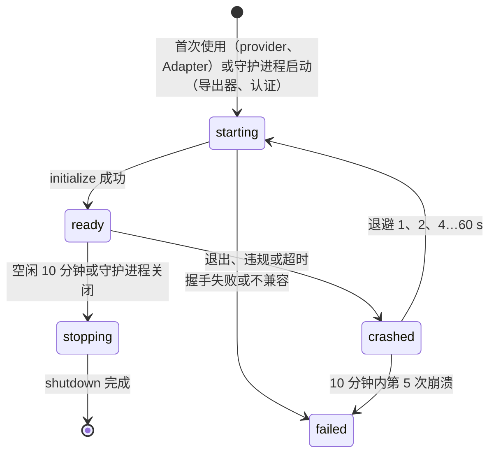

# 09 扩展

状态：提案（草案），2026-10-02。术语与进程模型以 [02 系统架构](02-architecture.md) 为准；插件运行在独立进程、经 stdio 使用 JSON-RPC 2.0 的决定见 [ADR-P07](adr-drafts.md#adr-p07-插件协议)；订阅复用只能以社区插件存在的决定见 [ADR-P09](adr-drafts.md#adr-p09-订阅复用不进核心)。插件与工具包的信任分级见 [07 第 7 节](07-data-security.md#7-插件与工具包的信任模型)，插件故障时的降级见 [08 第 3 节](08-reliability-observability.md#3-失败域与降级)。文中的命令名与包名表示所需的能力，最终命名以 [06 接口与交互面](06-interfaces.md) 与 [10 工程体系](10-engineering.md) 为准。

依据：现有工具包的内容寻址存储与路径校验（[`src/tool-packages/store.ts`](../../../src/tool-packages/store.ts)）；`yetone/magpie@d874adb` 的 `internal/plugin`（`host.go`、`host.js`、`store.go`、`market.json`）；OpenCode 插件 API `@opencode-ai/plugin` v1；[MCP](https://modelcontextprotocol.io) 的 stdio 传输与 [LSP](https://microsoft.github.io/language-server-protocol/) 的取消约定。

## 1. 扩展点

能用数据表达的扩展一律用数据：provider 预设与 Adapter 清单是声明式文件，社区通过 PR 贡献，不需要写代码。只有数据表达不了的行为才写插件。下表之外的部分（路由策略、Store 后端、秘密后端、控制台界面、Run 结果判定规则）在 1.x 不是扩展点，修改走核心仓库的 PR。

| 扩展点 | 形式 | 能做什么 | 不能做什么 | 版本 |
|---|---|---|---|---|
| provider | 预设数据文件；provider 插件 | 预设：基址、协议、认证头形状、模型列表来源、价格覆盖。插件：交互式认证（OAuth、设备码）与令牌刷新、按请求体摘要签名、请求与响应变换、列模型、解析非标准用量 | 读取其他 provider 的凭据；改变路由决策或绕过 ADR-P05 的重试规则；直接写证据（只回报用量字段，由网关提交 `model.call`）；读取 Session、Run 或其他调用的数据；经 `host/fetch` 访问清单外的主机 | 预设 0.1；插件 1.0 |
| Adapter | 声明式清单；Adapter 插件 | 清单：发现规则、配置文件位置与格式、接线字段、能力、启动方式（[04 第 1 节](04-agent-plane.md#1-adapter-清单)）。插件：清单表达不了的发现逻辑、JSONC/YAML/TOML 以外格式的补丁计算、版本解析、原生会话读取（1.x） | 直接写文件（只返回补丁，由守护进程预览、备份、写入、回读校验）；在 Worker 监督之外启动 Agent；接触 provider 凭据（只拿到 Gateway Key 占位符，由守护进程替换） | 清单 0.2；插件 1.0 |
| 工具包（Library） | 数据包：Skills、MCP 定义、指令集 | 随 Library 同步到 Agent 配置或 Session | 引用 HarnessHub 自身凭据（[07 第 4.6 节](07-data-security.md#46-禁止把-harnesshub-自身凭据作为工具秘密)）；静默安装可执行文件（MCP 命令在安装时逐项展示） | 0.2 |
| 导出器 | 导出器插件 | 接收已提交的证据流（事件、`model.call`、团队版审计），转换后发往外部系统（如 S3、SIEM、自建分析库）；至少一次投递，按游标续传 | 修改或否决事件；阻塞网关（异步、有界队列）；读取秘密值；读取提示词与回答正文，除非用户为该导出器单独开启内容导出 | 1.0；OTLP 导出内置，不需要插件（08 第 5 节） |
| 认证 | 认证插件（团队服务器） | OIDC 以外的身份源（如 LDAP、SAML 桥接）；把身份声明映射为角色 | 授予超过配置上限的角色；绕过审计；自行签发会话（会话由守护进程签发） | 1.x |

## 2. 插件协议

### 2.1 传输与进程

- 每个启用的插件一个进程，由守护进程的 `plugin-host` 包启动和监督。stdin 与 stdout 承载 JSON-RPC 2.0 消息，每条消息占一行（UTF-8 JSON，消息内不得出现未转义的换行），与 MCP 的 stdio 传输相同。stderr 是插件日志，由宿主收集并按 08 第 7 节脱敏，每分钟上限 1 MiB，超出部分计数后丢弃。
- 单条消息上限 8 MiB，超过时接收方返回 -32008 并丢弃该消息；更大的数据用流（2.4 节）。stdout 出现非 JSON 内容视为协议违规，宿主终止插件并记为一次崩溃。
- 请求是双向的：守护进程调用插件实现的方法；插件调用宿主方法（`host/*`）获取网络、秘密、文件与用户交互能力。两个方向的请求 ID 各自独立。
- 进程环境只含允许名单中的变量（PATH、语言与时区、代理与 CA 变量）以及 `HH_PLUGIN_PROTOCOL`、`HH_OWNER_TOKEN`；HOME 与工作目录指向插件私有目录 `plugins/<id>/state`（0700）。秘密从不放进环境变量。POSIX 上插件位于单独的进程组，Windows 上位于守护进程拥有的 Job（[ADR 0007](../../decisions/0007-windows-process-supervision.md)），守护进程退出时一并回收。插件在 stdin 关闭后必须在 2 s 内退出。

### 2.2 握手与版本协商

设计示意，不可直接运行：

```json
{"jsonrpc":"2.0","id":1,"method":"initialize","params":{
  "protocolVersions":["1.1","1.0"],
  "host":{"name":"harnesshub","version":"1.2.0","platform":"linux-x64","deployment":"local"},
  "plugin":{"id":"acme.vertex-auth","version":"0.3.1"},
  "grants":{"network":["oauth2.googleapis.com:443","*.aiplatform.googleapis.com:443"],
            "secrets":{"own":true,"refs":["provider:vertex/credential"]}},
  "config":{"projectId":"my-project"},
  "hostCapabilities":{"fetch":{"streaming":true},"secrets":true,"files":false,"prompt":true}}}

{"jsonrpc":"2.0","id":1,"result":{
  "protocolVersion":"1.1",
  "plugin":{"id":"acme.vertex-auth","version":"0.3.1"},
  "maxConcurrentRequests":16,
  "capabilities":{"provider":{"ids":["vertex"],"methods":["provider/authorize","provider/credentials","provider/listModels"]}}}}
```

- 宿主在 `protocolVersions` 中按优先级列出支持的 `主.次` 版本，插件选择双方都支持的最高版本并在结果中返回。没有共同版本时插件返回 -32010，宿主把插件标为 `incompatible`，并在 `hh doctor` 中报告。
- 握手超时 10 s，覆盖解释器冷启动。超时、声明的能力超出清单、ID 或版本与清单不符，都视为启动失败。
- 握手成功后宿主发送 `initialized` 通知，插件此后才能调用 `host/*`。

### 2.3 能力与方法

宿主只把调用路由到插件在握手中声明过的方法，未声明的方法不会被调用；插件收到未实现的方法时返回 -32601。宿主在每个请求的 `params._meta.deadline` 中给出绝对期限（Unix 毫秒）；到期时宿主发送取消通知，并按 -32002 处理，迟到的响应被忽略。

| 方法 | 方向 | 用途 | 默认期限 |
|---|---|---|---|
| `initialize`、`shutdown` | 宿主→插件 | 握手；有序关闭 | 10 s；5 s |
| `provider/authorize` | 宿主→插件 | 开始交互式认证，返回 URL、设备码或需要用户填写的字段 | 10 min（等待用户） |
| `provider/credentials` | 宿主→插件 | 返回本次请求要附加的认证头与过期时间，必要时先刷新令牌 | 5 s |
| `provider/signRequest` | 宿主→插件 | 按方法、URL、头与请求体 SHA-256 计算签名头，不传请求体 | 1 s |
| `provider/transformRequest`、`provider/transformResponse` | 宿主→插件 | 非流式请求与响应变换 | 2 s |
| `provider/transformStream` | 宿主→插件 | 流式响应逐块变换（2.4 节） | 首块 2 s，块间 60 s |
| `provider/listModels`、`provider/parseUsage` | 宿主→插件 | 列模型与能力；从非标准响应中取用量 | 30 s；1 s |
| `adapter/discover`、`adapter/computePatch`、`adapter/verify` | 宿主→插件 | 发现、计算配置补丁、校验接线结果 | 5 s |
| `exporter/export`、`exporter/flush` | 宿主→插件 | 投递一批已提交证据（带游标）；关闭前刷新 | 30 s |
| `auth/authenticate`、`auth/mapClaims` | 宿主→插件 | 团队版身份校验与角色映射 | 10 s |
| `host/fetch` | 插件→宿主 | 按清单校验后发起 HTTP 请求，响应体可流式返回 | 调用方给定，最长 10 min |
| `host/secrets/get`、`host/secrets/put` | 插件→宿主 | 读取授权的秘密；写入插件自有秘密（如 OAuth 令牌） | 5 s |
| `host/files/read`、`host/files/write` | 插件→宿主 | 读写清单声明的路径 | 5 s |
| `host/prompt` | 插件→宿主 | 请用户打开 URL、输入验证码或确认 | 10 min |
| `host/log`、`host/progress` | 插件→宿主（通知） | 结构化日志与进度 | — |

provider 插件应优先实现 `provider/credentials` 或 `provider/signRequest`：它们只处理请求头，上游的流式响应由宿主直接转发，不经过插件，网关延迟预算不受影响。只有线上格式确实不同时才实现 `provider/transformStream`。

### 2.4 取消与流式

- 取消：任一方向都可以发送 `$/cancelRequest {"id": …}` 通知（沿用 LSP 的约定）。接收方应停止工作、释放资源，并在 1 s 内以 -32800 响应；发送方在发出取消时就认为请求已结束。客户端断开、Run 取消与期限到达都会触发取消。
- 流：流数据以通知 `$/stream/chunk {"id", "seq", "data", "encoding": "utf8" | "base64"}` 发送，`id` 为所属请求的 ID，`seq` 从 0 连续递增，每块不超过 64 KiB。流的输出方以该请求的最终 JSON-RPC 响应（结果或错误）结束输出；输入方向（如 `provider/transformStream` 中宿主送入的上游数据块）以 `$/stream/end {"id"}` 结束。
- 流控：接收方用 `$/stream/ack {"id", "credits"}` 授予额度，初始窗口为 64 块，额度用完时发送方暂停。`seq` 不连续视为协议违规。
- `host/fetch` 的响应体与 `provider/transformStream` 的输入输出都使用这套机制。

### 2.5 生命周期与并发



- provider 与 Adapter 插件在首次使用时启动，空闲 10 分钟后停止；导出器与认证插件随守护进程启动并常驻。
- 有序关闭：发送 `shutdown` 请求，等待最多 5 s → 关闭 stdin，等待 2 s → 终止进程组或 Job。
- 插件在握手结果中声明 `maxConcurrentRequests`（默认 16，上限 256），超出的调用在宿主排队，排队时间计入期限。
- 处于 `failed` 的插件需要 `hh plugin restart`；进行中的调用以 `PLUGIN_UNAVAILABLE` 失败（08 第 3 节）。

### 2.6 错误码

| 码 | 名称 | 含义 | 宿主处理 |
|---|---|---|---|
| -32700、-32600 | 解析错误、非法请求 | JSON-RPC 标准 | 视为协议违规，终止插件 |
| -32601、-32602、-32603 | 方法不存在、参数非法、内部错误 | JSON-RPC 标准 | 映射为 `PLUGIN_ERROR` |
| -32800 | RequestCancelled | 已按取消请求停止 | 不重试 |
| -32001 | PermissionDenied | 超出清单或授权 | 映射为 `PLUGIN_PERMISSION_DENIED`，写证据 |
| -32002 | DeadlineExceeded | 超过期限 | 映射为超时 |
| -32003 | Unauthenticated | 需要用户重新登录 | provider 标为需要认证，控制台与 `hh doctor` 提示 |
| -32004 | UpstreamError | 插件访问的上游失败，`data` 含 `status` 与 `retryable` | 按 ADR-P05 判断能否在首字节前转移 |
| -32005 | RateLimited | `data.retryAfterMs` 给出等待时间 | 同上，遵守 Retry-After 上限 |
| -32006 | InvalidConfig | 插件配置无效 | 标为 `misconfigured` |
| -32007 | NotSupported | 能力存在但不支持该参数组合 | 明确失败，不降级 |
| -32008 | MessageTooLarge | 消息超过 8 MiB | 丢弃该消息 |
| -32010 | IncompatibleVersion | 没有共同的协议版本 | 标为 `incompatible` |
| -32011 | NotReady | 握手尚未完成 | 等待就绪或失败 |

`error.data` 可以带 `retryable`（布尔）与 `hhCode`（字符串）。`error.message` 经脱敏后才进入日志与公开错误。

## 3. 清单与权限

插件包根目录必须有 `hh-plugin.json`，由 JSON Schema 校验，注册表 CI 使用同一份模式（设计示意，不可直接运行）：

```json
{
  "schemaVersion": 1,
  "id": "acme.vertex-auth", "version": "0.3.1", "publisher": "acme", "license": "Apache-2.0",
  "engines": { "harnesshub": ">=1.0.0 <2.0.0", "pluginApi": "^1.0" },
  "runtime": { "type": "node", "entry": "dist/main.js" },
  "contributes": { "providers": [{ "id": "vertex", "auth": ["oauth"] }] },
  "permissions": {
    "network": { "hosts": ["oauth2.googleapis.com:443", "*.aiplatform.googleapis.com:443"] },
    "secrets": { "own": true, "refs": ["provider:vertex/credential"] },
    "files": { "read": [], "write": [] },
    "process": { "spawn": false }
  },
  "risk": []
}
```

运行时类型：`node` 由 hh 内嵌的 Node 以内部子命令加载，单可执行文件下的可行性在 M0 验证，不可行时要求系统安装 Node 22 或更高版本；`python` 要求用户机器上有 Python 3.10 或更高版本；`binary` 按平台列出可执行文件（`darwin-arm64`、`linux-x64`、`win32-x64` 等），每个附 SHA-256。`risk` 列出风险标签，订阅复用类必须声明 `subscription-reuse` 并附提示文本（ADR-P09）。

| 权限 | 含义 | 运行时强制方式 | 如实声明的限制 |
|---|---|---|---|
| `network.hosts` | 可访问的主机与端口，允许最左一级通配 | `host/fetch` 校验：只允许 https，回环地址需单独列出；DNS 解析后拒绝链路本地与云元数据地址，团队形态另拒绝私网段（[07 T9](07-data-security.md#6-威胁模型)）；不自动跟随重定向，跟随时重新校验目标；请求与响应的大小、时长有上限 | 插件进程自己打开的套接字不经过宿主，不受此限制；1.0 不提供 OS 级网络隔离。已审核级在审核时检查插件只通过 SDK 的 `host/fetch` 联网 |
| `secrets.own` | 可用 `host/secrets/put` 保存插件自有秘密，只能读回自己写入的 | 宿主按 `plugin:<id>` 用途隔离，完全在宿主内执行 | 无 |
| `secrets.refs` | 用户授权给该插件的秘密引用 | `host/secrets/get` 只返回已授权的引用；授权受 07 第 4.6 节约束；秘密从不进入插件环境 | 插件拿到值之后如何使用无法约束，这是授权本身的含义 |
| `files.read`、`files.write` | 可访问的路径，支持 `${agentConfig:<agent>}`、`${pluginData}` 等占位符 | `host/files/*` 校验规范化路径，拒绝符号链接、junction 与越界（沿用工具包的路径校验） | 插件直接调用文件 API 不受限制；HOME 指向私有目录只能减少误访问，不构成隔离 |
| `process.spawn` | 声明会启动子进程 | 只用于展示与审核 | 不强制；子进程在插件的进程组或 Job 内，随插件回收 |

- 未声明的能力对应的 `host/*` 调用返回 -32001。1.0 的授权是整体授予：用户要么接受清单列出的全部权限，要么不安装。
- 安装界面与文档明确写出“插件不在沙箱中运行”。OS 级隔离在 1.x 评估：Linux 的 Landlock 或 bubblewrap、Windows 的 AppContainer；macOS 的 `sandbox-exec` 已被弃用，不作为方案。

## 4. 打包、签名与分发

### 4.1 来源与包格式

| 来源 | 写法 | 完整性 | 签名 |
|---|---|---|---|
| npm | `npm:@acme/hh-vertex-auth@0.3.1` | registry 的 `integrity`（sha512） | npm provenance（Sigstore，含构建工作流身份） |
| OCI | `oci://ghcr.io/acme/hh-vertex-auth:0.3.1`，制品类型 `application/vnd.harnesshub.plugin.v1+tar` | 清单摘要 | cosign 无密钥签名 |
| git | `git+https://github.com/acme/hh-vertex-auth#<40 位 commit>`；写标签时解析为 commit 并记录 | commit 哈希 | 发布中附 Sigstore bundle 文件，或 gitsign 签名的标签 |

包必须自带全部依赖（单文件打包、附带 `node_modules`、Python wheel 目录或二进制），安装时不解析依赖、不执行任何脚本。解包拒绝链接与越界路径，包大小上限 100 MiB，安装结果按摘要存为 `plugins/objects/<sha256>`（07 第 1 节）。

### 4.2 签名验证

- 采用 Sigstore 无密钥签名：签名证书绑定 OIDC 身份，例如 GitHub Actions 工作流 `https://github.com/acme/hh-vertex-auth/.github/workflows/release.yml@refs/tags/v0.3.1`，签名记录在 Rekor 透明日志中。
- 客户端用 `sigstore` npm 包离线验证 bundle（含透明日志的包含证明），信任根随 HarnessHub 发布并经 TUF 更新。
- 策略：签名身份的 issuer 与 SAN 必须与注册表索引中该插件登记的发布者身份一致。07 第 7 节的“本地”级跳过签名，只校验摘要。
- 以下情况一律拒绝安装或启动：签名缺失、身份不符、摘要不符、版本被撤销、索引超过 30 天未更新。离线环境可用 `hh plugin index import` 导入签名索引。

### 4.3 注册表索引仓库与审核

- 索引是一个公开 git 仓库（计划名 `harnesshub/plugin-index`），每个插件一个文件：ID、发布者、来源、允许的签名身份、等级（已审核或社区）、风险标签、撤销列表。版本不逐个登记，客户端从来源获取版本，以签名身份判断归属。
- 每次合并后由 CI 生成 `index.json`，并以索引仓库自身的工作流身份签名；客户端只接受该身份签名的索引。
- 提交流程：向索引仓库提 PR。自动检查包括清单模式、SPDX 许可证（已审核级要求 OSI 批准）、签名身份匹配、包内无安装脚本、大小上限、声明的权限与代码使用的对照（如声明不联网却引用网络模块）、恶意代码启发式扫描。社区级在自动检查通过后由 AI 维护者合并；已审核级需要 AI 维护者完成代码审核并由所有者确认，每个大版本或权限扩大时重新审核；订阅复用类只能是社区级。
- 撤销：维护者在索引中撤销版本并附公告，客户端刷新索引后拒绝启动被撤销的版本。安全问题按 [11 第 5 节](11-governance.md#5-安全响应) 的流程处理。
- Library 工具包、社区 provider 预设与 Adapter 清单走同一索引与签名机制；核心仓库内的预设与 Adapter 随 HarnessHub 发布签名，不经过索引。
- 对照：Magpie 的插件市场是随应用发布的静态 `market.json`，安装时用 `bun add --ignore-scripts` 从 npm 取包，不校验签名，全部插件运行在同一个 Bun 进程中（`internal/plugin/market.json`、`store.go`、`host.go`）。

## 5. 插件 SDK

| 语言 | 包 | 运行环境 | 版本 |
|---|---|---|---|
| TypeScript | `@harnesshub/plugin-sdk`（npm） | hh 内嵌的 Node；独立开发时 Node 22 或更高版本 | 1.0 |
| Python | `harnesshub-plugin`（PyPI） | Python 3.10 或更高版本，asyncio | 1.0 |
| Go | `github.com/harnesshub/plugin-sdk-go` | Go 官方仍在维护的两个版本 | 1.0 |

每个 SDK 提供：stdio 分帧与 JSON-RPC；握手与版本协商；按扩展点类型化的能力注册；`host/fetch` 客户端，响应体以流的形式返回（TypeScript 为 WHATWG `Response`，Python 为异步迭代器，Go 为 `io.Reader`）；取消映射到 `AbortSignal`、asyncio 取消与 `context.Context`；期限传递；写到 stderr 的结构化日志；运行一致性套件的测试工具（`hh plugin test`）。

协议的 JSON Schema 是唯一来源，放在 `plugin-host` 包内，生成三种 SDK 的类型（TypeScript 类型、Python pydantic 模型、Go 结构体）；生成文件有新鲜度检查，手写部分只保留薄的便捷层。`hh plugin new --lang ts|py|go --kind provider|adapter|exporter` 生成模板：清单、最小实现、用 SDK 测试工具写的单元测试、CI 工作流（构建、三平台一致性测试、以 npm provenance 或 cosign 签名发布）以及说明权限的 README。

TypeScript provider 插件的最小形态（设计示意，不可直接运行）：

```ts
import { definePlugin } from "@harnesshub/plugin-sdk";

export default definePlugin({
  provider: {
    ids: ["vertex"],
    async credentials(_request, ctx) {
      let token = await ctx.secrets.getOwn("oauth"); // host/secrets/get
      if (!token || token.expiresAt < Date.now() + 60_000) {
        token = await refreshToken(ctx.fetch, token); // host/fetch，受清单约束
        await ctx.secrets.putOwn("oauth", token);
      }
      return { headers: { authorization: `Bearer ${token.accessToken}` }, expiresAt: token.expiresAt };
    },
  },
});
```

## 6. 兼容策略

- 插件 API 的版本就是协议版本 `主.次`，遵循语义化版本：次版本只增加可选的方法、字段与能力，接收方必须忽略未知字段与未声明的能力；删除、改名或改变语义只能发生在主版本。
- 宿主同时支持当前主版本与上一个主版本；新主版本发布后，上一个主版本至少保留 12 个月。
- 弃用：在协议模式中标记 `deprecated` 与计划移除的版本；插件调用弃用的方法时，宿主记录 `plugin.deprecation` 并在 `hh doctor` 中提示。从宣布弃用到移除至少间隔两个 HarnessHub 次版本且不少于 6 个月，与 [ADR-P11](adr-drafts.md#adr-p11-api-版本与兼容承诺) 对 API 的承诺一致。
- 清单中的 `engines.pluginApi` 声明兼容范围，安装时不匹配即拒绝；`engines.harnesshub` 供依赖特定宿主功能的插件使用。
- 插件清单、Adapter 清单、provider 预设数据各自有 `schemaVersion`，旧版本数据由同一套升级函数读取，不支持的版本明确拒绝。
- 0.x 期间允许在次版本中做破坏性变更，但每次都写入变更日志并提供迁移说明；1.0 起执行上述承诺。
- 一致性套件按协议版本发布；兼容矩阵公开每个已登记插件在每个 HarnessHub 版本上的结果。

## 7. OpenCode provider 插件兼容层（1.x）

OpenCode 的 provider 插件是基于 `@opencode-ai/plugin` v1 编写的 npm 包：`auth` 钩子提供登录方法（`api` 方法带标签、占位符与追问，`oauth` 方法带 `authorize` 与 `callback`）以及一个 `loader`，后者返回的选项中可以包含自定义 `fetch`；`config` 与 `provider` 钩子提供模型。Magpie 在一个 Bun 进程中运行全部这类插件，登录信息按 OpenCode 的 `auth.json` 形状存在 `plugin-auth.json` 中（`internal/plugin/host.js`、`bun.go`、`store.go`）。[01 对标矩阵](01-product.md#4-与-magpie-的功能对标矩阵) 把它列为 1.x 的兼容插件。

- 形态：一个名为 `opencode-compat` 的 HarnessHub 插件，在核心之外的独立仓库维护。它实现本章协议，每个进程只加载一个 OpenCode 插件，使崩溃与凭据按插件隔离。
- 运行时：OpenCode 插件面向 Bun。兼容层首次使用时从 Bun 官方发布地址下载，按兼容层发布清单中固定的 SHA-256 校验，存放在缓存根；每个兼容层版本固定一个 Bun 版本。

| OpenCode | HarnessHub |
|---|---|
| `auth.methods` 中 `type: "api"` 的方法（label、placeholder、prompts） | `provider/authorize` 返回需要用户填写的字段，值经 `host/secrets/put` 保存 |
| `type: "oauth"` 的 `authorize()` 与 `callback()` | `provider/authorize` 返回 URL 与说明，经 `host/prompt` 取回验证码 |
| `client.auth.get` / `client.auth.set` | 兼容层提供同名垫片，后端是 `host/secrets/*`，不写 `plugin-auth.json` |
| `loader()` 返回的选项与自定义 `fetch` | 兼容层作为“自行联网”的 provider：网关把请求交给兼容层，由该 `fetch` 发出，流式响应经 `$/stream/chunk` 回传 |
| `config`、`provider` 钩子 | `provider/listModels` |

- 权限如实声明：OpenCode 插件用自己的 `fetch` 联网，宿主无法限制其目标，兼容层因此声明 `network.hosts: ["*"]`，只能是社区级，安装界面会显示这一点。
- 风险：许多 OpenCode 认证插件复用订阅登录。兼容层按注册表索引中的风险标签判断，带 `subscription-reuse` 的插件启用时显示 ADR-P09 规定的提示。
- 证据不变：经兼容层的请求仍由网关处理并写入 `model.call`；用量由网关按已知协议解析，或由 `provider/parseUsage` 提供。
- 验证：三个固定在 `@opencode-ai/plugin` v1 类型版本上的 fixture 插件（API Key 方法；对接本地假 IdP 的 OAuth；带流式响应的自定义 `fetch`），在三平台上测试；另选 3 个支持 API Key 的公开插件进入夜间兼容矩阵，CI 中不使用任何真实订阅凭据。

## 8. 验证要求

- 协议一致性套件（`hh plugin test`），三个 SDK 与兼容层都必须通过：握手成功与无共同版本（-32010）；未实现的方法返回 -32601；收到取消后 1 s 内返回 -32800；期限到达后宿主按 -32002 处理并忽略迟到响应；8 MiB 上限的两侧；stdout 写入非 JSON 后插件被终止并记为崩溃；流式中途崩溃时调用方收到明确错误且宿主退避重启；stdin 关闭后 2 s 内退出；额度用完时发送方暂停。
- 权限无效样例，每条必须被拒绝：`host/fetch` 访问未声明的主机；重定向到未声明的主机；已声明的主机名解析到 169.254.169.254；团队形态下访问私网地址；读取未授权的秘密引用；授权的引用指向 provider 凭据（07 第 4.6 节）；读取声明范围外的路径；经符号链接或 junction 越界。
- 签名与分发无效样例：包被篡改；签名身份与索引不符；版本已撤销；索引过期；未签名包未带 `--allow-unsigned`；包内含安装脚本；解包路径越界。
- 隔离：插件崩溃、挂起或耗尽内存时，守护进程保持就绪，其他插件与不依赖它的 provider 不受影响（08 第 10 节）；守护进程退出与重启后插件残留进程被回收，Windows 部分在 Windows runner 上验证。
- 性能：64 KiB 以内消息的 IPC 往返 p99 ≤ 1 ms；走 `provider/credentials` 的流式请求，首字节附加延迟仍满足 01 的 15 ms；`provider/transformStream` 的逐块开销单独报告，不计入网关预算是否达标的结论；插件冷启动 TypeScript ≤ 500 ms、Python ≤ 1.5 s、Go ≤ 200 ms。
- 兼容：上一个主版本协议的 fixture 插件在新宿主上通过一致性套件；协议模式变更而生成代码未更新时，新鲜度检查失败（附无效样例）。
- 每条新增检查都附带无效样例；检查失败返回非零，必需检查被跳过不算通过（[AGENTS.md](../../../AGENTS.md)）。
