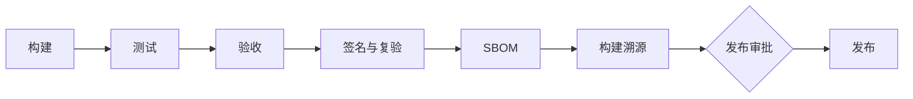

# 10 工程体系

状态：提案（草案），2026-10-02。术语、包名、端口与技术选型以 [02 系统架构](02-architecture.md) 为准，版本范围与成功指标以 [01 产品定义](01-product.md) 为准，许可证、存储、API 版本等决定见 [ADR 草案](adr-drafts.md)。采纳后，本文内容拆分进 [开发规范](../../development.md)、[测试要求](../../testing.md) 与 [文档规范](../../documentation.md)；现有规则中与比赛、公司和单一平台无关的部分全部沿用。

本文出现的 `pnpm` 脚本、`tools/` 下的新工具与工作流文件都是计划名称，尚未创建；`tools/` 目录与其中现有的仓库工具已在 OSS-004 第 1 步从 `scripts/` 移入。它们在实现并通过各自的无效样例测试之前，不能被写成“可运行”或“已接入”。

## 1. 仓库结构

仓库是一个 pnpm workspace，只有一个锁文件。`packages/` 下的 12 个包与 [02 第 8 节](02-architecture.md#8-模块与依赖规则) 完全一致，包名统一为 `@harnesshub/<目录名>`。其他顶层目录只做组合、测试、文档与工具，不承载业务逻辑。

```text
packages/            12 个业务包，见下表
apps/
  hh/                单可执行文件与 npm 包 harnesshub 的入口：按子命令分派到 cli 或 daemon，外加 SEA 构建配置
  docker/            Dockerfile 与容器入口；非 root 用户运行，数据卷 /data，不含任何 Agent
  packaging/         Homebrew formula、Scoop 与 winget 清单、nfpm（deb/rpm）配置模板，由发布流水线填入版本与哈希
  github-action/     CI 运行器形态的 GitHub Action（1.0），发布时同步到独立仓库
  tray/              Tauri 2 托盘外壳（1.x）
clients/
  python/            Python SDK（0.3），由同一份 OpenAPI 生成，加手写便捷层
conformance/         一致性套件：adapters、providers、protocols，报文黄金语料 corpus/，兼容矩阵生成器
tests/               跨包集成 integration、黑盒端到端 e2e、平台原生 platform、浏览器 browser、性能 perf
tools/               边界/文档/许可证/证据检查、测试启动器、假 Agent、假 provider、语料采集、发布脚本
docs-site/           VitePress 文档站（英文为主，zh/ 为中文翻译）
docs/                维护者文档：设计基线、ADR、验收记录、提案；不发布到文档站
examples/            可运行示例：SDK、REST、插件、Library 包、GitHub Action 工作流；CI 做类型检查与 smoke
rfcs/                RFC 正文与模板，流程见 11 开源治理
.github/             工作流、Issue/PR 模板、CODEOWNERS、标签定义
```

| 包 | 本文补充的约定 | 发布到 npm |
|---|---|---|
| `core` | 错误码注册表、事件信封、公共 JSON Schema 的唯一来源 | 是（`sdk` 的依赖） |
| `store` | SQLite 迁移在 `migrations/sqlite`，Postgres 在 `migrations/postgres`（1.x）；两者共用 Store 一致性测试 | 否 |
| `secrets` | 各平台后端在 `src/platform/{darwin,linux,win32}`；原生辅助程序源码在 `native/` | 否 |
| `gateway` | provider 预设是 `presets/<provider-id>.json` 数据文件，由 JSON Schema 校验 | 否 |
| `agents` | 每个 Adapter 一个目录 `adapters/<id>/`：`adapter.yaml` 清单、配置样例与可选钩子代码；一致性测试用的固定版本只记录在 `conformance/agents.lock.json` | 否 |
| `runtime` | 子进程启动的唯一实现：接口 `ProcessLauncher` 定义在 `core`，实现在此包，由 `daemon` 注入给 `drivers`、`secrets` 与 `plugin-host` | 否 |
| `drivers` | 只在 Worker 进程内加载 | 否 |
| `plugin-host` | 插件协议类型与版本协商 | 否 |
| `daemon` | 守护进程入口与 Worker 进程入口都在这里，是唯一组合根 | 否 |
| `cli` | `hh` 命令定义；命令元数据同时用于生成 CLI 参考文档 | 否（由 `apps/hh` 打包） |
| `sdk` | `src/generated/` 由 OpenAPI 生成并做新鲜度检查 | 是 |
| `console` | 构建产物作为静态资源嵌入 `daemon` | 否 |

`apps/hh` 只做两件事：把 `serve` 与 Worker 子命令交给 `daemon`，其余子命令交给 `cli`。它没有业务逻辑，因此不构成第二个组合根。原生辅助程序（macOS Keychain、Windows DPAPI 与 Job Object）在 SEA 中作为带哈希的内嵌资源，首次使用时解压到私有目录并校验；npm 发行时按 `@harnesshub/native-<os>-<arch>` 可选依赖分发。

依赖方向由 `tools/check-boundaries` 强制执行，它由现有 [边界检查](../../../tools/check-boundaries.mjs) 演进而来，分两层检查：各包 `package.json` 声明的内部依赖必须是 02 依赖图的子集；源码中的静态导入、动态导入、类型导入与 re-export 只能指向已声明的依赖。`conformance/`、`tests/e2e`、`tests/browser` 与 `examples/` 是黑盒，只能使用 `core`、`sdk`、HTTP 接口与 `hh` 命令。第三方依赖只能出现在声明它的包内，并且不得出现在该包的公开类型中，后者由第 2 节的 API 报告检查。检查脚本对每条规则保留拒绝样例。

## 2. 代码规范

**语言与编译**：TypeScript strict，开启 `noUncheckedIndexedAccess`、`exactOptionalPropertyTypes`、`noImplicitOverride`、`noFallthroughCasesInSwitch`、`verbatimModuleSyntax`，沿用 [现有配置](../../../tsconfig.json)；新增 `erasableSyntaxOnly`，使单元与集成测试可以借助 Node 24 默认启用的类型剥离直接从源码运行。只用 ESM（`"type": "module"`、NodeNext 解析）；各包用 project references 增量构建。`.node-version` 固定构建所用的 Node 补丁版本；npm 包声明 `"node": ">=24.11.0 <25"`，即 Node 24 进入 LTS 后的版本。`.mjs` 只用于零依赖的仓库工具。

**静态检查**：ESLint 保留现有规则（`no-floating-promises`、`no-misused-promises`、`no-explicit-any`、`ban-ts-comment`、`consistent-type-imports`），新增三条：`switch-exhaustiveness-check`；`node:child_process` 只允许在 `runtime` 的进程启动实现与 `tools/` 中导入（吸收 Magpie `TestNoCommandBypassesProc` 的做法）；`process.env` 只允许在配置解析器与组合根中读取。产品环境变量统一使用 `HH_` 前缀。Prettier 管格式，`--max-warnings=0`。

**外部输入与类型**：HTTP、配置文件、IPC、插件消息、Agent 配置文件与上游响应的入口都先收敛为 `unknown`，经 Ajv 按 JSON Schema 校验后才进入业务类型。Schema 与 TS 类型由 `core` 单一拥有，另一方由生成或等价检查维持。SessionId、RunId、GatewayKeyId、AdapterId、ProviderId 等 opaque ID 使用不同的品牌类型；封闭联合用 `assertNever` 穷尽处理；对扩展事件，未知类型的处理方式必须写明。

**错误处理**：所有可预期的失败使用 `core` 中注册的错误码（大写蛇形字符串，如 `GATEWAY_UPSTREAM_TIMEOUT`），携带 HTTP 状态、可公开的消息与仅供内部的 `cause`。错误码注册表生成文档站的错误码参考；1.0 起错误码属于公开接口，删除或改名视为破坏性变更。公开输出先脱敏再截断，不包含凭据、认证头或完整环境。best-effort 的 `catch` 只能包住一项预期可失败的操作，并注明丢弃的错误类别；状态提交、权限、进程归属与配置写入的错误不得吞掉。

**资源所有权**：每个异步资源（子进程、监听器、文件句柄、定时器、SSE 订阅）都有唯一所有者和可等待的清理入口。所有 I/O 接口接受 `AbortSignal`；有作用域的资源优先使用 `await using` 与 `Symbol.asyncDispose`。子进程只能经 `ProcessLauncher` 创建，由它登记进程组或 Job 归属并返回可等待的清理；内部自行创建子进程的第三方库（如 acpx）列入例外清单，必须用平台测试证明其子进程落在 Worker 的进程组或 Job 内。清理顺序、失败报告与配置解析流程沿用 [开发规范](../../development.md#并发错误与资源)。

**公开接口说明**：`core`、`sdk` 的公开导出、插件协议、Driver SPI、Store 接口与 HTTP 处理器的 JSDoc 写清调用方、输入限制、结果、可预期失败、取消与超时、顺序、幂等性和资源责任。`core` 与 `sdk` 用 API Extractor 生成 `*.api.md` API 报告并提交入库；报告有差异的 PR 必须附带 changeset，并由对应 CODEOWNERS 审查。

**提交格式**：采用 Conventional Commits，形如 `type(scope): summary`。type 取 feat、fix、perf、refactor、test、docs、build、ci、chore、revert；scope 取包名或领域，如 `gateway`、`agents/codex`、`release`。公开仓库的提交说明与 PR 使用英文。PR 采用 squash 合并：PR 标题即提交标题，PR 正文的证据字段即提交正文，最后附 DCO 的 `Signed-off-by`（见 11 开源治理）。

**证据字段**：下表是 PR 模板与提交正文共用的唯一定义。`tools/check-pr-evidence` 只检查必填字段是否存在且非空，内容质量由评审负责；该检查保留拒绝样例。

| 字段 | 何时必填 | 内容 |
|---|---|---|
| Problem | 非机械改动 | 可观察的问题或需求，附复现方式 |
| Behavior | 行为有变化 | 改动后的可观察行为，包括失败路径 |
| Verified | 全部 | 实际执行的命令与结果；Linux、macOS、Windows 分别注明是 CI、本机还是未运行 |
| Fails-without | 缺陷修复（标签 `kind/bug`、`kind/regression`） | 去掉修改后会失败的测试名；平台或真实 Agent 原因无法复现时，写原因与替代证据 |
| Real-agent / Real-provider | 触及 Adapter、驱动或协议 | Agent 或 provider 名与固定版本，或写“未运行” |
| Compatibility | 触及公开面 | 受影响的 API、配置、持久格式或插件协议，以及迁移说明与 changeset |
| Not-verified | 全部 | 未验证的项与原因；没有则写 none |
| Refs | 有关联时 | issue、RFC、ADR、CI 运行链接 |

## 3. 测试体系

### 3.1 分层、工具与时限

测试运行器沿用 `node:test`，覆盖率使用 Node 24 测试运行器内置的覆盖率与阈值参数（`--experimental-test-coverage`、`--test-coverage-lines`、`--test-coverage-branches`）。时限是单个用例的默认超时与单个平台上整层的墙钟上限，超出即失败。

| 层 | 定义 | 工具 | 时限 | 运行时机 |
|---|---|---|---|---|
| 静态 | 类型、lint、格式、边界、文档、API 报告、许可证、证据字段 | tsc、ESLint、Prettier、`tools/check-*` | 整层 5 min | 每个 PR，Linux |
| 单元 | 纯函数、schema、IR 转换、配置编辑器、路由策略；不起子进程，网络只限回环 | `node:test`、fast-check | 用例 5 s；整层 4 min | 每个 PR，三平台 |
| 集成 | 真实 SQLite、真实 IPC、真实 HTTP（`listen(0)`）、真实 Worker；外部 Agent 与上游由假 Agent、假 provider 替代 | `node:test`、`tools/fake-*` | 用例 60 s；整层 12 min | 每个 PR，三平台 |
| 端到端 | 从构建产物（SEA 文件、npm 打包产物）启动 `hh serve`，经 CLI、SDK、HTTP 黑盒操作 | `node:test`、SDK | 用例 120 s；整层 10 min | 每个 PR，三平台 |
| 平台 | 进程树清理、Job Object、Keychain/DPAPI/Secret Service、文件锁、路径语义 | `node:test` | 整层 10 min | 每个 PR，各自原生平台 |
| 一致性（离线） | 协议矩阵、语料回放、Adapter 配置补丁黄金文件、接线还原 | `conformance/` | 整层 8 min | 每个 PR |
| 浏览器 | 控制台在真实守护进程上的用户旅程 | Playwright | 整层 10 min | 每个 PR（Linux Chromium）；夜间全矩阵 |
| 一致性（在线） | 固定版本真实 Agent、真实 provider | `conformance/` | 每平台 90 min | 夜间、发布 |
| 性能 | 网关附加延迟、空闲内存、冷启动 | `tests/perf` | 20 min | 夜间、发布 |
| 模糊 | 长时间属性测试与入站报文变异 | fast-check | 30 min | 夜间 |

覆盖率按包统计单元加集成测试的结果：`core`、`store`、`secrets`、`gateway`、`agents`、`runtime` 的行覆盖不低于 85%、分支覆盖不低于 80%；`drivers`、`plugin-host`、`daemon`、`cli`、`sdk` 分别不低于 75% 与 70%；`console` 不设数字门槛，以第 3.6 节的旅程清单代替。PR 使某个包的覆盖率比基线下降超过 0.5 个百分点时，必须在 Verified 中解释缺失的行为。覆盖率不能代替关键路径的显式测试：终态仲裁、事务、权限、清理、秘密处理与配置写入还原，每条关键分支都要有对应用例，这一要求沿用 [测试要求](../../testing.md#测试可靠性)。

### 3.2 测试环境沙箱

所有测试命令都经 `tools/test-runner` 启动，不允许在 `package.json` 中直接调用 `node --test`。这一规则吸收上一轮核验的发现：测试继承开发者 shell 中的产品变量后，32–58 个集成用例假失败，其中 3 次请求带着开发者的 Key 发往了真实上游。启动器自身的测试包含无效样例：父环境带 `HH_MODEL` 或 `OPENAI_API_KEY` 时，子测试必须看不到；绕过启动器直接运行时，检查必须失败。启动器负责：

- **环境变量白名单**：只保留 PATH、SystemRoot、ComSpec、PATHEXT 等运行必需的系统变量与 `HH_TEST_*` 测试开关；移除 `HH_*`、旧前缀 `HARNESSHUB_*`、`AGENT_ENGINE`，以及 OPENAI、ANTHROPIC、GEMINI、DEEPSEEK 等厂商 Key 变量。只打印被移除的变量名，不打印值。删除清单由产品配置解析器导出的变量表生成，并有一致性测试保证两者同步。
- **私有目录**：每次运行创建私有根目录，把 HOME、USERPROFILE、APPDATA、LOCALAPPDATA、XDG_CONFIG_HOME、XDG_DATA_HOME、XDG_STATE_HOME、XDG_CACHE_HOME、TMPDIR、TEMP、TMP 全部指向其中的子目录，同时覆盖 Windows 语义（吸收 Magpie `0361189` 的做法）；数据根变量 `HH_HOME`（07 第 1 节）也指向其中。
- **真实目录守卫**：运行前后对真实用户目录下已知 Agent 配置位置（如 `~/.codex`、`~/.claude`、`~/.gemini`、`~/.config/opencode`）记录文件清单与哈希，任何变化都判失败。
- **网络守卫**：进程内测试安装只允许回环地址的全局 dispatcher；子进程获得指向拒绝端口的代理变量与回环 `NO_PROXY`。测试中所有凭据都是金丝雀值，假 provider 断言没有金丝雀离开回环地址。
- **系统密钥库**：真实 Keychain、DPAPI、Secret Service 用例只在平台层运行，使用临时钥匙串或专用条目前缀，结束后清理并核实；其余层使用内存后端。
- **退出看门狗**：默认 `--test-timeout`；某个测试文件的最后一个用例结束后 10 s 仍未退出，就以该文件名报失败，并结束其子进程树。禁止使用 `--test-force-exit`，它会以退出码 0 掩盖句柄泄漏。
- **残留检查**：运行结束后检查私有根目录外无新文件、无遗留子进程、无遗留监听端口。

### 3.3 三类一致性套件

一致性套件位于 `conformance/`，只通过公开接口操作系统，因此也能对其他实现运行。协议套件作为独立的 npm 包 `@harnesshub/conformance` 发布，可以指向任意网关地址运行，这对应 01 中“公开的四协议互转一致性测试套件”这一差异点。

| 套件 | 覆盖内容 | 离线部分（PR） | 在线部分（夜间、发布） |
|---|---|---|---|
| Adapter | 发现、配置补丁、全局接线与 `hh unwire`、漂移检测、隔离接线、真实 Agent 启动 | 各配置格式（JSONC、YAML、TOML）的补丁黄金文件；注释与缩进保留；还原后逐字节一致；隔离接线不写用户目录 | 在沙箱 HOME 中启动固定版本的真实 Agent，经假 provider 验证：首个请求到达网关、Gateway Key 作用域正确、Model Ref 正确、一次工具往返、流式、取消、用量入账；不支持的可选能力被明确拒绝 |
| Provider | 预设数据、认证方式、错误映射、能力 | 预设 schema 校验；录制的交换报文回放；错误分类（429 与上下文超长、5xx、认证失败） | 用维护者持有的 Key 做能力体检：流式、工具往返、usage、推理回传、输出上限字段名、`/models`、count_tokens；结果带日期写入兼容矩阵，未实测的预设标“未实测” |
| 协议 | Chat Completions、Responses、Anthropic Messages（含 count_tokens）、Gemini generateContent/streamGenerateContent、`/v1/models` | 4×4 互转矩阵与原生透传；以固定版本的官方 SDK 作为客户端，断言能解析；SSE 分帧、各协议的保活形态（绝不向 Gemini 发送 SSE 注释）、错误信封、流完整性规则、首字节前故障转移、Retry-After 上限 | 同一套用例对真实 provider 抽样运行 |

Adapter 分为稳定级、beta、实验三级，beta 与实验级的标准见 [04 第 9 节](04-agent-plane.md#9-一致性测试)。稳定级要求在其固定版本、在该 Agent 支持的每个平台上 100% 通过在线与离线套件；连续 3 个夜间运行失败即降为 beta，并自动开 issue。兼容矩阵由 `conformance/` 的结果生成，内容包括 Agent、固定版本、平台、级别、最后通过日期与 CI 运行链接，随文档站发布。

### 3.4 报文黄金语料与严格模拟上游

`conformance/corpus/<agent-id>@<固定版本>/` 保存真实 Agent 发往网关的入站请求，每个版本至少包括首轮请求、带工具结果的续轮请求、触发上下文压缩的请求与长上下文请求；`corpus/providers/<provider-id>/` 保存上游响应流，包括已知怪癖。每个样本附元数据：Agent 与版本、采集方式、日期、SHA-256。

采集由 `tools/capture-corpus` 完成：在沙箱 HOME 中运行固定版本 Agent，指向只在回环监听的假 provider，使用合成提示与一次性金丝雀 Key。产品本身不提供全量报文落盘开关。入库前由 `tools/check-corpus` 扫描 Key 形态、绝对路径、邮箱与主机名，再经人工审阅。单元测试在数秒内把每个样本经对应的解码器、IR 与各出口编码器回放，断言严格模拟上游不报违规、Model Ref 正确、没有未知输入项错误。Agent 升级固定版本时重新采集，差异经审阅后提交；CI 只读比较，不自动接受新结果。

`tools/fake-provider` 是严格模拟上游，支持四种协议，有两种模式：黑名单模式拒绝已知的厂商私有字段；白名单模式只接受按协议声明的顶层字段、消息字段与工具定义字段，未知字段返回带字段路径的 400。某个 Agent 的字段清单入库后，它的一致性用例切换到白名单模式。假 provider 还提供怪癖开关：不返回 usage、重复 finish_reason、缺少工具 index、只发注释的保活、HTTP 200 的 HTML 响应、异常结束原因、慢响应头、流中途出错、Retry-After。

### 3.5 属性测试与模糊测试

属性测试使用 fast-check，PR 中每个属性运行 200 例，夜间运行 10⁵ 例；失败的种子写入回归清单，永久回放。重点属性：

- IR 往返：任意合法的 Chat、Responses、Messages、Gemini 请求经 IR 再编码回同一协议后语义等价（限可无损表达的子集，见 03 第 11 节）；工具参数、推理内容与多字节文本不丢失。
- SSE 解析：同一字节流以任意位置切分，得到的事件序列相同，包括 UTF-8 多字节字符被切开的情况。
- 配置编辑器：对任意 JSONC、YAML、TOML 文档设置一个键路径后，解析结果中只有该键改变，该键所在区域以外的字节保持不变；还原后与原文逐字节一致。
- 路径与引用：Library 路径校验拒绝任何 `..`、符号链接、junction 与设备名；Model Ref 与 Gateway Key 作用域解析器不接受歧义输入。

模糊测试对网关与管理 API 的入站请求体做变异，要求任何输入都不会导致 500 或进程崩溃，只会得到带错误码的 4xx。fast-check 属于 OpenSSF Scorecard Fuzzing 检查认可的 JS/TS 工具；1.0 后评估接入 OSS-Fuzz。

### 3.6 控制台浏览器测试

现有控制台没有任何真实浏览器的自动回归（上一轮核验确认），Magpie 的 148 个浏览器测试也没有进入 CI。开源版把浏览器测试列为必需检查：

- **工具**：`@playwright/test`，使用它的 trace、截图与浏览器项目矩阵，失败时上传 trace；用 glob 发现用例，0 个用例即判失败；`forbidOnly` 与 0 次重试。
- **被测对象**：从构建产物启动真实的 `hh serve`（内嵌控制台），外部 Agent 与上游由假 Agent、假 provider 替代。只有难以真实触发的错误态才用 `page.route` 伪造，并在用例名中注明。
- **断言**：每个用例都断言 `pageerror` 与 `console.error` 为空；覆盖 1440 与 390 两种视口、英文与中文、深色模式、reduced-motion；用 axe-core 检查，不允许 serious 与 critical 级别的问题。
- **首批旅程**：首次运行粘贴 Key 并完成连接检查；接线预览、确认、还原；提交 Run、观察流式输出到终态；权限审批；刷新后按 URL 恢复；停止按钮发出取消；用量页数字与账本一致。
- **矩阵**：PR 运行 Linux Chromium；夜间运行 Chromium、Firefox、WebKit，以及 Windows 上的 Edge channel。文档声明最低浏览器版本，与构建目标一致。

### 3.7 flaky 测试政策

flaky 测试指同一提交、同一环境下既有通过也有失败的测试。必需检查一律不自动重试。发现 flaky 后 1 个工作日内开 `flaky` 标签的 issue，附失败运行链接；所属区域的维护者在 5 个工作日内修复，修不完可以移入隔离清单 `tests/quarantine.json`。清单每项必须有 issue 链接与到期日，最长 14 天；隔离中的用例只在夜间运行，不阻断合并。到期仍未修复的，要么修复，要么在补齐替代覆盖后删除并说明理由；过期条目会让静态检查失败。覆盖终态仲裁、权限、秘密、清理与配置写入还原的用例不得隔离，只能修复。夜间“flake 巡检”在三个平台上把集成层重复运行 20 次，统计失败率，结果进入月度质量报告。

## 4. CI 与质量门禁

### 4.1 PR 必需检查

所有工作流默认 `permissions: contents: read`，第三方 Action 按 commit SHA 固定；同一 PR 的新推送取消进行中的旧运行，`main` 上每个提交都完整运行，保留逐提交的证据。聚合任务 `ci-ok` 依赖平台矩阵中的全部必需任务，任何一个失败、取消或被意外跳过都判失败，必需检查跳过不算通过。DCO、CodeQL 与依赖审查的触发条件和权限不同，各自是独立工作流；分支保护要求 `ci-ok` 与这三项同时通过。合并使用 GitHub merge queue，必需检查在合并后的结果上重跑。

| 检查 | Linux x64 | macOS arm64 | Windows x64 |
|---|---|---|---|
| 静态层（第 3.1 节），含 PR 标题、证据字段、changeset、许可证与 SPDX 文件头 | 必需 | — | — |
| 单元、集成 | 必需 | 必需 | 必需 |
| 平台层 | 必需 | 必需 | 必需 |
| 构建 SEA 并运行端到端 | 必需 | 必需 | 必需 |
| 一致性（离线）与语料回放 | 必需 | 必需（Adapter 部分） | 必需（Adapter 部分） |
| 浏览器（Chromium） | 必需 | — | — |
| npm 包安装启动与 Docker 镜像构建的 smoke（不推送） | 必需 | — | — |
| CodeQL、依赖审查、秘密扫描 | 必需 | — | — |

PR 从打开到 `ci-ok` 的墙钟时间目标为 p90 不超过 25 min，超出时按耗时拆分任务，而不是删减检查。Linux arm64、Windows arm64 与 macOS x64 只在夜间运行，它们的结果不能代替 PR 矩阵中对应平台的证据。

### 4.2 夜间任务

| 任务 | 内容 | 失败时 |
|---|---|---|
| 一致性（在线） | 固定版本真实 Agent × 三平台与 arm64；provider 能力体检，费用上限由仓库变量设定，默认每晚 5 美元 | 更新兼容矩阵；稳定级 Adapter 连续 3 次失败降级并开 issue |
| 上游漂移 | 对每个 Agent 的最新发布版本运行 Adapter 套件 | 开“Adapter 漂移”issue，附差异，不改变固定版本 |
| 性能基准 | 01 第 7 节的网关延迟、空闲内存、冷启动 | 相对 7 日中位数退步超过 10% 时开 issue；1.0 起作为发布门槛 |
| 模糊测试与 flake 巡检 | 第 3.5、3.7 节 | 开 issue，种子入回归清单 |

### 4.3 发布流水线

发布由受保护的 `vX.Y.Z` 标签触发，或由定时任务触发 nightly，执行同一个工作流。每个阶段是独立的 job，以 `needs` 串联；整个发布工作流使用全局唯一的 concurrency 组，避免并发运行留下缺失或混搭的资产（上一轮发现两个分支向同一 tag 并发发布）。任何一步失败，后续步骤都不执行：Release 保持草稿并标注失败阶段，stable 与 beta 通道不提供“跳过验收强制发布”的入口。已发布的版本不可变，修复必须发布新的补丁版本。



1. **构建**：冻结锁文件，固定 Node，以提交时间作为 `SOURCE_DATE_EPOCH`；产出 6 个目标的 SEA、npm 包、多架构镜像（只推送到临时 digest）、deb/rpm，并写入构建身份（第 5 节）。
2. **测试**：以可复用工作流在标签提交上重跑完整的 PR 矩阵；在每个目标的原生 runner 上对产物运行端到端测试，并断言产物内的构建身份与 `GITHUB_SHA` 一致。
3. **验收**：稳定级 Adapter 在固定版本上 100% 通过；协议套件全部通过；1.0 起性能指标达到 01 的目标；从上一个 stable 版本的真实数据目录升级成功；每个分发渠道在干净容器或虚拟机中完成安装、`hh version --json` 与一次假上游网关调用。验收报告 JSON 作为发布资产。SKIP 不算 PASS，允许跳过的项必须逐项列出并写明理由。
4. **签名与复验**：macOS 使用 Developer ID 签名并公证（SEA 需要 JIT 相关 entitlement）；Windows 使用 Authenticode（候选为 SignPath Foundation 的开源免费签名或 Azure Trusted Signing）；全部产物与镜像使用 Sigstore cosign 无密钥签名。签名会改变字节，因此对签名后的产物重跑端到端 smoke。
5. **SBOM**：用 cdxgen 从 pnpm 锁文件为 npm 包与 SEA 生成 CycloneDX，用 syft 为镜像生成，作为发布资产并以 attestation 绑定到镜像。
6. **构建溯源**：用 `actions/attest-build-provenance` 生成 SLSA provenance；签名与溯源步骤放在隔离的可复用工作流中，目标为 SLSA Build L3。
7. **发布**：只能在第 1–6 步全部通过后由流水线执行，没有强制发布的旁路；所有者可以在 Release 草稿阶段否决（nightly 除外）。先创建 GitHub Release 草稿并上传全部资产，再依次发布 npm、GHCR、Homebrew tap、Scoop bucket、winget PR、deb/rpm，最后公开 Release 并移动通道指针。

## 5. 发布工程

**版本与兼容承诺**：遵循语义化版本 2.0.0。0.x 阶段次版本可以有破坏性变更，但必须在发布说明中给出迁移步骤，持久数据仍按迁移体系升级、不丢数据。1.0 起，同一大版本内向后兼容的范围是：REST API `/api/v1` 的路径、字段、错误码与 SSE 事件类型（规则见 [ADR-P11](adr-drafts.md#adr-p11-api-版本与兼容承诺)）；`sdk` 与 `core` 的 API 报告；CLI 命令、参数与 `--json` 输出；配置文件格式；数据目录与数据库（从任一 1.x 自动升级到更新的 1.y，备份规则见 [07 第 2.2 节](07-data-security.md#22-只进不退的版本化迁移)）；插件协议（宿主同时支持当前与上一个协议大版本）；Adapter 清单与 provider 预设的 schema；导出事件格式与 OpenTelemetry 属性名。不在承诺范围内的有：控制台界面、日志文本、未发布到 npm 的内部包、标记为 experimental 的功能，以及网关端点中跟随上游协议变化的部分。弃用至少保留两个次版本且不少于 6 个月，通过 `Deprecation`/`Sunset` 响应头与 CLI 的 stderr 提示。最新次版本接收全部修复；上一个次版本在新次版本发布后 90 天内接收安全修复。

**通道**：

| 通道 | 版本号 | 节奏 | 获得方式 |
|---|---|---|---|
| stable | `X.Y.Z` | 1.0 后次版本约每 6–8 周，补丁按需 | 全部渠道 |
| beta | `X.Y.Z-beta.N` | 每 2 周，次版本发布前至少一个 beta | GitHub 预发布、npm `beta` 标签、镜像 `beta` 标签、`hh self-update --channel beta` |
| nightly | `X.Y.Z-nightly.YYYYMMDD.N` | main 有变化的每晚 | GitHub 预发布（保留 14 天）、npm `nightly` 标签、镜像 `nightly` 标签 |

**changesets 与发布说明**：每个改变已发布包行为的 PR 附一个 `.changeset/*.md`，缺失时检查失败，纯内部改动用空 changeset 声明。已发布的包（`core`、`sdk`、`harnesshub`、`@harnesshub/conformance`）放在一个 `fixed` 组中同步版本，Python SDK 由发布脚本同步为相同版本号。changesets Action 维护“Version Packages” PR，发布说明由 changeset 汇总，固定包括：破坏性变更与迁移、新功能、修复、安全修复、兼容矩阵快照、实际测得的指标（未测量的指标不写，见 01 第 7 节）、已知问题、首次贡献者名单。根目录的 `CHANGELOG.md` 由 changesets 生成；现有比赛版变更记录移入归档。

**产物清单**：

| 产物 | 目标 | 格式与内容 |
|---|---|---|
| `hh` 单可执行文件 | darwin-arm64、darwin-x64、linux-x64、linux-arm64（glibc）、win32-x64、win32-arm64 | `tar.gz`（Windows 为 `zip`），内含可执行文件、LICENSE、生成的 THIRD_PARTY_NOTICES、`build-info.json` |
| npm 包 `harnesshub` | Node ≥ 24.11 | 打包后的 JS、内嵌控制台；原生辅助程序在平台可选依赖中 |
| npm 包 `@harnesshub/sdk`、`@harnesshub/core`、`@harnesshub/conformance` | Node ≥ 24.11 | ESM 与类型声明 |
| Python SDK `harnesshub` | Python ≥ 3.10 | PyPI wheel 与 sdist（0.3 起） |
| 容器镜像 `ghcr.io/<org>/harnesshub` | linux/amd64、linux/arm64 | Debian slim 基础，含 git 与 CA 证书 |
| deb、rpm | x64、arm64 | 安装 `/usr/bin/harnesshub` 与 `hh` 链接、systemd 用户单元（默认不启用） |
| 校验与证明 | 全部 | `SHA256SUMS`、Sigstore 签名包、CycloneDX SBOM、SLSA provenance、验收报告 |

**分发渠道**：

| 渠道 | 做法 | 起始版本 |
|---|---|---|
| Homebrew | 自有 tap，formula 下载预编译文件，由发布任务提 PR 更新；达到 homebrew-core 的知名度门槛后，以从源码构建（npm 安装）的 formula 提交 | tap 自 0.1 |
| Scoop | 自有 bucket，清单带 `checkver` 与 `autoupdate` | 0.1 |
| winget | 便携 zip 安装类型，用 komac 向 `microsoft/winget-pkgs` 提 PR | 0.3 |
| npm | 通过 OIDC 可信发布，附 provenance，不使用长期令牌 | 0.1 |
| Docker | 原生 arm64 runner 分别构建，按 digest 推送后合并多架构清单；推送前做冒烟；cosign 签名 | 0.1 |
| deb/rpm | nfpm 生成，作为 Release 资产；签名的 apt/yum 仓库在 1.x 提供 | 1.0 |

**更新命令**：`hh self-update [--channel stable|beta|nightly] [--version X.Y.Z] [--check] [--rollback]`。构建身份中的 `installMethod` 记录安装方式；由包管理器安装时，`hh self-update` 不替换文件，只打印对应的包管理器命令。更新检查默认关闭，首次运行时单独询问且默认否，配置项为 `updates.check`（见 [07 第 8 节](07-data-security.md#8-隐私与遥测) 的联网清单，与 [ADR-P08](adr-drafts.md#adr-p08-遥测默认关闭) 的“默认不外发”一致）。自行替换的流程如下，任何一步失败都停止，并保留当前版本：

1. 下载通道清单与目标产物到可执行文件旁的暂存目录，用内置的 Sigstore 信任根离线校验签名包：证书身份必须是本仓库 `release.yml` 在对应标签上的工作流身份，签发者必须是 `https://token.actions.githubusercontent.com`；再核对 SHA-256。
2. 运行新文件的 `hh version --json`，确认版本与平台一致。
3. 存在活动 Run 时拒绝更新，除非指定等待其结束；之后有序停止守护进程，保存当前可执行文件为上一版本。数据库不另做备份：新版本启动时若有待执行的迁移，按 [07 第 2.2 节](07-data-security.md#22-只进不退的版本化迁移) 先写迁移前备份。
4. 原子替换；Windows 上先把运行中的文件改名，再移入新文件。
5. 启动守护进程并做健康检查，不通过时按 `08-reliability-observability.md` 第 4 节的条件自动回滚：恢复旧文件，若已执行迁移则用 `hh restore --migration-backup` 恢复迁移前备份。`hh self-update --rollback` 可手动回滚；恢复备份会丢失更新后写入的数据，执行前必须列出影响并要求确认。

**构建身份**：每个产物内嵌 `build-info.json`，字段包括 version、channel、commit、commitDate、ref、dirty、builtAt、workflowRun、os、arch、nodeVersion、installMethod。CI 构建取 `GITHUB_SHA`；本地构建取 `git describe --always --dirty`，取不到时写 `unknown`，不做推测。构建身份出现在 `hh version --json`、系统信息接口、守护进程启动日志、诊断包与控制台页脚；不附加到发往上游 provider 的请求中。这一要求吸收上一轮发现：现有发行包内没有提交号，现场无法回答“正在运行哪个提交”。

## 6. 文档站

文档站位于 `docs-site/`，使用 VitePress，按 Diátaxis 组织：

| 类型 | 内容 |
|---|---|
| 教程 | 五分钟上手（对应 01 的旅程 1）、第一次多 Agent 并行运行、用 SDK 嵌入自己的程序、团队服务器部署（1.x） |
| 操作指南 | 接线某个 Agent 与还原、添加 provider 与路由组、在 CI 中运行、备份与恢复、编写 Adapter、编写插件、编写 provider 预设、排障与诊断包 |
| 参考 | CLI、REST 与 SSE、SDK、配置文件、环境变量、错误码、事件类型、Adapter 清单 schema、provider 预设 schema、插件协议、兼容矩阵 |
| 解释 | 三个平面与进程模型、证据模型与结果判定、安全模型、路由与故障转移语义、与同类产品的比较 |

英文是事实来源，中文翻译在 `docs-site/zh/`，通过 VitePress 的 locales 切换。每个翻译页在 frontmatter 中记录对应英文页的 `sourceCommit`，`tools/check-translations` 在夜间报告过期的翻译，不阻断合并。教程与操作指南按“前置条件 → 操作 → 预期结果 → 验证与恢复”编写，命令示例来自 `examples/`，用 VitePress 的代码导入引用，由 CI 做类型检查与 smoke。

参考文档全部自动生成，生成器与新鲜度检查同次维护：REST 参考由守护进程导出的 OpenAPI 3.1 渲染（沿用现有 `docs:api` 与 `check:api` 的做法）；SDK 参考由 TypeDoc 与 typedoc-plugin-markdown 生成；CLI 参考由 `cli` 的命令元数据生成；错误码与事件类型由 `core` 的注册表生成；配置、Adapter 清单与 provider 预设的参考由 JSON Schema 生成；兼容矩阵由 `conformance/` 的结果生成。

文档按次版本发布：根路径是最新 stable，`/next/` 对应 main，`/vX.Y/` 是归档快照，在线保留最近 3 个次版本，以及每个大版本的最后一个次版本。VitePress 本身没有多版本机制，由发布流水线从各版本标签分别构建到子路径，并生成版本切换器使用的清单。VitePress 构建默认对死链失败；外部链接由 lychee 在夜间检查。搜索先用 VitePress 内置的本地搜索，1.0 后申请 Algolia DocSearch。

## 7. 依赖与供应链治理

**Renovate**：每周一批量提交更新；类型声明、ESLint、测试工具等开发依赖分组。npm 依赖设置 `minimumReleaseAge` 为 3 天，规避被投毒版本在发布后最初几天内被拉入。开发依赖的补丁与次版本在 CI 通过后自动合并；运行时依赖、Node 版本与 GitHub Action 更新必须人工审查。Action 按 SHA 固定，由 Renovate 更新 digest。各 Agent 的固定版本保存在 `conformance/agents.lock.json`，由 Renovate 的自定义 manager 提 PR，从而触发在线 Adapter 套件。每月做一次锁文件维护。安全告警开启，但更新统一走 Renovate。

**锁定**：只有一个 `pnpm-lock.yaml`，CI 一律 `pnpm install --frozen-lockfile`。pnpm 升级到支持 `minimumReleaseAge` 的 10.x 版本；依赖的生命周期脚本默认不执行，只有 `onlyBuiltDependencies` 白名单内的包可以执行。运行时依赖在 `package.json` 中写精确版本。对依赖的修改只能通过 `pnpm patch`，并在第三方声明中写明原因与上游 PR（如现有的 [acpx 补丁](../../../patches/acpx@0.13.2.patch)）。仓库不再收录第三方源码归档或二进制文件。新增运行时依赖时，PR 必须说明它替代了多少自有代码、对体积与平台的影响，以及维护状况。

**许可证白名单**：允许、需审查、禁止三类清单与覆盖范围由 [07 第 9 节](07-data-security.md#9-许可证合规与第三方声明) 规定，本节只规定接入方式。`tools/check-licenses` 读取 `pnpm licenses list --json --prod` 与控制台的打包清单，对照与 07 清单一致的 `tools/licenses/policy.json` 检查，并生成发行包中的 THIRD_PARTY_NOTICES；例外项必须写明原因、审批人与到期日。仓库自身的文件级许可证用 REUSE 规范检查。

**OpenSSF Scorecard**：Scorecard Action 在每次推送 main 与每周运行，结果公开并显示徽章，1.0 的目标是不低于 8 分（01 第 7 节）。新公开仓库在前 90 天的 Maintained 检查得分为 0；Contributors 检查要求近期提交来自至少 3 个组织；Binary-Artifacts 检查会因仓库中的二进制文件扣分（现有 `vendor/` 约 480 MB 源码归档必须移除）。其余检查由本节与第 4 节的措施覆盖：分支保护、代码评审、依赖固定、令牌权限、签名发布、SAST、依赖更新工具、模糊测试、安全策略、许可证与危险工作流。1.0 前取得 OpenSSF Best Practices 徽章的 passing 级别。

**CodeQL**：对 `javascript-typescript` 与 GitHub Actions 工作流运行 `security-extended` 查询，在 PR 与每周触发；high 与 critical 告警阻断合并，误报须在 PR 中写明理由后忽略。

**依赖审查与秘密**：`actions/dependency-review-action` 在 PR 中对新增依赖检查漏洞（high 及以上失败）与许可证（与白名单一致），并显示其 Scorecard 分数，低于 3 分时给出警告。开启 GitHub 秘密扫描与推送保护，另在 PR 中用 gitleaks 扫描差异。工作流禁止对 fork 的 PR 使用 `pull_request_target` 执行代码，fork PR 拿不到任何 secret；发布只用 OIDC 换取的短期凭据。运行时依赖的已知高危漏洞须在 14 天内修复或缓解（01 第 7 节）。

## 8. 开发者体验

**devcontainer**：`.devcontainer/devcontainer.json` 基于 Node 24 镜像，安装 GitHub CLI、Playwright 的系统依赖与 git；创建后执行 `corepack enable`、`pnpm install --frozen-lockfile` 与 `pnpm build`，并转发守护进程默认端口 3180。目标是从全新 Codespace 到 `pnpm check:quick` 通过不超过 10 min，由夜间任务计时。devcontainer 只覆盖 Linux，macOS 与 Windows 的平台测试仍需在原生系统上运行。

**本地命令**（计划）：

| 命令 | 作用 |
|---|---|
| `pnpm dev` | 监视模式启动守护进程与控制台的 Vite 开发服务器；使用 `.dev/` 下的私有数据目录与沙箱 HOME，`--port 0` 并打印实际端口；默认加载假 Agent 与假 provider；全局接线只写 `.dev/home`，显式加 `--real-home` 才改写本机真实的 Agent 配置 |
| `pnpm hh -- <参数>` | 从源码运行 CLI，自动连接 `pnpm dev` 启动的守护进程 |
| `pnpm check:quick` | 对改动涉及的包运行静态层与单元测试 |
| `pnpm check` | 本机可运行的全部 PR 检查，与 CI 使用同一个测试启动器 |
| `pnpm test:conformance -- --adapter codex` | 运行指定 Adapter 的离线套件；加 `--live` 时需要本机已安装固定版本的 Agent |
| `pnpm test:browser` | 构建后运行浏览器测试；本机缺浏览器时明确报告未运行，不判通过 |
| `pnpm bench` | 运行性能基准并与 main 的最近结果比较 |

**假 Agent**：`tools/fake-agent` 由现有测试替身 `drivers/fake` 演进而来，同时支持 ACP 与 CLI 两种运行方式。它按真实 Agent 的格式读写 JSONC、TOML、YAML 配置，供接线测试使用；按配置的协议（Chat、Responses、Messages、Gemini）向网关发请求。行为由 JSON 场景脚本控制，可以模拟工具调用、权限请求、延迟、崩溃、挂起、输出洪泛和派生孙进程。

**假 provider**：即第 3.4 节的 `tools/fake-provider`，可以独立运行，用 `hh provider add` 登记为普通 provider，支持脚本化响应、首字节延迟注入、白名单模式与怪癖开关，并能录制语料。开发模式内置一个只在回环监听的 `dev/fake` 预设。

**调试**：`HH_LOG_LEVEL=debug` 打开详细日志；`pnpm dev --inspect` 为守护进程打开调试端口，`HH_DEBUG_WORKER=1` 让每个 Worker 以 `--inspect=0` 启动并在日志中报告端口。仓库提交 `.vscode/launch.json`，提供附加到守护进程与 Worker、运行单个测试文件的配置。`hh doctor` 检查运行环境；`hh debug bundle` 生成脱敏的诊断包，包含构建身份、去掉秘密的配置、最近的日志与兼容信息。`pnpm dev:otel` 用 Docker Compose 启动本地 OpenTelemetry Collector 与追踪查看器。`hh debug replay <语料文件>` 把一条语料样本发给开发中的网关，便于调试协议转换。
